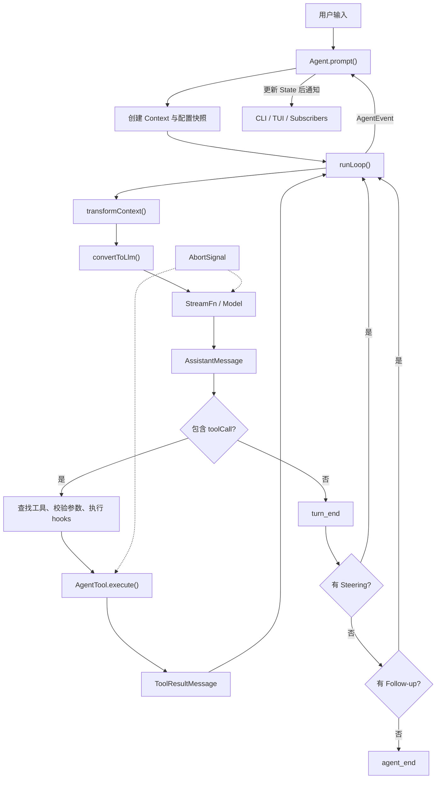

# 第 7 课：第一阶段复盘

[上一课](06-abort-steering-follow-up.md) · [返回本阶段目录](README.md) · [横向对照](../comparison.md)

## 阶段结论

最小 Agent Runtime 不是“循环调用 LLM”这么简单。可以把它压缩成：

```text
Agent Runtime =
  有状态 Agent 外壳
  + Context 请求视图
  + 模型调用边界
  + Tool loop
  + Event 协议
  + Abort / Queue 控制
```

普通模型调用只负责 `messages → response`。Runtime 还要保证状态、工具协议、失败、控制信号和外部观察者在多轮执行中保持一致。

## 端到端流程图



为突出主线，图中省略了 error、aborted、`shouldStopAfterTurn()`、工具批次 `terminate` 和并行执行分支。

## 一次工具任务的消息变化

```text
1. user
2. user → assistant(toolCall)
3. user → assistant(toolCall) → toolResult
4. user → assistant(toolCall) → toolResult → assistant(text)
```

第二次模型调用不是重试。它获得了第一次调用时不存在的 observation，因此是新的推理 turn。

## 六个组件的职责

| 组件 | 负责 | 不负责 |
| --- | --- | --- |
| Agent wrapper | 生命周期、State、队列、订阅者结算。 | 模型供应商协议。 |
| Context projection | 为本次请求裁剪、压缩、过滤消息。 | 永久删除 transcript 事实。 |
| Model boundary | 把 Context 交给模型并产生 AssistantMessage。 | 直接执行宿主工具。 |
| Tool executor | 查找工具、校验参数、执行并生成 ToolResult。 | 替模型撰写最终回答。 |
| Event protocol | 描述运行中的时间序列事实。 | 完整持久化全部 Agent 配置。 |
| Run control | Abort、Steering、Follow-up 的时序控制。 | 自动回滚外部副作用。 |

## 必须避开的六个误区

1. **“模型执行了工具”**：模型只生成 toolCall，Runtime 才执行宿主函数。
2. **“Transcript 就是 Context”**：Context 是一次请求视图，完整 transcript 可以包含更多历史和应用消息。
3. **“工具报错等于 Agent 崩溃”**：可编码成错误 ToolResult 的失败仍属于正常 loop。
4. **“Event 就是日志”**：Event 是 Runtime 与 UI、状态归约和持久化调用方的接口。
5. **“Steering 就是 Abort”**：Steering 等当前 turn 完成；Abort 尝试协作式取消当前工作。
6. **“Prompt 禁止危险操作就是 Sandbox”**：Pi 默认继承宿主权限，模型约束不能替代操作系统隔离。

## Pi Mono 最值得学习的边界

### 低层 loop 与有状态 wrapper 分离

`agent-loop.ts` 可以独立驱动模型和工具；`Agent` 再提供 State、队列、Abort 和订阅者。这让测试可以直接注入 fake StreamFn，也让不同 UI 共享同一个 loop。

### AgentMessage 与模型 Message 分离

应用可以保留 UI 或 Harness 自定义消息，同时在模型边界进行过滤或转换。Context 管理因此不需要污染核心模型协议。

### 工具失败显式进入对话

未知工具、参数错误和执行异常都应成为带 `isError` 的 ToolResult。模型能看到事实并恢复，而不是收到伪造成功或让异常被静默吞掉。

### 控制信号有明确 drain point

Steering 和 Follow-up 使用不同队列，Abort 使用 signal。控制消息不会在任意代码位置突然改变当前工具批次。

## 本阶段没有得出的结论

为了控制范围，我们还没有研究：

- `packages/agent/src/harness/` 中的完整 Harness v2。
- Session backend、持久化与搜索。
- Context compaction 的具体切分和摘要算法。
- Coding Agent 的文件、Shell、扩展和 TUI 产品层。
- 容器化方案的具体实现。

这些空白不能用猜测填入横向对照表。后续阶段遇到对应设计时，再回到源码验证。

## 学习验收

不查看前面的课程，用自己的话回答：

1. 用户要求读取文件并总结时，从 `prompt()` 到最终回答会经过哪些消息和调用？
2. `transformContext()` 与 `convertToLlm()` 各解决什么问题？为什么不能直接改写 transcript？
3. 工具参数校验失败后，为什么模型通常仍会被再次调用？
4. Event 与 State 的区别是什么？为什么 `agent_end` 时 `isStreaming` 仍可能为 `true`？
5. Steering、Follow-up、Abort 的注入时机分别是什么？
6. 为什么 Pi 的 `beforeToolCall` 或 system prompt 不能替代 Sandbox？

验收标准：每题用 2～4 句话回答，概念和时序正确即可，不要求复述源码函数名。

<details>
<summary>参考答案（建议先独立回答）</summary>

1. Runtime 将用户输入写成 `user` 消息，经 Context 转换后交给模型。模型返回包含 `read` toolCall 的 assistant 消息；Runtime 查找工具、校验参数并读取文件，再把结果作为 `toolResult` 追加到 Context。下一次模型调用同时看到 user、assistant toolCall 和 toolResult，最后生成总结文本。

2. `transformContext()` 在 AgentMessage 层裁剪、压缩或注入本次请求需要的信息；`convertToLlm()` 再过滤应用消息并转换成模型协议支持的 Message。它们构造的是一次请求视图，直接覆盖 transcript 会丢失用于恢复、审计、分叉和 UI 展示的会话事实。

3. 参数校验失败仍能被 Runtime 编码成 `isError: true` 的 ToolResult，并与原 toolCall id 对应。结果写回 Context 后，模型可以解释错误、修正参数或选择其他方案，所以 loop 通常继续；Abort 或显式停止策略除外。

4. Event 描述“刚刚发生了什么”，State 描述“现在是什么状态”。Pi 先根据 Event 更新 State，再 await subscribers；`agent_end` 只保证 loop 不再产生事件，最后的异步 subscriber 和 wrapper 清理仍可能未完成，所以此时 `isStreaming` 仍可为 `true`。

5. Steering 在当前 assistant turn 和工具批次完成后、下一次模型调用前注入；Follow-up 只在没有工具和 Steering、Agent 本来要自然结束时注入；Abort 立即触发 signal，由当前模型或工具协作响应。

6. System prompt 和 `beforeToolCall` 属于模型指导或应用策略，可能配置错误、覆盖不全，也不能限制宿主进程本身。Sandbox 在操作系统边界限制文件、进程和网络能力，即使模型或策略层做出错误决定，受限操作仍无法越权执行。

</details>

## 阶段出口

第一阶段课程内容已经完成：

1. 个人可以随时根据参考答案复查并勾选[阶段目标](README.md#阶段目标)。
2. 文档不会在没有个人回答证据时自动勾选掌握项。
3. 下一阶段进入 OpenCode，观察最小 Runtime 如何成长为完整 Coding Agent。
