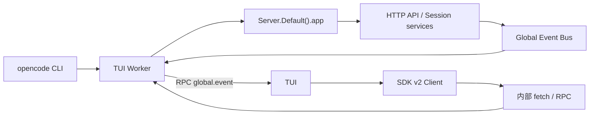

# 第 1 课：从 Runtime 到完整产品边界

[返回本阶段目录](README.md) · [Pi Mono 对照](../01-pi-mono/07-phase-review.md)

## 核心问题

Pi Mono 的最小 Runtime 怎样成长为一个同时支持 CLI、TUI、桌面端、Web 和远程 Server 的 Coding Agent 产品？

## 第一眼不要找 Agent loop

OpenCode 当前 monorepo 有二十多个 package。直接搜索 `loop` 容易跳进某个实现细节，却看不见用户请求首先经过的产品边界。

本课先回答：

```text
谁接收用户输入？
谁提供 API？
谁执行 Session？
谁接收运行事件？
```

## 源码版本

本课基于 commit [`2f17fc9`](https://github.com/anomalyco/opencode/tree/2f17fc9613771af3de3b5a2715b836037d80c4b1)，完整版本信息见[阶段目录](README.md#固定源码版本)。

## Package 地图

根据 workspace manifest、依赖方向和源码入口，可以先把相关 package 分成五层：

| 层 | 主要 package / 目录 | 当前确认的职责 |
| --- | --- | --- |
| 产品 surface | `opencode`、`tui`、`app`、`desktop`、`web` | CLI 命令、终端、桌面和 Web 交互入口。 |
| Client | `client`、`sdk-next`、旧 SDK | 调用 Server API、订阅事件，供多个 surface 复用。 |
| Transport | `protocol`、`server` | 定义协议与 HTTP/WebSocket 服务边界。 |
| Domain/runtime | `core`、`llm`、`schema` | Session、模型、共享 schema 和核心服务。 |
| Coding 能力 | `agent`、`tool`、`permission`、`provider`、`mcp`、`lsp` 等目录 | Agent 配置、工具、授权、模型供应商和项目能力。 |

这是一张学习地图，不表示每个目录已经完整审计。后续课程会沿真实调用链逐项验证。

## CLI 是产品组合入口

[`packages/opencode/src/index.ts`](https://github.com/anomalyco/opencode/blob/2f17fc9613771af3de3b5a2715b836037d80c4b1/packages/opencode/src/index.ts) 注册了：

- 默认 TUI。
- 非交互 `run`。
- 无头 `serve` 和 Web。
- Session、Agent、Provider、MCP、插件、导入导出等管理命令。

这与 Pi Mono `Agent.prompt()` 的入口层级不同。OpenCode 在用户输入到达 Session Runtime 之前，就要处理工作目录、网络模式、会话恢复、模型选择、Agent 选择、权限选项和输出格式。

## 本地 TUI 也走 Client/Server

默认 TUI 的关键路径：



已从源码确认：

1. [`tui.ts`](https://github.com/anomalyco/opencode/blob/2f17fc9613771af3de3b5a2715b836037d80c4b1/packages/opencode/src/cli/cmd/tui.ts) 创建 worker 和 RPC client。
2. 本地模式把 URL 设为 `http://opencode.internal`，并用 `createWorkerFetch()` 转发请求，不必监听真实 TCP 端口。
3. [`worker.ts`](https://github.com/anomalyco/opencode/blob/2f17fc9613771af3de3b5a2715b836037d80c4b1/packages/opencode/src/cli/tui/worker.ts) 将请求交给 `Server.Default().app.fetch()`。
4. worker 监听 GlobalBus，再通过 `global.event` RPC 把事件转回 TUI。

所以“本地运行”只改变 transport 实现，没有删掉 Client/Server 架构边界。

## 为什么保留这个边界

同一套 Server 能服务不同运行方式：

| 方式 | 连接方式 |
| --- | --- |
| 默认本地 TUI | worker 内部 fetch + RPC event source。 |
| `opencode run` | 默认使用 in-process server；也可以 `--attach` 到已有 server。 |
| `opencode serve` | 启动无头 HTTP Server。 |
| 桌面端 / Web | 通过 Client/API 使用相同的领域能力。 |

直接让 TUI 调用 Session 内部函数虽然代码更短，但会导致远程运行、桌面端、Web、SDK 和自动化各自重新实现一套入口、事件与错误协议。

## 与 Pi Mono 的第一组对照

```text
Pi Mono 最小 Runtime
caller → Agent → agent loop → events

OpenCode 完整产品
surface → Client/SDK → Server/Protocol → Session Runtime
        ← Event stream / projected state ←
```

Pi Mono 教会我们 loop 内核如何工作；OpenCode 首先增加的是多个“内核外系统”：

- 稳定的 Client/Server 调用边界。
- 本地与远端统一的 transport。
- 多种 UI 和非交互入口。
- Session 恢复、fork、attach 和服务生命周期。
- 配置、Provider、Permission、Plugin、MCP、LSP 等产品能力。

## 当前仓库的迁移事实

根 `AGENTS.md` 明确描述 V2 Session Core，并要求 durable prompt admission 与模型执行分离；与此同时，`packages/opencode` 中仍能看到 V1、V2 和 `legacy` 命名的兼容路径。

因此本阶段遵守两条规则：

1. 每个结论都注明它属于当前 active path、V2 设计约束还是兼容层。
2. 不把同名 Session、Client 或 Tool 模块自动视为同一套实现。

## 30 秒复述

1. 为什么本地 TUI 不直接调用 Agent loop？
2. Worker 在默认 TUI 架构中承担什么职责？
3. `opencode run --attach` 和本地运行最重要的共同点是什么？
4. 相比 Pi Mono，Client/Server 边界解决了哪些产品问题？

## 下一步

下一课从客户端的 prompt API 开始，追踪输入如何先成为 durable session input，再由 Session execution runner 在安全边界推进模型 turn。
