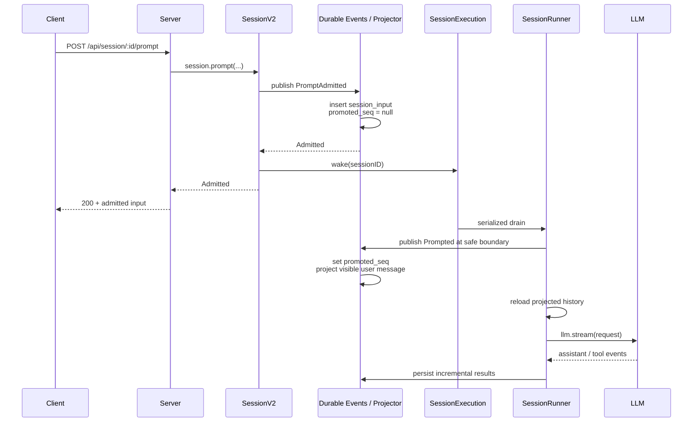

# 第 2 课：Prompt Admission 与 Durable Session

[上一课](01-runtime-to-product-boundaries.md) · [返回本阶段目录](README.md) · [Pi Mono 运行控制对照](../01-pi-mono/06-abort-steering-follow-up.md)

## 核心问题

用户按下回车后，OpenCode 为什么不直接把 prompt 塞给模型，而要先把它可靠接纳到 Session，再单独唤醒执行器？

先记住本课最重要的结论：

```text
prompt API 成功
  = 输入已经 durable admission
  ≠ 模型已经开始执行
  ≠ assistant 已经回答完成
```

## 源码版本与路径

本课基于 commit [`2f17fc9`](https://github.com/anomalyco/opencode/tree/2f17fc9613771af3de3b5a2715b836037d80c4b1)，只追踪当前 V2 active path：

```text
packages/client
  → packages/protocol
  → packages/server
  → packages/core/src/session.ts
  → packages/core/src/session/input.ts
  → packages/core/src/session/execution
  → packages/core/src/session/runner/llm.ts
```

`packages/opencode/src/server/routes/...` 中还能看到 legacy prompt 路径。本课不把它与 V2 Session Core 混为一套实现。

## 端到端时序



图中的 HTTP 响应与 Runner 可以并行推进；客户端不能根据 `200` 推断模型执行到了哪一步。

## 第一层：Client 与 Protocol

生成的 [`client.ts`](https://github.com/anomalyco/opencode/blob/2f17fc9613771af3de3b5a2715b836037d80c4b1/packages/client/src/generated/client.ts#L370-L380) 调用：

```http
POST /api/session/:sessionID/prompt
```

请求体包含四个关键字段：

| 字段 | 作用 |
| --- | --- |
| `id` | 可选的 prompt message ID，用于幂等重试。 |
| `prompt` | 结构化用户输入。 |
| `delivery` | `steer` 或 `queue`；省略时默认为 `steer`。 |
| `resume` | 是否在接纳后调度执行；`false` 表示只接纳。 |

[`protocol/session.ts`](https://github.com/anomalyco/opencode/blob/2f17fc9613771af3de3b5a2715b836037d80c4b1/packages/protocol/src/groups/session.ts#L205-L223) 对接口的描述非常直接：可靠接纳一条 Session input，并在 `resume` 不为 `false` 时调度 Agent loop。

成功响应的类型是 `SessionInput.Admitted`。冲突的 message ID 会由 [`server/handlers/session.ts`](https://github.com/anomalyco/opencode/blob/2f17fc9613771af3de3b5a2715b836037d80c4b1/packages/server/src/handlers/session.ts#L130-L175) 映射为 `409 Conflict`。

## 第二层：`SessionV2.prompt()` 先接纳，再唤醒

[`SessionV2.prompt()`](https://github.com/anomalyco/opencode/blob/2f17fc9613771af3de3b5a2715b836037d80c4b1/packages/core/src/session.ts#L360-L390) 的主线可以压缩成：

```text
确认 Session 存在
  → 解析 prompt
  → 生成或采用 message ID
  → delivery 默认设为 steer
  → SessionInput.admit(...)
  → 校验已有记录是否与本次请求完全等价
  → resume !== false 时 execution.wake(sessionID)
  → 返回 Admitted
```

整个区域被 `Effect.uninterruptible` 包裹。`源码`：一旦进入这段关键路径，请求取消不会把“写入输入”和“安排唤醒”随意切成半截状态。

这里的顺序是系统语义，不是实现细节：

1. 先让输入成为可恢复的 Session 事实。
2. 再发送一次 advisory wake，通知进程内执行器有工作可取。
3. `wake()` 不等待模型完成，因此 API 返回的是接纳结果。

## `admitted` 与 `promoted` 是两个生命周期

[`session_input` 表](https://github.com/anomalyco/opencode/blob/2f17fc9613771af3de3b5a2715b836037d80c4b1/packages/core/src/session/sql.ts#L141-L166) 同时保存：

| 字段 | 含义 |
| --- | --- |
| `admitted_seq` | 输入已经按 durable aggregate 顺序被可靠接纳。 |
| `promoted_seq` | 输入已经在安全边界转换成模型可见的 user message；未发生时为 `null`。 |

状态变化是：

```text
不存在
  → PromptAdmitted
  → session_input(admitted_seq=N, promoted_seq=null)
  → Prompted
  → session_input(admitted_seq=N, promoted_seq=M)
  → projected user message
```

[`SessionInput.admit()`](https://github.com/anomalyco/opencode/blob/2f17fc9613771af3de3b5a2715b836037d80c4b1/packages/core/src/session/input.ts#L42-L82) 发布 `PromptAdmitted` durable event；[`Session projector`](https://github.com/anomalyco/opencode/blob/2f17fc9613771af3de3b5a2715b836037d80c4b1/packages/core/src/session/projector.ts#L350-L380) 将它投影到 `session_input`。

Runner 到达安全边界后才发布 `Prompted`，设置 `promoted_seq`，并将 prompt 投影成 Session history 中真正可见的 user message。

这样，正在进行的模型请求不会被中途修改。新输入先可靠排队，下一次 provider turn 再从新的 projected history 构造全新 request。

## `steer` 与 `queue`

两种 delivery 都会先 admission，区别在于 promotion 时机：

| Delivery | Promotion 规则 | 用户意图 |
| --- | --- | --- |
| `steer` | 在下一个 provider-turn 安全边界，将截止序列前待处理的 steers 按 FIFO 一批推进。 | 尽快修正当前任务方向。 |
| `queue` | 当前 Session 本来要空闲时，只推进最旧的一条 queue；处理后再重新判断。 | 等当前任务稳定结束后再做下一件事。 |

实现位于 [`promoteSteers()` 与 `promoteNextQueued()`](https://github.com/anomalyco/opencode/blob/2f17fc9613771af3de3b5a2715b836037d80c4b1/packages/core/src/session/input.ts#L245-L289)。

它们与 Pi Mono 的 Steering / Follow-up 很相似，但不要直接画等号：OpenCode 的输入先进入 durable inbox，并由 serialized Session runner promotion；Pi Mono 第一阶段看到的是 Runtime 内存队列。

## `resume=false`：只接纳，不执行

发送 `resume: false` 时：

```text
PromptAdmitted 仍然发生
session_input 仍然写入
execution.wake() 不发生
```

这适合把“可靠记录输入”和“现在启动模型”拆成两个操作。输入会保持 pending，直到之后的显式 resume 或其他 wake 让 Runner drain 它。

`resume=false` 不是丢弃、草稿或临时内存消息；它只是 admit-only。

## Message ID：精确重试与冲突

调用方可以自己提供 message ID。`SessionInput.admit()` 会先按 ID 查找已有输入：

- Session、prompt 内容和 delivery 全部相同：视为同一次输入的精确重试，返回已有记录。
- 任一项不同：`SessionV2.prompt()` 抛出 `PromptConflictError`，Server 返回 `409`。

所以 message ID 是幂等键，不是允许覆盖旧消息的编辑键。

```text
相同 ID + 相同内容 = reconcile retry
相同 ID + 不同内容 = conflict
```

这避免了客户端因超时重发时产生重复用户消息，也避免同一个 ID 被静默改写成另一条历史事实。

## Wake 不是另起一个并行 Agent

[`SessionRunCoordinator`](https://github.com/anomalyco/opencode/blob/2f17fc9613771af3de3b5a2715b836037d80c4b1/packages/core/src/session/run-coordinator.ts#L1-L112) 以 Session ID 为 key：

- 同一个 Session 只允许一个 active drain，执行保持串行。
- active 时重复 `wake()` 只设置 `pendingWake`，多个通知可以合并。
- 不同 Session 使用不同 key，可以并发运行。
- 显式 `resume()` 在空闲时启动，在已有执行时等待同一条执行链。
- `interrupt()` 只中断当前进程拥有的 active execution；空闲时是 no-op。

[`execution/local.ts`](https://github.com/anomalyco/opencode/blob/2f17fc9613771af3de3b5a2715b836037d80c4b1/packages/core/src/session/execution/local.ts#L1-L45) 在 drain 真正启动时才根据 Session location 找到对应 Runner。

这里最值得记住的是：durable inbox 才是工作事实，wake 只是“有新工作”的可合并通知。系统不需要为每一次 prompt 创建一个并行 loop。

## Runner 的安全边界与 provider turn

[`SessionRunner.run()`](https://github.com/anomalyco/opencode/blob/2f17fc9613771af3de3b5a2715b836037d80c4b1/packages/core/src/session/runner/llm.ts#L382-L409) 使用两层推进逻辑：

```text
外层：当前任务稳定后，一次推进一条 queue
  内层：tool continuation 或 pending steer 继续 provider turn
```

每次 [`runTurnAttempt()`](https://github.com/anomalyco/opencode/blob/2f17fc9613771af3de3b5a2715b836037d80c4b1/packages/core/src/session/runner/llm.ts#L173-L240) 会：

1. 检查当前 Runner 是否拥有该 Session location。
2. 在安全边界 promote 本轮应该可见的 inputs。
3. 重新读取 projected history。
4. 组装 system、messages、tools 和 model request。
5. 每个 provider turn 恰好调用一次 `llm.stream(request)`。
6. 增量持久化 assistant、text、reasoning、tool call 和 usage 等事件。
7. 本地 tool call 在副作用开始前先被 durable record，再经过 registry 与 permission 执行。
8. 等待工具全部结算；需要继续时，下一 turn 重新读取 history。

因此 active provider turn 期间到达的 steer 不会改写已经发给模型的 request。它先 durable admission，等当前 stream 与工具结算到达边界，再进入下一次 request。

## 与 Pi Mono 对照

| 问题 | Pi Mono 最小 Runtime | OpenCode V2 |
| --- | --- | --- |
| prompt 从哪里进入 | `Agent.prompt()` 直接驱动内存 loop。 | Client → Server → durable Session admission。 |
| 等待语义 | `prompt()` 通常等待当前 Agent run 结束。 | prompt API 返回 `Admitted`，不等待回答。 |
| 运行中纠偏 | 内存 Steering queue。 | durable `steer` input，在 provider-turn 安全边界 promotion。 |
| 后续任务 | 内存 Follow-up queue。 | durable `queue` input，在 Session 本来要空闲时逐条 promotion。 |
| 并发控制 | 单个 Agent 实例的运行状态。 | 按 Session ID 串行，不同 Session 可并发。 |
| 进程退出后 | 内存队列会消失。 | admitted input 可持久保存；执行 continuation 不等于已经自动恢复。 |

OpenCode 没有抛弃第一阶段的 Agent loop，而是在 loop 外增加了可靠输入、幂等协议、Session 调度和可投影历史。

## 当前版本的实现边界

[`runner/llm.ts` 顶部清单](https://github.com/anomalyco/opencode/blob/2f17fc9613771af3de3b5a2715b836037d80c4b1/packages/core/src/session/runner/llm.ts#L44-L89) 明确标出了尚未完成的部分：

- Session drain 仍是当前进程本地所有权，不是 durable multi-node ownership。
- busy、retrying、idle、terminal failure 等执行状态尚未全部 durable 化。
- 崩溃后的 provider continuation recovery 仍需要单独的重试设计。
- 完整的 built-in、MCP、plugin tool policy resolution 仍在建设中。
- cancellation settlement 和部分 post-run maintenance 仍未完成。

所以本课只能得出“prompt admission 是 durable 的”，不能推导出“整个运行过程已经具备任意崩溃点的 exactly-once 自动恢复”。

## 30 秒复述

1. prompt API 返回 `200` 时，系统保证了什么，又没有保证什么？
2. `admitted_seq` 和 `promoted_seq` 分别代表哪个时间点？
3. active provider turn 期间收到 steer，为什么不能直接追加到当前 request？
4. `queue` 与 `steer` 的 promotion 时机有什么区别？
5. 相同 message ID 在什么条件下是安全重试，什么条件下返回冲突？
6. durable input 为什么不等于 durable execution recovery？

## 下一步

下一课继续追踪一次 Coding Agent 工具调用：模型产生 tool call 后，Tool Registry、Permission、执行副作用和 durable result 如何连接成完整闭环。
