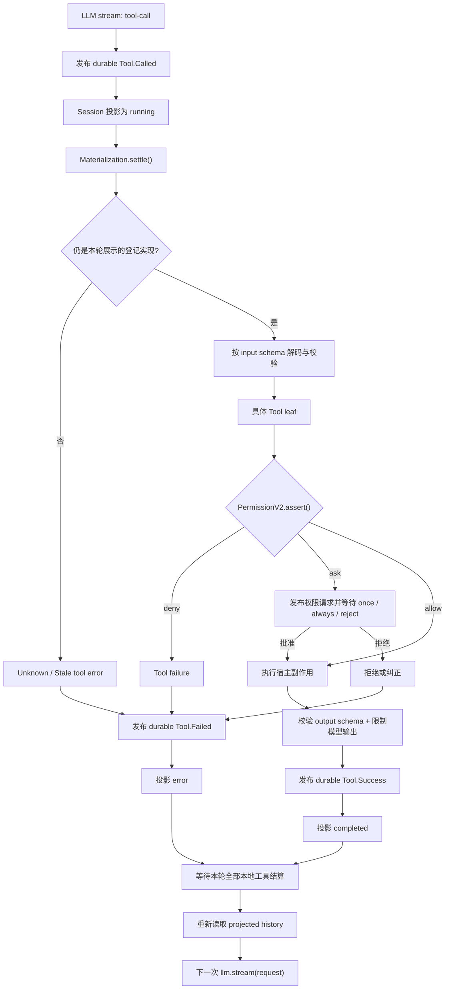

# 第 3 课：Tool、Permission 与执行闭环

[上一课](02-prompt-admission-durable-session.md) · [返回本阶段目录](README.md) · [Pi Mono 工具循环对照](../01-pi-mono/02-prompt-tool-loop.md)

## 核心问题

模型产生一个 `tool-call` 后，OpenCode 如何把它变成经过校验、授权、执行、持久化并重新送回模型的宿主副作用？

先记住六步主线：

```text
模型提议工具调用
  → Session 先记账
  → Tool Registry 定位本轮登记的实现
  → 具体 Tool 在副作用前请求权限
  → Session 持久化成功或失败
  → Runner 重新读取历史，再调用模型
```

模型只负责提议。真正执行命令、读取文件或写入文件的是 OpenCode 进程。

## 源码版本与范围

本课基于 commit [`2f17fc9`](https://github.com/anomalyco/opencode/tree/2f17fc9613771af3de3b5a2715b836037d80c4b1)，追踪 V2 Core 的本地工具路径：

```text
SessionRunner
  → ToolRegistry.Materialization
  → Tool.settle()
  → built-in leaf
  → PermissionV2.assert()
  → filesystem / process side effect
  → ToolOutputStore
  → SessionEvent.Tool.Success / Failed
  → projected Session history
  → next provider turn
```

本课以 `write` 为具体例子，同时区分本地工具与 provider-executed tool。MCP 和 plugin 的完整 V2 canonical registration 仍在建设中，不把 legacy 路径当成当前 Core 已完成能力。

## 完整时序



图中省略了中断、provider stream failure、并行工具和超大输出存储等分支，后文逐项补上。

## Tool 的两张面孔

[`tool.ts`](https://github.com/anomalyco/opencode/blob/2f17fc9613771af3de3b5a2715b836037d80c4b1/packages/core/src/tool/tool.ts#L1-L158) 中，一个 canonical Tool 同时拥有：

| 模型可见 | 仅 Runtime 可见 |
| --- | --- |
| name、description。 | `execute(input, context)`。 |
| input JSON Schema。 | input 解码与校验。 |
| output JSON Schema。 | output 编码与校验。 |
| 结构化输出约定。 | `toModelOutput()` 和错误转换。 |

`Tool.make()` 返回的是一个 opaque value；真正的 codec 和 executor 保存在内部 `WeakMap`。Registry 交给模型的是 `ToolDefinition`，不是 JavaScript 执行函数。

所以：

```text
模型知道“可以请求 write”
不等于
模型获得了 write.execute 的调用能力
```

Runtime 收到 provider 的结构化 tool call 后，才会按 input schema 解码。无效参数在进入具体副作用前变成 `ToolFailure`；工具返回值也必须通过 output schema，不能把任意宿主对象直接塞回模型。

## Registry 先为一次 provider turn 固定工具目录

Runner 在构造模型请求时调用 [`ToolRegistry.materialize()`](https://github.com/anomalyco/opencode/blob/2f17fc9613771af3de3b5a2715b836037d80c4b1/packages/core/src/tool/registry.ts#L106-L122)：

```text
收集 process-scoped application tools
  → 覆盖 Location-scoped tools
  → 删除被整体禁用的 definitions
  → 返回 { definitions, settle }
```

登记规则：

- shipped built-ins 通过 Location-scoped `Tools.Service` 注册。
- application tools 通过 process-scoped `ApplicationTools.Service` 注册。
- 同名时 Location registration 优先。
- registration 有 Scope；Scope 关闭后只移除对应登记，并恢复下一层有效实现。

### 为什么 `materialize()` 不只返回 definitions

它还返回与本轮目录绑定的 `settle()`。如果模型看到工具定义之后，同名 registration 被删除或替换，本轮调用会得到 `Stale tool call`，不会悄悄执行一个模型从未看到的新实现。

[`registry.ts`](https://github.com/anomalyco/opencode/blob/2f17fc9613771af3de3b5a2715b836037d80c4b1/packages/core/src/tool/registry.ts#L50-L82) 通过 registration identity 检查这个条件。

这是一个容易忽略的时间一致性问题：

```text
本轮展示的是 Tool A v1
调用结算时有效实现已变成 Tool A v2
正确结果：stale error
错误结果：直接执行 v2
```

## 工具目录过滤不等于执行授权

Registry 会根据 Agent rules 隐藏被整体禁用的工具。例如 `edit`、`write`、`apply_patch` 共享 `edit` action，只要最后匹配的 `edit / *` 规则是 deny，它们都不会出现在 definitions 中。

但是 [`Tool Registry`](https://github.com/anomalyco/opencode/blob/2f17fc9613771af3de3b5a2715b836037d80c4b1/packages/core/src/tool/registry.ts#L132-L147) 没有 `PermissionV2.Service` 运行时依赖，也不会替具体资源授权。

必须区分：

| 层 | 回答的问题 |
| --- | --- |
| Catalog visibility | 这个工具是否应该作为整项能力展示给模型？ |
| Invocation authorization | 这一次调用针对这些具体 resources 是否允许？ |
| OS Sandbox | 即使上层判断错误，宿主进程在操作系统层到底能做什么？ |

只做第一层过滤不安全。模型可能产生未展示的工具名，或者资源只在运行时才能解析；具体 Tool leaf 仍必须在副作用前执行授权。

## Permission rules 怎样求值

[`PermissionV2`](https://github.com/anomalyco/opencode/blob/2f17fc9613771af3de3b5a2715b836037d80c4b1/packages/core/src/permission.ts#L76-L218) 的 rule 包含：

```text
action + resource pattern + effect
```

`effect` 有三种：

| Effect | 行为 |
| --- | --- |
| `allow` | 立即继续。 |
| `deny` | 返回 `BlockedError`，不执行副作用。 |
| `ask` | 建立 pending request，等待用户回复。 |

求值规则：

- action 与 resource 都支持 wildcard 匹配。
- 后出现的匹配 rule 优先。
- 没有匹配 rule 时默认为 `ask`。
- 一次请求包含多个 resources 时，任一 deny 则整体 deny；否则任一 ask 则 ask；全部 allow 才 allow。
- 已保存的 allow 可以满足后续 ask，但不能覆盖 Agent 配置中的显式 deny。
- Agent 无法解析或没有权限配置时使用 deny-all，而不是放行。

## `ask` 如何暂停工具，而不阻塞整个 Server

当 `PermissionV2.assert()` 得到 `ask`：

1. 创建包含 Session、action、resources 和 tool call source 的 request。
2. 放入当前 Location 的 pending `Map`。
3. 发布 `permission.v2.asked`，供 TUI、CLI 或其他 Client 展示。
4. 当前工具 fiber 等待一个 `Deferred`。
5. Client 通过 [permission reply API](https://github.com/anomalyco/opencode/blob/2f17fc9613771af3de3b5a2715b836037d80c4b1/packages/protocol/src/groups/permission.ts#L119-L139) 回复。

回复语义：

| Reply | 结果 |
| --- | --- |
| `once` | 只放行当前 pending request。 |
| `always` | 放行当前请求，并在有 `save` patterns 时保存项目级 allow。 |
| `reject` | 拒绝当前请求，并拒绝同一 Session 的其他 pending permission requests。 |

`always` 保存到 [`permission` SQL 表](https://github.com/anomalyco/opencode/blob/2f17fc9613771af3de3b5a2715b836037d80c4b1/packages/core/src/permission/sql.ts#L1-L22)。但 pending requests 和等待它们的 `Deferred` 是当前进程内存状态；它们本身不是 durable execution ownership。

## 具体例子：`write` 的授权顺序

[`write.ts`](https://github.com/anomalyco/opencode/blob/2f17fc9613771af3de3b5a2715b836037d80c4b1/packages/core/src/tool/write.ts#L47-L100) 展示了 leaf 自己拥有解析、权限和副作用顺序：

```text
解析目标路径
  → 如果是外部绝对路径，先 assert external_directory
  → assert edit(target.resource)
  → FileMutation.writeTextPreservingBom(...)
```

相对路径必须留在 active Location。绝对外部路径不是自动拒绝，而是产生单独的 `external_directory` approval boundary；随后仍要通过 `edit` 授权。

权限请求带有：

```text
source = {
  type: "tool",
  messageID: assistantMessageID,
  callID: toolCallID
}
```

因此 UI 能把授权问题关联回具体 assistant message 和 tool call，而不是展示一个来源不明的全局弹窗。

真正写文件的 [`FileMutation`](https://github.com/anomalyco/opencode/blob/2f17fc9613771af3de3b5a2715b836037d80c4b1/packages/core/src/file-mutation.ts#L1-L150) 会按 canonical target 使用进程内 keyed lock；`edit` 类工具还可以通过 compare-and-write 检测 stale content。它解决协作中的覆盖竞争，但不等于跨进程事务或 Sandbox。

## Session 为什么要在副作用前记录 `Tool.Called`

Runner 处理每个 local `tool-call` 时，顺序是：

1. [`publish(event)`](https://github.com/anomalyco/opencode/blob/2f17fc9613771af3de3b5a2715b836037d80c4b1/packages/core/src/session/runner/llm.ts#L232-L271) 先发布 durable `SessionEvent.Tool.Called`。
2. Session projection 将该 tool state 更新为 `running`。
3. Runner 才在 tool fiber 中调用 `toolMaterialization.settle()`。

[`Session tool events`](https://github.com/anomalyco/opencode/blob/2f17fc9613771af3de3b5a2715b836037d80c4b1/packages/schema/src/session-event.ts#L283-L379) 与 [`message-updater.ts`](https://github.com/anomalyco/opencode/blob/2f17fc9613771af3de3b5a2715b836037d80c4b1/packages/core/src/session/message-updater.ts#L245-L349) 组成下面的状态机：

```text
Tool.Input.Started  → pending
Tool.Called         → running
Tool.Success        → completed
Tool.Failed         → error
```

这样即使进程在工具执行中退出，重放 Session 时也不会把这次调用当作“从未发生”。下一次 Runner 启动会把遗留的 pending/running tool 标记为 `Tool execution interrupted`。

### 但这不是 exactly-once 副作用

考虑崩溃点：

```text
Tool.Called 已持久化
  → 文件实际写入成功
  → 进程崩溃
  → Tool.Success 尚未持久化
```

重启后系统知道调用没有可靠结算，却无法仅凭 Session event 判断文件副作用是否已经发生。源码在 `file-mutation.ts` 明确保留了“Tool.Called 与 durable settlement 之间的 crash recovery / idempotency”待设计项。

所以“先记账”提升了可观察性与恢复判断，但没有自动获得 exactly-once。

## 多个本地工具如何结算

[`SessionRunner`](https://github.com/anomalyco/opencode/blob/2f17fc9613771af3de3b5a2715b836037d80c4b1/packages/core/src/session/runner/llm.ts#L218-L349) 对 local tool calls 的策略是：

- 每个已经 durable record 的本地调用立即启动一个 tool fiber。
- 同一个 provider turn 中的多个本地工具可以并发执行。
- provider stream 结束后，Runner 等待全部已启动工具完成。
- 所有 settlement 都进入 durable Session events 后，才开始 continuation provider turn。
- 用户拒绝权限或关闭 question 被视为控制信号，会中断 continuation，而不是伪装成普通成功结果。

因此“同一 Session 的 Runner 串行”不表示一个 assistant turn 内的多个工具必定串行。串行的是 provider-turn orchestration；本轮工具 settlement 可以并发。

## 成功与失败都要回到模型

Registry 将预期的 `ToolFailure` 转成 error result；未知工具、无效参数、stale registration、权限阻止和执行失败最终都会投影成 tool `error` 状态。

成功则经过：

```text
domain output
  → output schema 编码
  → model content 转换
  → ToolOutputStore bounding
  → Tool.Success
```

[`to-llm-message.ts`](https://github.com/anomalyco/opencode/blob/2f17fc9613771af3de3b5a2715b836037d80c4b1/packages/core/src/session/runner/to-llm-message.ts#L1-L115) 在下一次请求中还原：

```text
assistant(tool-call)
tool(tool-result 或 tool-error)
```

Runner 不是把当前内存中的返回值直接传给下一次模型调用，而是等待 durable settlement、重新读取 projected history，再生成 canonical LLM messages。

这就是 OpenCode 版的工具闭环：

```text
provider turn 1
  → durable tool call
  → authorized host execution
  → durable tool result
  → reload history
  → provider turn 2
```

## 超大工具输出不会无限挤占 Context

[`ToolOutputStore`](https://github.com/anomalyco/opencode/blob/2f17fc9613771af3de3b5a2715b836037d80c4b1/packages/core/src/tool-output-store.ts#L1-L190) 默认限制模型可见文本为：

- 最多 2,000 行。
- 最多 50 KiB。

超过限制时，完整文本写入 managed output file，模型收到头尾预览和文件路径；默认保留期为 7 天。结构化数据与媒体有各自的保留语义，生产工具还可能在更早的 capture 层有独立限制。

这解决的是 Context 与输出存储边界，不是执行权限。

## Provider-executed tool 是另一条分支

某些 Provider 自己执行工具，例如 hosted web search。它们的 `tool-call` 带 `providerExecuted: true`：

- OpenCode 仍持久化 call、result 和 provider metadata。
- Runner 不调用本地 Tool Registry，也不在宿主机重复执行。
- 结果在 assistant provider content 中按 provider-executed 语义还原。

因此看到 Session 中有 tool event，不能自动推断副作用发生在本地机器；必须检查 `provider.executed`。

## Permission 不是 Sandbox

这是本课最重要的安全边界。

[`bash.ts`](https://github.com/anomalyco/opencode/blob/2f17fc9613771af3de3b5a2715b836037d80c4b1/packages/core/src/tool/bash.ts#L104-L202) 的描述明确写着：命令使用 host user 的 filesystem、process 和 network authority。

Permission 能做的是：

- 在执行前依据 action/resource 做 allow、deny 或 ask。
- 让用户知道是哪一个 tool call 请求能力。
- 保存明确批准的项目级规则。

Permission 不能做的是：

- 从操作系统层阻止已放行进程越界。
- 自动隔离网络、子进程和主机文件系统。
- 回滚已经发生的外部副作用。
- 把 Bash 的 best-effort path scan 变成强制文件访问控制。

这正是第三阶段还要专门学习生产 Sandbox 的原因。

## 与 Pi Mono 对照

| 问题 | Pi Mono 最小 Runtime | OpenCode V2 |
| --- | --- | --- |
| 工具定义 | `AgentTool` 暴露给模型的 schema 与宿主 execute。 | opaque canonical Tool，经 Registry materialize。 |
| 参数校验 | Runtime 在执行前校验。 | input codec 解码，output codec 再验证返回值。 |
| 执行前记录 | 第一阶段示例主要是内存 transcript/event。 | `Tool.Called` 先成为 durable Session event。 |
| 权限 | 可通过 hooks 实现应用策略。 | leaf 在副作用前调用 Location-scoped `PermissionV2`。 |
| 多工具 | 支持工具批次。 | 已记录的 local tools eager 并发，全部结算后 continuation。 |
| 工具结果 | 追加 `ToolResultMessage`。 | durable Success/Failed → projected history → canonical tool message。 |
| 超大输出 | 由调用方自行处理。 | Registry settlement 统一经过 ToolOutputStore bounding。 |
| Sandbox | 默认继承宿主权限。 | Permission 仍不是 OS Sandbox，Bash 同样使用 host authority。 |

OpenCode 增加的不是“另一个工具循环”，而是目录快照、资源权限、durable lifecycle、输出管理和 Session continuation。

## 当前版本的实现边界

`源码`：当前固定版本仍有这些明确缺口：

- Plugin boot 尚未全部迁移到 canonical `Tools.Service` registration。
- MCP 与未来 Session-scoped tools 仍需要明确的 canonical registration 设计。
- pending permission request 是进程本地状态；只有 `always` 保存的 allow rules 进入 SQL。
- 文件副作用在 `Tool.Called` 与 durable settlement 之间没有通用 crash idempotency。
- `apply_patch` 按顺序应用多个文件操作，后一步失败不会原子回滚前面的修改。
- Bash 对命令参数中外部路径的识别仍是 advisory scan，不是强制隔离。

这些限制不能从架构图中省略，否则会把“可审计的权限系统”误读成“已经具备生产级强隔离与 exactly-once 执行”。

## 30 秒复述

1. 模型看到 ToolDefinition 后，为什么仍不能直接执行宿主函数？
2. Registry 的 catalog filtering 和 Tool leaf 的 invocation authorization 有什么区别？
3. 为什么 registration 在 provider turn 中途被替换时应该返回 stale error？
4. `PermissionV2` 的 `allow`、`deny`、`ask` 分别如何推进工具？
5. 为什么必须在副作用前持久化 `Tool.Called`？它为何仍不等于 exactly-once？
6. 多个 local tool calls 与下一次 provider turn 的并发关系是什么？
7. 为什么 OpenCode Permission 不能替代第三阶段要学的 Sandbox？

## 验证状态

- `源码`：调用链、事件状态机、权限求值、`write` 授权顺序和工具 continuation 已从固定 commit 逐项确认。
- `源码`：上游包含对应的 Tool Registry、Permission、Write Tool、Runner continuation 与并发测试。
- `未验证`：本地 `sources/opencode` 尚未安装 workspace dependencies，因此本课没有声称运行过上游 Bun tests。

## 下一步

下一课追踪 System Context 与项目级指令：OpenCode 如何从配置、Agent、项目环境和 Context Sources 构造每次 provider request 的 system 部分。
