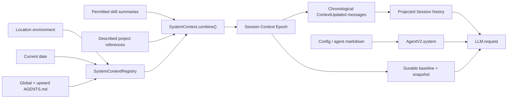

# 第 4 课：System Context 与项目级指令

[上一课](03-tool-permission-execution-loop.md) · [返回本阶段目录](README.md) · [Pi Mono Context 对照](../01-pi-mono/04-transcript-and-model-context.md)

## 核心问题

OpenCode 每次调用模型时，Agent system prompt、工作目录、日期、`AGENTS.md`、Skills 和项目 References 从哪里来？这些信息变化后，为什么不能直接静默替换旧 system prompt？

本课先记住这个结构：

```text
Provider Request
  ├─ system[0]：当前选中 Agent 的 system
  ├─ system[1]：当前 Session Context Epoch 的 baseline
  └─ messages：用户、assistant、tool result，以及 baseline 之后的 system updates
```

OpenCode 的“System Context”不是每轮随手拼接的一段字符串，而是带有来源、结构化 snapshot、变化检测和 Session 时间线的上下文系统。

## 源码版本与范围

本课基于 commit [`2f17fc9`](https://github.com/anomalyco/opencode/tree/2f17fc9613771af3de3b5a2715b836037d80c4b1)，追踪 V2 Core：

```text
AgentV2 selection
SystemContextRegistry
InstructionContext
SkillGuidance
ReferenceGuidance
  → SystemContext.combine()
  → SessionContextEpoch
  → SessionHistory.entriesForRunner()
  → LLM.request({ system, messages })
```

## 一次 request 的上下文来源



根据 [`SessionRunner`](https://github.com/anomalyco/opencode/blob/2f17fc9613771af3de3b5a2715b836037d80c4b1/packages/core/src/session/runner/llm.ts#L168-L215)，拼装顺序是：

1. 选择本轮 Agent。
2. 并发加载 Registry、Skill Guidance 和 Reference Guidance。
3. 初始化或刷新 Session Context Epoch。
4. 使用 `baselineSeq` 选择本轮 history。
5. 把 Agent system 放在 epoch baseline 之前。
6. 将 history 转成 canonical LLM messages。

## Agent system 是独立的第一层

Agent 配置可以定义：

- system。
- model 与 variant。
- permissions。
- 最大 steps。
- primary / subagent mode 等产品属性。

这些字段由 [`ConfigAgent`](https://github.com/anomalyco/opencode/blob/2f17fc9613771af3de3b5a2715b836037d80c4b1/packages/core/src/config/agent.ts#L1-L25) 描述，并由 [`config/plugin/agent.ts`](https://github.com/anomalyco/opencode/blob/2f17fc9613771af3de3b5a2715b836037d80c4b1/packages/core/src/config/plugin/agent.ts#L51-L123) 从配置文件和 agent markdown materialize 到 `AgentV2`。

Runner 使用：

```ts
system: [agent.info?.system, system.baseline]
```

所以 Agent system 与环境 baseline 是两个有顺序的 system parts。当前 Agent 决定角色、工作方式和权限；Context Epoch 描述该 Session 已接纳的环境与项目上下文。

它们不能混成一个概念：切换 Agent 会改变 Agent system 和 skill 可见性，但工作目录、日期和项目 `AGENTS.md` 仍属于 Location / Session Context。

## System Context Source 是一种代数

[`system-context/index.ts`](https://github.com/anomalyco/opencode/blob/2f17fc9613771af3de3b5a2715b836037d80c4b1/packages/core/src/system-context/index.ts#L1-L319) 为每个来源定义：

| 字段 | 职责 |
| --- | --- |
| `key` | 稳定且带 namespace 的来源身份，如 `core/date`。 |
| `codec` | 把来源值编码为可持久化 JSON，并在刷新时重新解码。 |
| `load` | 观察当前值，或返回 `unavailable`。 |
| `baseline(current)` | 第一次接纳时生成完整模型文本。 |
| `update(previous, current)` | 值变化时生成增量说明。 |
| `removed(previous)` | 来源被可靠移除时告诉模型旧规则不再适用。 |

`SystemContext.make()` 隐藏每个来源不同的值类型，再由 `combine()` 统一组合。重复 source key 会直接失败，避免两个模块同时声称自己拥有同一个上下文身份。

结构化 snapshot 不是 system 文本的 hash。它保存每个 source 的 canonical JSON value，以及可选 removal rendering，使系统能回答：

```text
值真的没变？
值变了，应该如何告诉模型？
来源可靠消失了，旧规则是否仍适用？
来源只是暂时读不到，是否应该保留旧值？
```

## Registry 提供稳定且可扩展的来源目录

[`SystemContextRegistry`](https://github.com/anomalyco/opencode/blob/2f17fc9613771af3de3b5a2715b836037d80c4b1/packages/core/src/system-context/registry.ts#L1-L65) 是 Location-scoped：

- entry 通过 Scope 注册和移除。
- entry key 会排序，保证 baseline 顺序稳定。
- 不同 entries 并发加载。
- 每次 `load()` 都重新运行 producer，而不是永久缓存第一次结果。
- producer failure 会显式传播；需要容忍临时故障的 producer 必须返回 `SystemContext.unavailable`。

Runner 还会在 Registry 结果之后依次组合 Skill Guidance 与 Reference Guidance，所以最终顺序可概括为：

```text
Registry sources
  → Skill Guidance
  → Reference Guidance
```

## Built-ins：环境与日期

[`system-context/builtins.ts`](https://github.com/anomalyco/opencode/blob/2f17fc9613771af3de3b5a2715b836037d80c4b1/packages/core/src/system-context/builtins.ts#L1-L51) 注册两个基本来源。

### `core/environment`

模型会看到：

- 当前 working directory。
- workspace / project root。
- 当前目录是否属于 Git repository。
- 宿主平台。

这些信息让模型知道相对路径和项目边界，但不会赋予任何新的文件权限。

### `core/date`

日期按本地主机日历加载。跨天后不重新复制整份环境信息，只生成类似 `Today's date is now: ...` 的 Context update。

## `AGENTS.md` 如何进入 System Context

[`InstructionContext`](https://github.com/anomalyco/opencode/blob/2f17fc9613771af3de3b5a2715b836037d80c4b1/packages/core/src/instruction-context.ts#L1-L105) 注册 `core/instructions` source。

V2 当前发现顺序：

1. 全局配置目录中的 `AGENTS.md`。
2. 从 `location.directory` 开始向上发现 `AGENTS.md`。
3. 到 `location.project.directory` 为止，不越过 project root。

固定版本测试确认的 rendering 顺序是：

```text
global AGENTS.md
  → 当前 Location 最近的 AGENTS.md
  → 更高层 AGENTS.md
  → project root AGENTS.md
```

每份内容带有来源路径：

```text
Instructions from: /repo/packages/core/AGENTS.md
<文件内容>
```

这不是向下扫描整个仓库。只有从 active Location 到 project root 的祖先链会被接纳；project root 外的 `AGENTS.md` 不会成为项目指令。`OPENCODE_DISABLE_PROJECT_CONFIG` 可以关闭项目扫描，但全局 `AGENTS.md` 仍是独立来源。

### 指令变化如何表达

Instruction source 把本轮发现的全部文件作为一个聚合值：

- 任一文件内容变化或集合变化：生成“新列表替换旧 ambient instructions”的完整 update。
- 文件被可靠删除且最终没有指令：生成“previously loaded instructions no longer apply”。
- 扫描失败，或扫描后文件在读取前消失：返回 `unavailable`，保留已经接纳的旧指令。

最后一条非常重要。暂时 I/O 失败不能被误解释为“用户删除了项目规则”。

## Skills：只把目录发给模型，不把全文常驻 Context

[`SkillGuidance`](https://github.com/anomalyco/opencode/blob/2f17fc9613771af3de3b5a2715b836037d80c4b1/packages/core/src/skill/guidance.ts#L1-L75) 会：

1. 读取当前已发现的 Skills。
2. 按选中 Agent 的 `skill` permission 过滤。
3. 只保留 name 与 description。
4. 生成 `<available_skills>` 列表。

完整 Skill 内容不会全部常驻 system baseline。模型判断任务匹配后，通过 [`skill` tool](https://github.com/anomalyco/opencode/blob/2f17fc9613771af3de3b5a2715b836037d80c4b1/packages/core/src/tool/skill.ts#L1-L109) 按名称加载正文和采样文件列表；这个工具调用仍需 Permission。

```text
System Context：告诉模型“有哪些 Skill 可用”
skill tool：按需把某个 Skill 的完整工作流注入会话
```

这样可以避免几十份 Skill 全文永久占据每一次请求。

## References：告诉模型还有哪些项目外上下文

[`ReferenceGuidance`](https://github.com/anomalyco/opencode/blob/2f17fc9613771af3de3b5a2715b836037d80c4b1/packages/core/src/reference/guidance.ts#L1-L68) 将带 description 的 References 渲染为：

- name。
- materialized path。
- description。

References 可以由配置中的本地路径或 Git repository 提供。Guidance 只告诉模型资源存在，不会绕过 read、external-directory 或其他 Tool permissions。

Skills 和 References 列表发生变化时，也通过 System Context update 进入 Session 时间线，而不是静默改写过去的请求。

## Context Epoch：给动态环境建立一个稳定锚点

[`session_context_epoch` 表](https://github.com/anomalyco/opencode/blob/2f17fc9613771af3de3b5a2715b836037d80c4b1/packages/core/src/session/sql.ts#L162-L174) 保存：

| 字段 | 含义 |
| --- | --- |
| `baseline` | 当前 generation 的完整模型可见上下文。 |
| `snapshot` | 各 source 已接纳的结构化值。 |
| `baseline_seq` | baseline 覆盖 Session 时间线到哪个 durable sequence。 |

第一次 Runner 执行时，[`SessionContextEpoch.initialize()`](https://github.com/anomalyco/opencode/blob/2f17fc9613771af3de3b5a2715b836037d80c4b1/packages/core/src/session/context-epoch.ts#L18-L99) 在 prompt promotion 之前建立 baseline。

如果任一必需 source 此时 `unavailable`：

- initialization 失败为 `InitializationBlocked`。
- provider request 不会开始。
- prompt 仍保留在 durable inbox，稍后可重新 wake。

这避免第一次请求在项目规则缺失的情况下偷偷运行。

## 为什么 baseline 不随每次变化原地改写

假设第一次请求看到：

```text
baseline: AGENTS.md 要求使用 tabs
```

第二轮前文件变成“使用 spaces”。如果直接把 baseline 改成新文本，历史看起来就像第一轮也在新规则下执行，破坏时间顺序。

[`SessionContextEpoch.prepare()`](https://github.com/anomalyco/opencode/blob/2f17fc9613771af3de3b5a2715b836037d80c4b1/packages/core/src/session/context-epoch.ts#L30-L89) 因此采用：

```text
system baseline：旧 generation 的稳定锚点
messages：在正确时间位置追加 ContextUpdated("规则现在变成 ...")
```

`ContextUpdated` 是 durable Session event，并投影成 `system` message。事件提交成功后，epoch snapshot 才 advance 到新值。

结果是下一次 request 同时看到：

```text
system: 初始完整 baseline
messages:
  user(...)
  assistant(...)
  system(更新后的环境或指令)
  user(...)
```

模型可以理解“什么时候发生了变化”，Session replay 也能重建同一条时间线。

## Epoch 的四种刷新结果

System Context 将刷新分为：

| 结果 | Session 行为 |
| --- | --- |
| `Unchanged` | 继续使用原 baseline 与 snapshot。 |
| `Updated` | 保留 baseline，追加 durable ContextUpdated，并推进 snapshot。 |
| `ReplacementReady` | 建立新的完整 baseline generation。 |
| `ReplacementBlocked` | 旧来源暂时 unavailable，保留已接纳 generation。 |

需要 replacement 的典型情况：

- 已保存 snapshot 无法再用当前 codec 解码。
- 一个没有 removal rendering 的来源消失。
- Session 已完成 compaction，需要在新的历史边界重新建立完整 baseline。

Session location 移动时，projector 会 reset Context Epoch；新 Location 必须重新观察环境与项目指令。

## `baseline_seq` 如何避免重复发送旧 updates

[`SessionHistory.entriesForRunner()`](https://github.com/anomalyco/opencode/blob/2f17fc9613771af3de3b5a2715b836037d80c4b1/packages/core/src/session/history.ts#L19-L101) 根据 `baseline_seq` 选择历史：

- 普通 user、assistant、tool 等消息仍按 sequence 保留。
- `baseline_seq` 之前或等于它的 system updates 已被 baseline 吸收，不再重复发送。
- baseline 之后的 system updates 继续按时间顺序进入 messages。
- compaction 后只保留 compaction 边界需要的历史，并配合新 baseline generation。

可以把它理解为：

```text
baseline = 截止 baseline_seq 的完整系统状态
system messages after baseline_seq = 此后发生的增量变化
```

这与数据库 snapshot + event log 的组合很像，但这里只用于模型 Context selection，不代表整个应用采用单一 Event Sourcing 模型。

## 最终的 provider request

本课调用链最终收敛到：

```text
LLM.request({
  model,
  system: [
    selectedAgent.system,
    contextEpoch.baseline,
  ],
  messages: toLLMMessages(
    history after compaction,
    excluding system updates already absorbed by baseline
  ),
  tools: materializedToolDefinitions,
})
```

所以完整 Model Context 至少由四类信息构成：

1. 当前 Agent 的稳定行为指令。
2. Location 与项目环境 baseline。
3. Session 的对话、工具结果和 chronological Context updates。
4. 本轮可见 Tool definitions。

只检查 transcript 或只搜索 system prompt 都看不见全貌。

## 与 Pi Mono 对照

| 问题 | Pi Mono 最小 Runtime | OpenCode V2 |
| --- | --- | --- |
| Context 来源 | `transformContext()` 由调用方组合。 | typed sources + Registry + Agent / Skill / Reference services。 |
| 项目指令 | 第一阶段未深入 Coding Agent 产品层。 | 全局与 upward `AGENTS.md` 进入 `core/instructions`。 |
| 环境变化 | 由调用方决定是否更新 Context。 | structured snapshot 比较，变化成为 chronological system update。 |
| 临时读取失败 | 由调用方处理。 | `unavailable` 与 removed 明确区分。 |
| 初始 Context | 每次 request 可重新计算。 | Session 保存 baseline、snapshot 与 baseline sequence。 |
| Skills | 未作为最小 Runtime 前置能力。 | system 只列摘要，全文通过受权限控制的 tool 按需加载。 |
| Compaction 后 | 第一阶段未实现。 | 建立新的 Context Epoch generation。 |

OpenCode 在 Pi 的“Context 是请求视图”基础上，又增加了 Context 来源身份、时间一致性和持久化锚点。

## 当前版本的实现边界

`源码`：固定版本仍有这些需要明确记录的边界：

- V2 `InstructionContext` 当前只接入全局与 upward `AGENTS.md`；虽然 `Config.Info` 声明了 `instructions` paths / URLs，但 V2 Core 尚未在该 source 中消费它们。
- MCP instructions 仍出现在 legacy Session system 路径，不能自动算作本课 V2 Context Epoch 的来源。
- `SkillV2.list()` 对本地 source 使用内存 cache，源码仍保留是否由 filesystem watch 触发失效的问题。
- Agent system 是 request 中独立的 system part，不存入 `session_context_epoch`；不要把 Agent 配置与 epoch snapshot 当成同一份状态。
- `unavailable` 能保留旧 Context，但它不是无限重试机制；第一次 initialization blocked 仍需要后续 wake 或 resume。

## 30 秒复述

1. Agent system 与 Context Epoch baseline 分别负责什么？
2. 一个 System Context Source 为什么需要 `codec`、`baseline`、`update` 和 `removed`？
3. V2 当前按什么边界发现 `AGENTS.md`？为什么不向下扫描整个仓库？
4. 项目指令暂时读取失败时，为什么不能直接生成 removal update？
5. Skills 为什么只把 name / description 放入 system，而把全文留给 `skill` tool？
6. Context 变化后为什么追加 system message，而不是改写旧 baseline？
7. `baseline_seq` 如何防止同一条 Context update 被发送两次？
8. Permission 与 Context guidance 为什么都不能替代 Sandbox？

## 验证状态

- `源码`：Runner request 组装、Agent system、Registry、built-ins、`AGENTS.md`、Skill / Reference Guidance、Epoch 与 history selection 已从固定 commit 确认。
- `源码`：上游包含对应的 System Context、Instruction Context 和 Session Runner 行为测试。
- `未验证`：本地 `sources/opencode` 未安装 workspace dependencies，本课没有声称运行过上游 Bun tests。

## 下一步

下一课追踪 Model Provider 与 Context Compaction：Session、Agent 和全局配置如何选择模型，provider request 如何适配不同协议，以及 Context 超限时怎样建立可继续的摘要边界。
