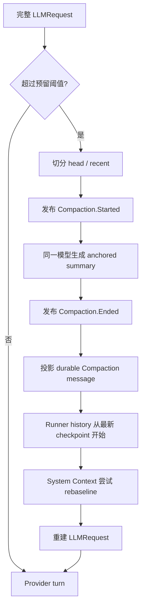

# 第 5 课：Model Provider 与 Context Compaction

[上一课](04-system-context-project-instructions.md) · [返回本阶段目录](README.md) · [Pi Mono 模型边界对照](../01-pi-mono/01-agent-runtime-mental-model.md)

## 核心问题

OpenCode 怎样从配置和 Session 中选出一个模型，把统一的 `LLMRequest` 转成 OpenAI、Anthropic 等不同协议，并在对话超过 Context Window 时继续工作？

先记住两条主线：

```text
模型调用：Config / Integrations
  → Catalog
  → Session model resolution
  → protocol Route
  → provider-native request
  → canonical LLM events

上下文压缩：完整 request 估算
  → 旧历史摘要 + 近期原文
  → durable Compaction checkpoint
  → history 截断视图 + Context rebaseline
  → 重建 provider request
```

Provider 适配解决“同一种 Agent 请求怎样调用不同模型 API”；Compaction 解决“有限 Context Window 怎样承载持续增长的 Session”。

## 源码版本与范围

本课基于 commit [`2f17fc9`](https://github.com/anomalyco/opencode/tree/2f17fc9613771af3de3b5a2715b836037d80c4b1)，追踪 V2 Core 与新的 `@opencode-ai/llm`：

```text
ConfigProviderPlugin
  → Catalog
  → SessionRunnerModel
  → @opencode-ai/llm Route / Protocol / Transport
  → SessionRunner
  → SessionCompaction
  → SessionHistory + SessionContextEpoch
```

本课不把 legacy `Provider`、V1 `SessionPrompt` 和 V2 active path 合并描述。固定版本仍处于迁移期，V2 Runner 实际支持的协议子集比 `packages/llm` 已实现的协议少。

## 先区分四个名字

| 概念 | 回答的问题 |
| --- | --- |
| Provider | 谁提供模型和连接，例如 OpenAI、Anthropic 或一个兼容服务？ |
| Catalog Model | 这个部署有哪些能力、限制、价格、API 类型和 request defaults？ |
| Route | 应该用什么 endpoint、auth、protocol、framing 和 transport 调用它？ |
| Session Model Ref | 当前 Session 选择哪个 `providerID / modelID / variant`？ |

`源码`：[`ModelV2.Info`](https://github.com/anomalyco/opencode/blob/2f17fc9613771af3de3b5a2715b836037d80c4b1/packages/schema/src/model.ts#L59-L105) 保存 Catalog 视角的模型元数据；真正交给 `LLM.request()` 的则是已经绑定 Route 的 `@opencode-ai/llm Model`。

所以，`openai/gpt-5` 这个字符串还不是一个可执行网络请求。Runtime 还需要确定 endpoint、认证、provider body、流式协议和 Context limits。

## Catalog 是模型部署的运行时真相

[`Catalog`](https://github.com/anomalyco/opencode/blob/2f17fc9613771af3de3b5a2715b836037d80c4b1/packages/core/src/catalog.ts#L13-L60) 在 Location runtime 中保存：

- Providers。
- 每个 Provider 下的 Models。
- 可选的 default model。

Catalog 不是一份静态 JSON。内置或外部 Plugins 可以 transform 它；配置 Provider plugin 也会把 Location 的配置叠加进去。

### 配置怎样叠加

[`Config`](https://github.com/anomalyco/opencode/blob/2f17fc9613771af3de3b5a2715b836037d80c4b1/packages/core/src/config.ts#L122-L131) 返回从低到高优先级的 entries：

```text
global config
  → project configs
  → 更具体的 .opencode configs
```

[`ConfigProviderPlugin`](https://github.com/anomalyco/opencode/blob/2f17fc9613771af3de3b5a2715b836037d80c4b1/packages/core/src/config/plugin/provider.ts#L41-L111) 按这个顺序：

1. 用最后一个已配置的 `model` 设置 Catalog default。
2. 更新 Provider 的 name、API、headers 和 body。
3. 更新 Model 的 API、capabilities、variants、limits、cost 和 enabled 状态。

同一字段后加载的配置覆盖先加载的配置；没有出现的字段保留前一层结果。

### Provider 与 Model 何时算 available

`源码`：[`Catalog.available()`](https://github.com/anomalyco/opencode/blob/2f17fc9613771af3de3b5a2715b836037d80c4b1/packages/core/src/catalog.ts#L160-L232) 会综合：

- Provider 是否 disabled。
- 是否已有配置 key 或可用 Integration connection。
- `provider.use` policy 是否已经把 Provider 从 Catalog 移除。
- Model 是否 enabled。

读取模型时，[`projectModel()`](https://github.com/anomalyco/opencode/blob/2f17fc9613771af3de3b5a2715b836037d80c4b1/packages/core/src/catalog.ts#L78-L97) 还会把 Provider 与 Model 两层配置合成最终视图：

```text
provider API defaults + model API override
provider request headers/body + model request headers/body
```

Model 层覆盖 Provider 层。这使同一个 Provider 下的不同部署可以复用 endpoint 与认证配置，同时保留模型级差异。

## V2 Runner 的实际模型选择顺序

[`SessionRunnerModel.locationLayer`](https://github.com/anomalyco/opencode/blob/2f17fc9613771af3de3b5a2715b836037d80c4b1/packages/core/src/session/runner/model.ts#L181-L216) 的固定版本顺序是：

```text
Session 显式 model
  → Catalog configured/default model
  → Catalog 中第一个 Runner 支持的 available model
```

具体规则：

| 情况 | 行为 |
| --- | --- |
| Session 有 model | 在 available models 中精确匹配 providerID + modelID。 |
| 显式模型不可用 | 返回 `ModelUnavailableError`，不会偷偷换模型。 |
| Session 没有 model | 先取 Catalog default。 |
| Catalog default 不受 V2 Runner 支持 | 从 available models 中找第一个受支持模型。 |
| 完全没有可用模型 | 返回 `ModelNotSelectedError`。 |

Catalog 默认模型如果没有显式配置，会回退到 release time 最新的 available model。`available()` 本身也按发布时间从新到旧排列，因此最终 fallback 倾向于最新的受支持模型。

### 模型切换是 Session 状态，不是 prompt 文本

`源码`：Session 创建时可以保存 model ref，也可以通过 [`switchModel`](https://github.com/anomalyco/opencode/blob/2f17fc9613771af3de3b5a2715b836037d80c4b1/packages/core/src/session.ts#L402-L415) 发布 durable `ModelSwitched` event。

这个事件会更新 Session 当前模型并成为可审计的 Session message，但 [`toLLMMessages()`](https://github.com/anomalyco/opencode/blob/2f17fc9613771af3de3b5a2715b836037d80c4b1/packages/core/src/session/runner/to-llm-message.ts#L115-L130) 不把“切换模型”作为对话文本发送给模型。下一轮直接用新的 Session state 解析 Route。

回放旧 assistant message 时，如果它来自另一个模型：

- 普通文本仍保留。
- reasoning 会降级为普通文本，或在为空时丢弃。
- 旧模型专属 provider metadata 不会注入新模型请求。

这是跨模型继续 Session 必须处理的协议兼容问题。

### 固定版本的 Agent model 边界

`源码`：配置 schema 和 `AgentV2.Info` 都能保存 Agent 的 `model`、`variant` 与 request overrides。

`限制`：本课固定 commit 的 V2 Runner 选择 Agent 与解析 Model 是两条独立路径。`SessionRunnerModel.resolve(session)` 只读取 `session.model` 和 Catalog，当前没有读取 `agent.info.model` 或 `agent.info.request`。

因此这一版本 active path 的有效优先级不是配置描述中暗示的“Session → Agent → global”，而是：

```text
Session → Catalog default → supported fallback
```

不要因为字段已经出现在 schema 中，就假定它已经接入执行路径。

## Variant 怎样进入一次调用

[`withVariant()`](https://github.com/anomalyco/opencode/blob/2f17fc9613771af3de3b5a2715b836037d80c4b1/packages/core/src/session/runner/model.ts#L104-L126) 先确定 variant：

- Session 显式 variant 优先。
- `undefined` 或 `default` 使用 Model 配置的默认 variant。
- 显式请求不存在的 variant 返回 `VariantUnavailableError`。

找到 variant 后，它的 headers 和 body 覆盖 Model request defaults。Variant 不是另一个模型身份，而是同一模型 Route 的请求参数组合，例如 reasoning effort、temperature 或 service tier。

## 从 Catalog Model 到可执行 Route

[`fromCatalogModel()`](https://github.com/anomalyco/opencode/blob/2f17fc9613771af3de3b5a2715b836037d80c4b1/packages/core/src/session/runner/model.ts#L131-L170) 在这个 commit 中只映射三类 API：

| Catalog API | V2 Runner Route | 认证 |
| --- | --- | --- |
| `@ai-sdk/openai` | OpenAI Responses | Bearer token |
| `@ai-sdk/anthropic` | Anthropic Messages | `x-api-key` |
| `@ai-sdk/openai-compatible` + URL | OpenAI-compatible Chat | Bearer token |

这里的 AI SDK package 名更像 Catalog 中的兼容性标记。V2 Runner 没有在调用时动态加载这些 AI SDK packages，而是映射到 `@opencode-ai/llm` 自己实现的协议 Route。

固定版本的 `packages/llm` 已经包含 Gemini、Bedrock 等更多协议，但没有被上述 V2 resolver 接入。显式选择这类 Catalog 模型会得到 `UnsupportedApiError`，不能用“LLM 包里有实现”推导“V2 Coding Agent 已能使用”。

### Credential 怎样进入 Route

Resolver 根据 Provider 找到 active Integration connection，再解析 Credential：

- stored key 或 OAuth access token 优先。
- 没有 connection 时才查看 Model request body 或 API settings 中的 `apiKey`。
- `apiKey` 从 provider JSON body 中移除，交给 Route auth。
- key credential 的 metadata 可以叠加到 request body；OAuth account metadata 不自动进入 body。

`源码`：这些规则集中在 [`apiKey()`、`withDefaults()` 与 `fromCatalogModel()`](https://github.com/anomalyco/opencode/blob/2f17fc9613771af3de3b5a2715b836037d80c4b1/packages/core/src/session/runner/model.ts#L83-L170)，避免认证 secret 被当成普通 provider 参数发送或记录。

## `@opencode-ai/llm` 如何抹平协议差异

Runner 只构造统一的：

```ts
LLM.request({
  model,
  system,
  messages,
  tools,
  toolChoice,
  providerOptions,
})
```

[`LLMClient.compile()`](https://github.com/anomalyco/opencode/blob/2f17fc9613771af3de3b5a2715b836037d80c4b1/packages/llm/src/route/client.ts#L341-L380) 再执行：

```text
合并 Route / Model / Request defaults
  → 应用 cache policy
  → Protocol.from(LLMRequest) 构造 provider body
  → 用 provider body schema 校验
  → Endpoint + Auth + headers 准备 Transport request
```

Route 把一次部署拆成几个正交维度：

| 维度 | 职责 |
| --- | --- |
| Protocol | 构造 provider body，并把 provider stream 解析为 canonical events。 |
| Endpoint | base URL 与 path。 |
| Auth | Bearer、header 或其他签名方式。 |
| Framing | SSE、JSON lines、WebSocket 等帧边界。 |
| Transport | HTTP / WebSocket 的实际 I/O。 |

例如 [`OpenAI Responses Route`](https://github.com/anomalyco/opencode/blob/2f17fc9613771af3de3b5a2715b836037d80c4b1/packages/llm/src/protocols/openai-responses.ts#L950-L992) 和 [`Anthropic Messages Route`](https://github.com/anomalyco/opencode/blob/2f17fc9613771af3de3b5a2715b836037d80c4b1/packages/llm/src/protocols/anthropic-messages.ts#L824-L853) 最终都输出统一的：

```text
text-delta
reasoning-delta
tool-call / tool-result
step-finish / finish
provider-error
```

Session Runner 因而不需要为每家 Provider 重写工具循环和事件持久化。

## Provider retry 有两层，不能混为一谈

### HTTP RequestExecutor 的短重试

[`RequestExecutor`](https://github.com/anomalyco/opencode/blob/2f17fc9613771af3de3b5a2715b836037d80c4b1/packages/llm/src/route/executor.ts#L35-L38) 对 retryable HTTP errors 最多额外尝试两次：

- Rate limit 和 Provider internal errors 可重试。
- 优先遵守 `Retry-After` / `retry-after-ms`，但单次最多等待 10 秒。
- 没有服务器提示时使用带随机抖动的指数退避。
- Authentication、quota、invalid request、content policy 和当前 Transport errors 不重试。

这些重试发生在 HTTP response stream 交给协议解析器之前，不会产生 Session `Retried` message。

### Session Runner 没有通用 provider-turn retry

Provider stream 已经开始后出现 `provider-error`，或 raw `LLMError` 逃出 stream 时，Session Runner 会持久化失败并停止 continuation。固定版本虽然定义了 `session.next.retried` event schema，但 active Runner 没有发布它。

唯一专门的 Session-level recovery 是 Context overflow compaction。它不是一般网络重试。

## Compaction 何时触发

[`compactIfNeeded()`](https://github.com/anomalyco/opencode/blob/2f17fc9613771af3de3b5a2715b836037d80c4b1/packages/core/src/session/compaction.ts#L225-L240) 在真正调用 Provider 前估算：

```text
JSON.stringify({ system, messages, tools })
  → 按 4 chars ≈ 1 token 估算
```

触发条件是：

```text
estimated request tokens
  > model context limit - max(model output limit, configured buffer)
```

默认设置：

| 设置 | 默认值 | 作用 |
| --- | ---: | --- |
| `auto` | `true` | 是否在 provider request 前主动判断。 |
| `buffer` | 20,000 tokens | 为输出和估算误差保留空间。 |
| `keep.tokens` | 8,000 tokens | 尽量保留最近对话的原文。 |

`源码`：Token 估算只是 [`length / 4`](https://github.com/anomalyco/opencode/blob/2f17fc9613771af3de3b5a2715b836037d80c4b1/packages/core/src/util/token.ts#L1-L5)，不是 Provider 的真实 tokenizer。buffer 正是在吸收这种误差，但它不能保证所有协议都精确命中阈值。

## 压缩的不是整个 request，而是旧 Session 历史

[`select()`](https://github.com/anomalyco/opencode/blob/2f17fc9613771af3de3b5a2715b836037d80c4b1/packages/core/src/session/compaction.ts#L128-L159) 从最新消息向前累计，形成：

```text
head：较旧历史，交给模型生成摘要
recent：最近约 keep.tokens 的序列化原文，直接保留
```

序列化会保留用户、assistant、reasoning、tool call、tool result、system update 和 shell 信息，但：

- Tool 与 shell output 单项最多保留 2,000 字符。
- Media 只保存 MIME 和文件名说明，不嵌入 base64。
- 已有 Compaction message 不作为普通对话再次序列化。

这样做的目的不是生成“漂亮总结”，而是构造可继续工作的 checkpoint：任务目标、关键约束、已完成/进行中/阻塞状态、下一步和相关文件必须保留。

### 摘要本身也是一次模型调用

[`compactAfterOverflow()`](https://github.com/anomalyco/opencode/blob/2f17fc9613771af3de3b5a2715b836037d80c4b1/packages/core/src/session/compaction.ts#L170-L224) 使用当前 Session 已解析出的同一个 Model：

```text
messages = [user(summary prompt)]
tools = []
max output = min(model output limit, 4096)
```

它不携带 Agent system、Context Epoch baseline 或工具目录，而是根据已经序列化进 summary prompt 的对话生成结构化摘要。若 summary prompt 自己无法放进 Context Window、Provider 失败、返回 provider error 或没有文本，则压缩失败。

重复压缩时，旧 checkpoint 的 summary 与 recent 会参与新摘要：仍然有效的信息被合并，过时信息应被移除；新的 recent 再作为原文锚点保留。

## Compaction 是 durable checkpoint，不是删除历史

成功流程：



`源码`：[`SessionHistory`](https://github.com/anomalyco/opencode/blob/2f17fc9613771af3de3b5a2715b836037d80c4b1/packages/core/src/session/history.ts#L13-L52) 只在 Runner 查询时从最新 Compaction sequence 开始取历史。旧消息仍保存在数据库中，没有被物理删除。

Checkpoint 在下一轮被翻译为普通 user message：

```xml
<conversation-checkpoint>
  <summary>...</summary>
  <recent-context>...</recent-context>
</conversation-checkpoint>
```

其中明确声明它是 historical context，不是新指令。摘要不进入 privileged system channel，避免把历史中的普通内容提升成系统指令。

## 预压缩与 Overflow recovery 的区别

### 预压缩

Runner 组装完整 request 后、开始 provider stream 前调用 `compactIfNeeded()`。成功后以相同 Agent step 重建请求；摘要调用不消耗一次 Coding Agent step。

### Provider 报 overflow 后恢复

Provider 可能使用不同 tokenizer，或实际协议 body 比估算更大，所以预估没有触发也仍可能收到 Context overflow。

Overflow 可以从两条路径被分类：

- HTTP 4xx body 被 `RequestExecutor` 识别为 `InvalidRequest / context-overflow`。
- OpenAI、Anthropic 等协议把 stream error 归一化为 `provider-error / context-overflow`。

[`SessionRunner`](https://github.com/anomalyco/opencode/blob/2f17fc9613771af3de3b5a2715b836037d80c4b1/packages/core/src/session/runner/llm.ts#L231-L289) 只在 assistant 尚未开始输出时：

1. 暂不发布原始 overflow error。
2. 强制尝试一次 Compaction。
3. 成功则从 checkpoint 重建 request。
4. 失败则发布原始 overflow error。

压缩后第二次 provider attempt 不再允许另一次 overflow recovery；第二次 overflow 会成为 durable assistant error。

这个“一次且必须在输出前”的边界避免：

- 无限“压缩 → 仍超限 → 再压缩”循环。
- 模型已经输出部分文本或工具调用后，隐藏失败并重放请求造成重复输出或副作用。

`源码`：即使 `compaction.auto` 是 `false`，它只跳过主动阈值检查；真实 provider overflow 的一次恢复路径仍会直接调用 `compactAfterOverflow()`。

## Compaction 与 System Context Epoch 怎样配合

上一课讲过，System Context baseline 不能随意改写历史。Compaction 建立新的对话边界后，[`SessionContextEpoch.prepare()`](https://github.com/anomalyco/opencode/blob/2f17fc9613771af3de3b5a2715b836037d80c4b1/packages/core/src/session/context-epoch.ts#L40-L78) 会尝试建立新的 baseline generation：

```text
新的 baseline：checkpoint 时刻的完整环境状态
新的 baseline_seq：compaction sequence
messages：checkpoint + 此后的对话和 Context updates
```

如果某个 Context source 暂时 unavailable，replacement 会被阻止。Runner 继续使用旧 baseline，同时保留旧 baseline 之后仍有效的 system updates，不会因为压缩误丢项目规则。

所以一次安全压缩必须同时处理两类状态：

| 状态 | 压缩后的表达 |
| --- | --- |
| Conversation state | durable summary + recent checkpoint。 |
| Environment / instruction state | 新 Context Epoch baseline，或旧 baseline + updates。 |

只总结 transcript 而不处理动态 system context，会造成上下文时间线不一致。

## 当前版本的实现边界

`源码` / `限制`：固定 commit 需要明确记录：

- V2 Runner 只接入 OpenAI Responses、Anthropic Messages 和带 URL 的 OpenAI-compatible Chat；`packages/llm` 的其他协议不能自动算作可用。
- Agent 的 model、variant 和 request 配置已经 materialize，但 V2 Runner model resolution 尚未消费它们。
- `ConfigCompaction` 声明了 `prune`，当前 V2 `SessionCompaction.settings()` 没有读取该字段。
- V2 `session.compact()` API 当前返回 `OperationUnavailableError`；本课只有 automatic 与 overflow recovery 路径。
- Compaction 依赖近似 token estimator，不读取 provider usage 作为下一轮精确输入预算。
- 如果 system、tools 或一条无法有效切分的近期消息本身就占满窗口，摘要旧历史未必能解决 overflow。
- HTTP executor 有短重试，但 Session Runner 没有 durable retry status、通用 provider-turn retry 或崩溃后自动 continuation recovery。

## 与 Pi Mono 对照

| 问题 | Pi Mono 最小 Runtime | OpenCode V2 |
| --- | --- | --- |
| Provider 边界 | Provider 实现统一 `stream()` / event contract。 | Catalog + Route + Protocol + Transport 分层。 |
| 模型选择 | Runtime 调用方直接传 model。 | Session ref、Catalog default、availability 和 policy 共同解析。 |
| 协议适配 | SDK Provider 负责。 | `@opencode-ai/llm` 把 canonical request 降低为 provider body。 |
| Retry | 第一阶段只解释事件与错误 contract。 | HTTP executor 有有限重试，Session provider-turn 不通用重试。 |
| Context 超限 | 第一阶段未实现产品级持久化压缩。 | 摘要 + recent 成为 durable checkpoint。 |
| 压缩后环境 | 由调用方重建 Context。 | Context Epoch 在 compaction sequence 尝试 rebaseline。 |

OpenCode 新增的关键不是“调用模型前写一段 summary”，而是把模型部署解析、协议适配、错误分类、对话 checkpoint 和环境 baseline 组合成一条可继续的 Session 时间线。

## 30 秒复述

1. Provider、Catalog Model、Route 和 Session Model Ref 分别是什么？
2. 为什么显式 Session model 不可用时不能静默 fallback？
3. 当前 V2 Runner 的真实模型优先级是什么？Agent model 为什么不能算已接入？
4. `@ai-sdk/openai` 为什么最终走的是本地 OpenAI Responses Route？
5. Protocol、Endpoint、Auth、Framing 和 Transport 各自负责什么？
6. HTTP retry 与 Session-level retry 有什么区别？
7. Compaction 为什么同时保留 summary 与 recent 原文？
8. 为什么 Compaction message 是 user checkpoint，而不是 system prompt？
9. Overflow recovery 为什么只允许一次，而且必须发生在 assistant 输出前？
10. 压缩后为什么还需要 Context Epoch rebaseline？

## 验证状态

- `源码`：Catalog、Config Provider、Session model resolution、variants、credentials 与三个 active Routes 已从固定 commit 确认。
- `源码`：LLM request compilation、HTTP retry、provider error classification、自动压缩、overflow recovery、history boundary 与 Context rebaseline 已从固定 commit 确认。
- `源码`：上游包含 Session Runner compaction / overflow recovery、Route model resolution 和 RequestExecutor retry 测试。
- `未验证`：本地 `sources/opencode` 未安装 workspace dependencies，本课没有声称运行过上游 Bun tests。

## 下一步

下一课追踪 Event Stream 与客户端状态同步：durable Session events 怎样经过 Server / SDK 到达 TUI，客户端又怎样区分历史快照、实时增量、权限请求与执行状态。
