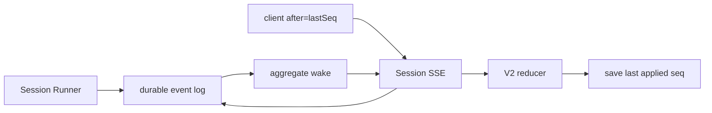
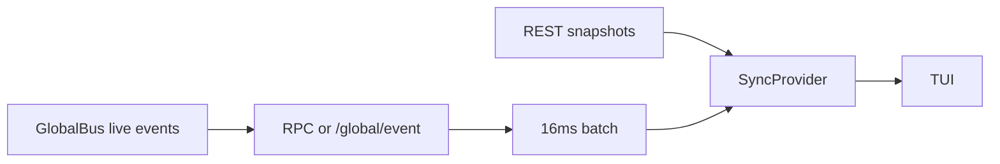

# 第 6 课：Event Stream 与客户端状态同步

[上一课](05-model-provider-context-compaction.md) · [返回本阶段目录](README.md) · [Pi Mono 事件流对照](../01-pi-mono/05-event-driven-agent-state.md)

## 核心问题

OpenCode 怎样把 Server 内发生的 Session 变化送到客户端，并让 TUI 在历史快照、实时增量、断线重连和并发更新之间维持可用状态？

先把三个经常混淆的概念拆开：

```text
durable event log：数据库里的可靠事实，可按 Session sequence 重放
live event stream：通知客户端“刚刚发生了变化”，连接中断时可能丢失
client store：把快照和事件归约成 UI 当前要显示的状态
```

OpenCode 固定版本没有用一条统一事件流解决所有问题，而是同时存在：

```text
V2 Session durable stream
  /api/session/:sessionID/history
  /api/session/:sessionID/event

Global live stream
  /api/event
  /global/event
  Worker RPC global.event
```

判断一条流是否可靠，不能只看它是不是 SSE。关键要看：事件是否持久化、有没有 cursor、重连后能否补读缺口，以及客户端怎样把补读结果合并进状态。

## 源码版本与范围

本课基于 commit [`2f17fc9`](https://github.com/anomalyco/opencode/tree/2f17fc9613771af3de3b5a2715b836037d80c4b1)，追踪：

```text
EventV2 durable log
  → Session HTTP API
  → GlobalBus bridge
  → SDK / Worker RPC
  → TUI SyncProvider / DataProvider
```

固定版本正处于 V1 / V2 迁移期。本课会分别描述 V2 Session API、全局实时流和现有 TUI，不把它们误写成已经完全统一的一套系统。

## 第一条通道：V2 Session durable stream

[`Session protocol`](https://github.com/anomalyco/opencode/blob/2f17fc9613771af3de3b5a2715b836037d80c4b1/packages/protocol/src/groups/session.ts#L307-L343) 暴露两个按 Session aggregate 读取的端点：

| API | 类型 | 含义 |
| --- | --- | --- |
| `GET /api/session/:sessionID/history?after=N&limit=M` | 有限分页 | 读取 `seq > N` 的一页 durable events，并返回 `hasMore`。 |
| `GET /api/session/:sessionID/event?after=N` | SSE 长连接 | 先重放 `seq > N` 的 durable events，再持续发送新事件。 |

`after` 是排他的 aggregate sequence，不是消息 ID、时间戳或全局 offset。每个 Session 都有自己的 sequence 时间线。

Server handler 本身很薄：[`history`](https://github.com/anomalyco/opencode/blob/2f17fc9613771af3de3b5a2715b836037d80c4b1/packages/server/src/handlers/session.ts#L333-L356) 调用有限分页读取；[`events`](https://github.com/anomalyco/opencode/blob/2f17fc9613771af3de3b5a2715b836037d80c4b1/packages/server/src/handlers/session.ts#L357-L364) 返回持续的 Session event stream。

### 为什么不会在“读历史”和“开始监听”之间漏事件

一个朴素实现容易产生竞态：

```text
读完数据库历史
  → 此时新事件提交
  → 客户端才开始订阅 live bus
  → 新事件永久漏掉
```

[`EventV2.durable()`](https://github.com/anomalyco/opencode/blob/2f17fc9613771af3de3b5a2715b836037d80c4b1/packages/core/src/event.ts#L565-L603) 的顺序不同：

1. 先为这个 aggregate 安装 wake subscription。
2. 再从数据库读取 `seq > after` 的 durable events。
3. 用最后一条事件的 sequence 推进本地 cursor。
4. 每次收到 wake 后，再从数据库读取 `seq > cursor`。

所以 PubSub 中传递的不是可靠业务 payload，而只是“数据库可能有新内容”的 wake：

```text
durable event commit
  → database sequence 是事实来源
  → wake 只负责唤醒 reader
  → reader 按 sequence 补齐全部事实
```

wake 使用容量 1 的 sliding PubSub。多个 wake 可以合并，因为下一次数据库查询会一次读出 cursor 之后的所有事件；通知数量不需要与事件数量一一对应。

这是一种很实用的 Harness 设计：**把可靠性放在 event log + cursor，把进程内通知降级为可合并的提示。**

### 客户端应怎样恢复

一个直接消费 V2 Session stream 的客户端可以保存最后成功归约的 `seq`：

```text
首次连接：after 未设置，读取完整 Session event history
正常消费：每归约一条 durable event，就保存它的 seq
连接中断：使用 after=lastAppliedSeq 重新订阅
重连成功：Server 先补发缺口，再继续 tail 新事件
```

分页 `history` 适合显式回放、审计或批量重建；持续 `event` 适合“补历史后跟随实时变化”。两者共享同一套 sequence 语义。

## 第二条通道：Global live event stream

OpenCode 还有两条面向全局变化的 live stream，它们不能自动等同于 durable replay。

### `/api/event`

[`packages/server` event handler](https://github.com/anomalyco/opencode/blob/2f17fc9613771af3de3b5a2715b836037d80c4b1/packages/server/src/handlers/event.ts#L9-L48) 会：

- 先发送 `server.connected`。
- 订阅所有当前 EventV2 live events。
- 使用容量 256 的 bounded subscriber；消费者跟不上时以 overflow failure 终止，而不是无限占用内存。
- 每 15 秒发送一次 heartbeat comment。

它没有 `after` query，也没有重放数据库缺口。即使 payload 中某些事件原本是 durable 的，这个端点本身仍是连接期 live subscription。

### `/global/event`

现有 TUI 远程模式主要消费 [`/global/event`](https://github.com/anomalyco/opencode/blob/2f17fc9613771af3de3b5a2715b836037d80c4b1/packages/opencode/src/server/routes/instance/httpapi/handlers/global.ts#L33-L65)。这条流来自 `GlobalBus`：

- 连接时发送 `server.connected`。
- 转发跨 directory / workspace 的全局事件。
- 每 10 秒发送一个 `server.heartbeat` payload。
- 没有 Session `after` cursor，也没有 durable history replay。

所以两条 global stream 的语义是“告诉在线客户端现在发生了什么”，而不是“保证客户端最终收到过去发生过的一切”。

## V2 event 怎样桥接到现有全局总线

[`event-v2-bridge.ts`](https://github.com/anomalyco/opencode/blob/2f17fc9613771af3de3b5a2715b836037d80c4b1/packages/opencode/src/event-v2-bridge.ts#L35-L60) 会为每个 EventV2 event 向 `GlobalBus` 发出普通实时 payload：

```ts
{
  id,
  type,
  properties: event.data,
}
```

如果原事件是 durable 的，它还会再发一个 `type: "sync"` payload，包含：

```text
versioned event type
seq
aggregateID
event data
```

这两份 payload 服务于不同消费者：

| payload | 用途 |
| --- | --- |
| 普通 event | 让现有实时客户端按事件类型更新 UI。 |
| `sync` event | 携带可同步的 durable envelope，供 workspace / control-plane 路径复制或回放。 |

TUI 的 [`useEvent()`](https://github.com/anomalyco/opencode/blob/2f17fc9613771af3de3b5a2715b836037d80c4b1/packages/tui/src/context/event.ts#L9-L29) 主动过滤 `sync` payload，只把普通实时事件交给 UI stores。因此，不能因为 GlobalBus 中出现了 `seq`，就认为普通 TUI 已经在使用 sequence cursor 恢复。

## 本地 TUI 与远程 TUI 的传输差异

OpenCode TUI 始终通过 Client/Server contract 读取状态，但本地与远程的 transport 不同。

### 本地默认模式

```text
TUI process
  ↕ RPC fetch + global.event
Worker
  ↕ in-process Server
Session / Tools / Providers
```

[`worker.ts`](https://github.com/anomalyco/opencode/blob/2f17fc9613771af3de3b5a2715b836037d80c4b1/packages/opencode/src/cli/tui/worker.ts#L23-L48) 监听 `GlobalBus`，通过 RPC `global.event` 转发事件，同时把 SDK fetch 转进 Worker 内的 Server app。

[`tui.ts`](https://github.com/anomalyco/opencode/blob/2f17fc9613771af3de3b5a2715b836037d80c4b1/packages/opencode/src/cli/cmd/tui.ts#L238-L249) 再把自定义 fetch 和 `EventSource` 注入 TUI。这样本地模式不需要开放 TCP 端口，但仍保留 SDK / HTTP API 的产品边界。

### 远程或显式 Server 模式

没有自定义 `EventSource` 时，[`SDKProvider`](https://github.com/anomalyco/opencode/blob/2f17fc9613771af3de3b5a2715b836037d80c4b1/packages/tui/src/context/sdk.tsx#L82-L131) 订阅 `/global/event` SSE：

- 事件在最多 16ms 的窗口内用 Solid `batch()` 归约，减少连续 token delta 导致的重复 render。
- 断线后由外层循环按 1 秒到 30 秒指数退避重新连接。
- 每次连接禁用生成 SDK 内层重试，避免两套 retry loop 叠加。

批处理改变的是 render 频率，不改变事件顺序；多个 event 仍按入队顺序逐个交给 stores。

## TUI 不是一个 Store，而是迁移中的两套状态系统

[`app.tsx`](https://github.com/anomalyco/opencode/blob/2f17fc9613771af3de3b5a2715b836037d80c4b1/packages/tui/src/app.tsx#L298-L335) 当前同时挂载：

```text
SDKProvider
  → SyncProvider
    → DataProvider
      → UI
```

### `SyncProvider`：现有 UI 的主要状态源

[`SyncProvider`](https://github.com/anomalyco/opencode/blob/2f17fc9613771af3de3b5a2715b836037d80c4b1/packages/tui/src/context/sync.tsx#L64-L138) 保存：

- Session、message 和 part。
- Permission、question 与 session status。
- Diff、todo、provider、agent、command、MCP、LSP 等产品状态。

它采用“REST snapshot + global live delta”的组合：

```text
bootstrap
  → REST 拉取初始 Session / provider / status 等快照
  → status 从 loading 进入 partial，再进入 complete

event subscription
  → message.updated / message.part.delta
  → permission.asked / question.asked
  → session.status / session.diff 等
  → 增量修改 Solid store
```

`源码`：[`bootstrap()`](https://github.com/anomalyco/opencode/blob/2f17fc9613771af3de3b5a2715b836037d80c4b1/packages/tui/src/context/sync.tsx#L445-L549) 先等待阻塞 UI 的关键数据，再异步补 command、LSP、MCP、formatter 和 session status 等次要状态。

### Snapshot 与 live delta 的竞态

进入一个 Session 时，REST 的 `session.messages()` 可能比 live token delta 更晚返回：

```text
开始 REST hydration
  → live text delta 已把 part 更新到 "hello"
  → 较旧 REST response 只包含 "hel"
  → 如果直接覆盖，UI 会倒退
```

[`session.sync()`](https://github.com/anomalyco/opencode/blob/2f17fc9613771af3de3b5a2715b836037d80c4b1/packages/tui/src/context/sync.tsx#L588-L659) 在 hydration 期间记录被 live events 触碰过的 message ID 和 part ID。REST response 合并时，触碰过的对象优先保留当前 store 版本，避免旧快照覆盖新增量。

它还只保留最近 100 条可见 messages，并清理窗口之外的 parts。这个限制控制 TUI 内存和归约成本，不代表 Server 删除了更早历史。

### Permission、Question 与执行状态目前走哪一套

现有权限对话框直接读取 [`SyncProvider`](https://github.com/anomalyco/opencode/blob/2f17fc9613771af3de3b5a2715b836037d80c4b1/packages/tui/src/routes/session/permission.tsx#L111-L132)；prompt 的 busy / idle 也读取 [`sync.data.session_status`](https://github.com/anomalyco/opencode/blob/2f17fc9613771af3de3b5a2715b836037d80c4b1/packages/tui/src/component/prompt/index.tsx#L154-L164)。

因此当前主要 UI 的“正在执行”“等待权限”“等待问题回答”仍属于现有 Sync path，不应从 V2 durable Session messages 反向推断它们已经统一。

### `DataProvider`：V2-native reducer 的迁移目标

[`DataProvider.handleEvent()`](https://github.com/anomalyco/opencode/blob/2f17fc9613771af3de3b5a2715b836037d80c4b1/packages/tui/src/context/data.tsx#L124-L403) 直接归约 `session.next.*` events，可以重建：

- user、system、synthetic 和 shell messages。
- assistant step 的 started / ended / failed。
- text 与 reasoning 的 start / delta / end。
- tool 的 pending / running / progress / completed / error。
- compaction checkpoint。

这说明 V2 event schema 不只是日志格式，也可以作为确定性的 UI reducer input。但固定版本中 `DataProvider` 的使用面仍很窄；例如 [`prompt autocomplete`](https://github.com/anomalyco/opencode/blob/2f17fc9613771af3de3b5a2715b836037d80c4b1/packages/tui/src/component/prompt/autocomplete.tsx#L87-L100) 同时读取 Sync / Data，目前只用 Data 获取 V2 references，主要 Session timeline、permission dialog 和 prompt status 仍依赖 `SyncProvider`。

`限制`：`DataProvider` 虽然声明了 V2 permission / question collections 和 [REST refresh 方法](https://github.com/anomalyco/opencode/blob/2f17fc9613771af3de3b5a2715b836037d80c4b1/packages/tui/src/context/data.tsx#L416-L451)，但 `handleEvent()` 尚未归约 `permission.v2.*` / `question.v2.*` events，也没有在默认 mount 时为每个 Session 自动刷新它们。V2 的 [Permission](https://github.com/anomalyco/opencode/blob/2f17fc9613771af3de3b5a2715b836037d80c4b1/packages/schema/src/permission.ts#L43-L52) / [Question](https://github.com/anomalyco/opencode/blob/2f17fc9613771af3de3b5a2715b836037d80c4b1/packages/schema/src/question.ts#L70-L86) definitions 又不是 Session durable events，pending requests 保存在进程内。不能把它们描述成已经具备 durable replay 的 UI 状态。

## “Session 正在运行”也有两种语义

V2 [`session.active`](https://github.com/anomalyco/opencode/blob/2f17fc9613771af3de3b5a2715b836037d80c4b1/packages/server/src/handlers/session.ts#L71-L80) 返回当前进程的 coordinator 正在执行哪些 Session。

[`RunCoordinator`](https://github.com/anomalyco/opencode/blob/2f17fc9613771af3de3b5a2715b836037d80c4b1/packages/core/src/session/run-coordinator.ts#L24-L103) 的 active map 是内存状态：执行开始时加入、settle 后删除。它适合回答“这个进程现在是否拥有执行”，不是 durable Session history。

现有 TUI 使用的 `session.status` 则来自 legacy status service 和全局实时事件。两者都不应该与 `session.next.step.started / ended` 简化成完全相同的状态机：一个 Session 可能在 provider step 之间处理 queue、等待 permission，或者因为进程重启而没有 active owner。

## 断线重连的真实边界

生成的 [`SSE client`](https://github.com/anomalyco/opencode/blob/2f17fc9613771af3de3b5a2715b836037d80c4b1/packages/sdk/js/src/v2/gen/core/serverSentEvents.gen.ts#L91-L112) 支持读取 SSE `id` 并在重连时发送 `Last-Event-ID`。

但当前 `/api/event` 与 `/global/event` 编码事件时都把 SSE `id` 设为 `undefined`，Server 也没有用 `Last-Event-ID` 做 history replay。`SDKProvider` 重连全局流后，只是从新的 live subscription 继续消费，并不会自动再次调用 `SyncProvider.bootstrap()`。

因此需要明确区分：

| 场景 | 能否补缺口 | 原因 |
| --- | --- | --- |
| V2 Session stream 使用 `after=lastSeq` 重连 | 可以 | 数据库 durable log + aggregate sequence。 |
| `/api/event` 断线重连 | 不可以自动补 | bounded live stream，无 `after`。 |
| `/global/event` / TUI 断线重连 | 不可以自动补 | GlobalBus live stream，无 cursor，当前不主动 rehydrate。 |
| TUI 首次打开 Session | 可以获取当前快照 | REST hydration，但它不是逐事件 replay。 |

`限制`：全局流断线窗口中的事件可能丢失。后续 REST refresh、Server instance disposed 后的 bootstrap，或另一条完整 update 可能修正部分状态，但不能把这些偶然修正写成全局 exactly-once / eventually-consistent 保证。

## 两条端到端路径不要混写

### V2 replay-aware 客户端



这里的恢复锚点是 durable sequence。

### 当前 TUI 主路径



这里的初始锚点是 REST snapshot，在线变化依靠 live events；当前没有统一的 reconnect cursor。

## 常见误解

### “用了 SSE 就不会丢事件”

SSE 只定义传输格式和连接行为。没有持久化日志、cursor 与 Server replay，断线仍会产生缺口。

### “EventV2 都是 durable 的”

EventV2 同时承载 durable 与 ephemeral definitions。Permission / Question 等进程内请求可以发布 EventV2 live event，但没有因此自动进入 Session durable log。

### “GlobalBus 中有 sync event，所以 TUI 能自动恢复”

普通 TUI `useEvent()` 会过滤 `sync` payload。它当前主要通过 REST bootstrap + 普通 live events 维护状态。

### “TUI 的 Store 就是 Server 真相”

Store 是面向渲染的 projection：它会裁剪到最近 100 条消息、批处理 delta，并可能在断线窗口变旧。durable event log、Server operational state 与 UI projection 是三个不同层次。

### “started / ended events 足够表达 busy / idle”

Provider step 只是整个 Session drain 的一部分。执行 owner、等待权限、queue promotion 和 step 生命周期必须分开建模。

## 与 Pi Mono 对照

| 问题 | Pi Mono 最小 Runtime | OpenCode |
| --- | --- | --- |
| 流式事件 | Runtime 内的 Agent event stream。 | Session durable stream + global live streams + Worker RPC。 |
| 历史恢复 | 由调用方保存 Agent state。 | V2 可按 aggregate sequence 回放 durable Session events。 |
| 客户端状态 | 示例直接消费事件。 | REST bootstrap、Solid stores、事件 reducer 与 hydration merge。 |
| 背压 | 第一阶段聚焦 generator 逐事件消费。 | `/api/event` 使用容量 256 的 bounded subscriber。 |
| 本地模式 | Runtime 与调用方通常同进程。 | Worker 承载 Server，TUI 仍使用 SDK / transport boundary。 |
| 迁移复杂度 | 单一最小 Runtime 心智模型。 | V1 / V2 events 与 Sync / Data 双 Store 并存。 |

OpenCode 新增的不是“把 token delta 发给 TUI”这么简单，而是把事件持久化、在线通知、跨进程传输、客户端 projection 和迁移兼容拆成不同层。

## 30 秒复述

1. Durable event log、live stream 和 client store 分别解决什么问题？
2. `/history` 与 `/event` 的 `after` 为什么是排他的 Session sequence？
3. `EventV2.durable()` 为什么先订阅 wake，再读数据库？
4. wake 为什么可以容量为 1，而不会漏 durable events？
5. `/api/event` 和 `/global/event` 为什么不能称为 replayable stream？
6. V2 bridge 为什么同时发送普通 event 与 `sync` event？
7. 本地 TUI 为什么没有开放端口，却仍然保留 Client/Server 边界？
8. `SyncProvider` 怎样避免旧 REST response 覆盖 live delta？
9. `SyncProvider` 与 `DataProvider` 当前分别承担什么？
10. 为什么 SDK 支持 `Last-Event-ID` 仍不代表全局流可以恢复？

## 验证状态

- `源码`：Session history / SSE contract、durable database reread、aggregate wake 与 cursor 推进已从固定 commit 确认。
- `源码`：`/api/event`、`/global/event`、V2 bridge、本地 Worker RPC 与远程 TUI reconnect 已从固定 commit 确认。
- `源码`：Sync / Data 双 Store、hydration race protection、message window、permission / status consumers 已从固定 commit 确认。
- `限制`：固定版本的当前 TUI 还没有把 V2 Session durable replay、V2 permission / question 与主要 UI 完整统一。
- `未验证`：本地 `sources/opencode` 未安装 workspace dependencies，本课没有声称运行过上游 Bun tests。

## 下一步

下一课做一次完整 Coding Task 的端到端追踪：从用户 prompt、provider turn、tool permission、文件修改和验证，一直追到 durable history 与 TUI projection，并用这条链复盘第二阶段已经学到的全部边界。
