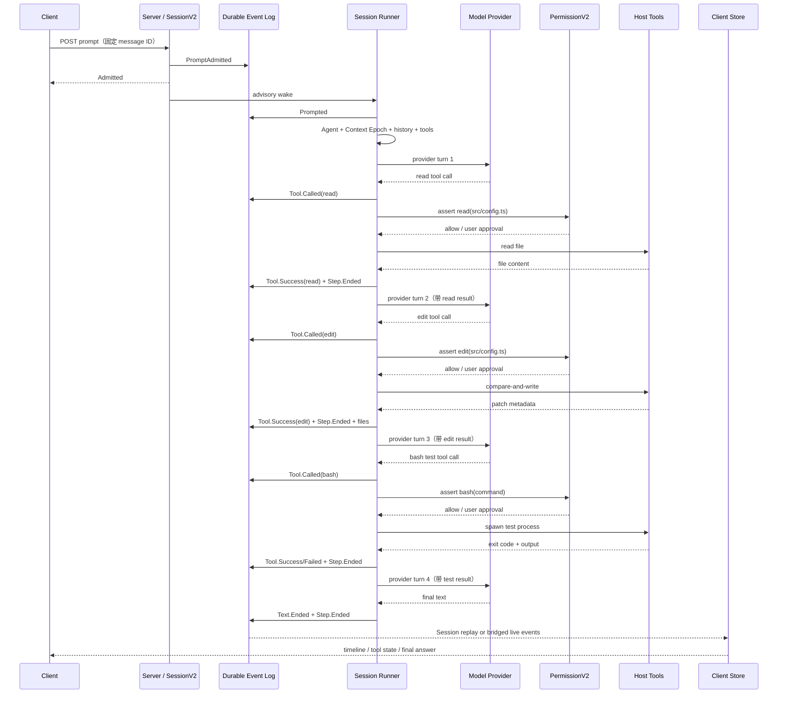

# 第 7 课：完整 Coding Task 端到端追踪与阶段复盘

[上一课](06-event-stream-client-state.md) · [返回本阶段目录](README.md) · [横向对照](../comparison.md)

## 阶段结论

OpenCode 展示了一个最小 Agent Runtime 怎样成长为完整 Coding Agent：

```text
OpenCode Coding Agent =
  多种产品入口与 Client / Server 边界
  + durable Session inbox 与串行执行器
  + Model Catalog / Route / Provider protocol
  + 项目感知的 System Context
  + 受 Permission policy 约束的 Coding Tools
  + durable events、live streams 与客户端 projections
```

Pi Mono 的核心仍然存在：模型提出 tool call，Runtime 执行工具，把 result 放回 Context，再调用模型。OpenCode 的主要增量，是让这条 loop 可以被多个客户端使用、在 Session 中记录、受项目规则约束、持续运行并被 UI 观察。

但公式里没有 OS Sandbox。Permission policy 决定“OpenCode 是否同意执行”，不能限制已经获准运行的宿主进程到底拥有什么系统权限。这正是第三阶段要继续研究的问题。

## 本课任务

用一个具体任务串联前六课：

```text
把 src/config.ts 中的默认超时从 30 秒改为 45 秒，
运行相关测试，并说明修改和验证结果。
```

为了固定教学路径，假设模型依次选择：

```text
read src/config.ts
  → edit src/config.ts
  → bash 运行相关测试
  → 最终文本回答
```

`限制`：这不是一次真实模型实验。实际模型可能使用 `grep`、`apply_patch`、一次产生多个 tool calls，或选择不同测试命令。本课追踪的是源码允许的一条具体合法路径，不把模型选择描述成确定行为。

## 先画出四条时间线

一次 Coding Task 并不只是一串聊天消息：

| 时间线 | 保存什么 | 例子 |
| --- | --- | --- |
| Durable Session facts | 可按 sequence 回放的 Session 事实。 | Prompt admitted / promoted、Tool called / success、Step ended。 |
| Process operational state | 当前进程正在做什么。 | active drain、pending permission、tool fiber、wake。 |
| Host side effects | 工作区和系统真正发生的变化。 | 文件被写入、测试进程运行、网络请求。 |
| Client projection | 当前客户端为了渲染保存的视图。 | message、part、tool status、diff、busy / idle。 |

这四条时间线通常一起推进，但可靠性边界不同。Session event 已经落库，不代表文件副作用可回滚；文件已经修改，不代表 `Tool.Success` 已经落库；Server 已经完成，不代表断线的 TUI 一定收到了最后一个 live event。

## 完整时序



图中每个 provider turn 还可能产生 reasoning、text delta、tool input delta、snapshot 和 token usage。为了突出 Coding Task 主线，这里只画出决定状态转换的事件。

## 第 1 段：Prompt 先成为可靠工作

Client 调用 V2 prompt API 后，[`SessionV2.prompt()`](https://github.com/anomalyco/opencode/blob/2f17fc9613771af3de3b5a2715b836037d80c4b1/packages/core/src/session.ts#L360-L390) 的顺序是：

```text
PromptAdmitted durable event
  → session_input(admitted_seq, promoted_seq=null)
  → execution.wake(sessionID)
  → 返回 Admitted
```

所以 HTTP 成功只证明输入已经可靠接纳。Runner 到达安全边界后，[`promoteSteers()`](https://github.com/anomalyco/opencode/blob/2f17fc9613771af3de3b5a2715b836037d80c4b1/packages/core/src/session/input.ts#L216-L266) 才发布 `Prompted`，把输入变成模型可见的 user message。

如果 Client 因网络超时重发，同一个 message ID 与同样内容会 reconcile 到已有 admission；同一个 ID 搭配不同内容会冲突。输入幂等和模型执行是两个不同问题。

## 第 2 段：Runner 构造 Coding Agent request

[`runTurnAttempt()`](https://github.com/anomalyco/opencode/blob/2f17fc9613771af3de3b5a2715b836037d80c4b1/packages/core/src/session/runner/llm.ts#L173-L216) 在真正调用 Provider 前组合：

```text
当前 Session 与 Agent selection
  → 初始化或刷新 Context Epoch
  → 在安全边界 promotion pending input
  → 解析 Model / Route / credential / variant
  → 读取 compaction boundary 之后的 Session history
  → materialize 本轮 Tool definitions
  → Agent system + Context baseline + messages + tools
  → 判断是否需要 Compaction
```

对于本课任务，模型看到的不只是用户的一句话，还包括：

- 当前 Agent 的行为约束。
- 工作目录、平台、日期和 upward `AGENTS.md` 等项目 Context。
- Session 之前的 user、assistant、tool result 和 Context updates。
- 当前策略允许展示的 `read`、`edit`、`bash` 等工具 definitions。

如果完整 request 超过阈值，Runner 会先生成 durable Compaction checkpoint，再从摘要、近期原文与新的 Context baseline 重建 request。

## 第 3 段：读取文件

模型输出 `read` tool call 时，[`LLM event publisher`](https://github.com/anomalyco/opencode/blob/2f17fc9613771af3de3b5a2715b836037d80c4b1/packages/core/src/session/runner/publish-llm-event.ts#L165-L193) 先记录 tool input lifecycle；完整 call 到达后再发布 durable `Tool.Called`。

[`ReadTool`](https://github.com/anomalyco/opencode/blob/2f17fc9613771af3de3b5a2715b836037d80c4b1/packages/core/src/tool/read.ts#L30-L106) 随后：

1. 把相对路径解析到 active Location。
2. 外部目录需要额外的 `external_directory` approval。
3. 对 canonical resource 执行 `PermissionV2.assert(read)`。
4. 区分目录、文本、图片与不支持的二进制内容。
5. 返回受分页和大小限制的 Tool output。

若 policy 是 `ask`，当前 tool fiber 等待用户回复，其他 Server 请求不必一起阻塞。批准后读取宿主文件；拒绝则终止当前 continuation，而不是伪造一个成功结果。

读取成功后，Runner 发布 durable `Tool.Success(read)`。下一次 provider request 会同时包含：

```text
user task
assistant read tool call
read tool result（src/config.ts 的内容）
```

因此第二次模型调用是基于新 observation 的 continuation，不是重试。

## 第 4 段：修改文件

模型根据读取结果构造 `edit`：目标文件、精确 `oldString` 与 `newString`。

[`EditTool`](https://github.com/anomalyco/opencode/blob/2f17fc9613771af3de3b5a2715b836037d80c4b1/packages/core/src/tool/edit.ts#L90-L223) 的关键顺序是：

```text
解析 canonical target
  → assert external_directory（仅外部路径）
  → assert edit(target resource)
  → 重新读取当前 bytes
  → 检查 oldString 精确出现次数
  → 保留 BOM 与行尾风格
  → writeIfUnchanged(expected bytes, new bytes)
  → 返回 patch / additions / deletions
```

`writeIfUnchanged` 防止 permission 等待期间或并发任务已经改动文件后，旧读取结果继续覆盖新内容。发现 stale content 时，工具明确要求模型重新读取，而不是静默覆盖。

文件写入成功后，Tool result 带回 patch metadata；Runner 在 provider step 前后 capture snapshot，并在 [`Step.Ended`](https://github.com/anomalyco/opencode/blob/2f17fc9613771af3de3b5a2715b836037d80c4b1/packages/core/src/session/runner/llm.ts#L316-L336) 记录这一 step 变化的文件列表。

这里必须区分：

```text
Tool.Success(edit) = OpenCode 已可靠记录工具成功结果
文件已写入 = 宿主工作区副作用已经发生
Step.Ended(files) = 本轮 snapshot 看到了文件变化
```

三者相关，但不是一个原子数据库事务。

## 第 5 段：验证不是特殊魔法，只是另一个 Tool observation

模型继续调用 `bash` 运行测试。[`BashTool`](https://github.com/anomalyco/opencode/blob/2f17fc9613771af3de3b5a2715b836037d80c4b1/packages/core/src/tool/bash.ts#L97-L206) 会：

- 解析 workdir；外部 workdir 需要额外 approval。
- 对完整 command string 执行 `PermissionV2.assert(bash)`。
- 使用配置 shell 或平台默认 shell 启动宿主子进程。
- 应用默认 2 分钟、最大 10 分钟的 timeout。
- 最多在内存捕获 1 MiB 合并输出。
- 返回 exit code、output、truncated 和 timeout 信息。

OpenCode 没有一个独立的“验证完成”Runtime 状态。测试是否通过，是模型从 bash observation 中得出的语义判断。

尤其要注意：命令成功启动并返回 exit code，即使 `exit=1`，通常仍是一次已正常结算的 Tool result；它表达“测试命令执行完成，但测试失败”，不等于 Tool executor 崩溃。模型应该读取失败输出，继续修复或明确报告失败。

所以一个可靠的 Coding Agent 不能只检查“bash tool completed”，还要检查：

```text
是否运行了与修改相关的命令？
exit code 是否符合预期？
输出是否被截断或超时？
失败后是否继续修复并重新验证？
最终回答是否与真实 observation 一致？
```

## 第 6 段：Tool result 驱动 continuation

[`SessionRunner`](https://github.com/anomalyco/opencode/blob/2f17fc9613771af3de3b5a2715b836037d80c4b1/packages/core/src/session/runner/llm.ts#L232-L345) 收到本地 tool call 后：

1. 先发布 durable `Tool.Called`。
2. 为每个本地 call 启动 tool fiber。
3. Provider stream 结束后等待本轮全部 tools 结算。
4. 把成功或失败持久化为 `Tool.Success / Tool.Failed`。
5. 重新读取 projected history，开始新的 provider turn。

最外层 [`run()`](https://github.com/anomalyco/opencode/blob/2f17fc9613771af3de3b5a2715b836037d80c4b1/packages/core/src/session/runner/llm.ts#L383-L405) 继续处理：

- 本地 tool call 产生的 continuation。
- provider turn 期间新接纳的 steers。
- Session 原本要空闲时逐条 promotion 的 queues。
- Agent step limit；最后一步禁用工具并要求文本收束。

本课路径中，read、edit、bash 各自产生新的 observation，因此 Runner 重建四次 provider request。最后一轮只有文本且没有 pending steer / queue 时，drain 才自然结束。

## 第 7 段：哪些事件用于实时显示，哪些用于重放

[`Session event schema`](https://github.com/anomalyco/opencode/blob/2f17fc9613771af3de3b5a2715b836037d80c4b1/packages/schema/src/session-event.ts#L197-L373) 刻意把流式体验与可靠恢复分开：

| 内容 | Live | Durable replay boundary |
| --- | --- | --- |
| 文本 | `Text.Delta` | `Text.Started + Text.Ended(full text)` |
| Reasoning | `Reasoning.Delta` | `Reasoning.Started + Reasoning.Ended(full text)` |
| Tool input | `Tool.Input.Delta` | `Tool.Input.Started + Tool.Input.Ended(full input)` |
| Tool execution | 可有 progress | `Tool.Called + Progress + Success / Failed` |

[`DurableDefinitions`](https://github.com/anomalyco/opencode/blob/2f17fc9613771af3de3b5a2715b836037d80c4b1/packages/schema/src/session-event.ts#L448-L520) 不保存每一个 text / reasoning / tool-input delta，而是保存可重建完整状态的 started / ended 边界。这样实时客户端能逐字渲染，replay 又不需要永久保存无限碎片。

直接使用 V2 Session SSE 的客户端可以用最后应用的 `seq` 恢复。当前 TUI 主路径仍以 REST snapshot + GlobalBus live delta 的 `SyncProvider` 为主；V2 `DataProvider` 尚未完整接管主要 timeline、permission 和 status。

## 一张表复盘可靠性边界

| 时刻 | 已可靠保存 | 仍可能丢失或不一致 |
| --- | --- | --- |
| `PromptAdmitted` 后、wake 前 | 输入与 admission sequence。 | 当前进程尚未保证开始执行。 |
| `Prompted` 后、Provider 前 | 模型可见 user message。 | Model request 尚未成功。 |
| `Tool.Called` 后、副作用前 | 调用身份、工具名与 input。 | 工具可能尚未执行。 |
| Permission asked 后 | pending request 在当前进程可见。 | pending / Deferred 不是 durable Session state。 |
| 文件写入后、`Tool.Success` 前 | 宿主文件可能已经改变。 | Session 不知道副作用是否完成。 |
| `Tool.Success` 后、continuation 前 | 工具 observation 可重放。 | 进程崩溃后不会自动恢复 continuation。 |
| `Step.Ended` 后 | finish、tokens、snapshot 与 files。 | 不代表测试语义一定通过。 |
| Global event 已发送 | 在线 TUI 可能已经更新。 | 断线客户端没有全局 replay cursor。 |

### 典型失败如何表现

| 故障 | 当前行为 | 不能误解为 |
| --- | --- | --- |
| Prompt 响应超时，admission 已提交 | 用相同 message ID 精确重试可 reconcile。 | 可以用不同 ID 随便重发。 |
| Context overflow，assistant 尚未输出 | 最多一次专门的 Compaction recovery。 | 通用 provider retry。 |
| Edit 发现 stale content | `Tool.Failed`，模型可以重新 read 后再 edit。 | 自动覆盖新内容。 |
| 用户 reject permission | 未结算工具被标记失败，当前 continuation 中断。 | 普通 error result 后必定继续问模型。 |
| Test process 返回 exit 1 | bash observation 包含失败 exit / output，模型决定下一步。 | Tool Runtime 一定崩溃。 |
| 写文件后、settlement 前崩溃 | 遗留 running tool 会被标记 interrupted。 | 已实现 exactly-once 或自动回滚。 |
| Global SSE 断线 | 重连后继续收新 live events。 | 自动补回断线窗口。 |

## 用六个问题复盘 OpenCode

| 维度 | 第二阶段结论 |
| --- | --- |
| Loop | `SessionRunCoordinator` 保证同一 Session 串行 drain；Tool result、steer 和 queue 决定 continuation。 |
| Context | Agent system、Context Epoch baseline、chronological Session history 与 Tool definitions 构成 request；Compaction 建立 durable checkpoint。 |
| Tools | Registry 固定本轮 definitions / settlement identity；leaf 完成 schema、Permission、宿主副作用和 bounded output。 |
| State | Prompt、message、tool 和 compaction 等进入 durable Session events / projections；execution owner 与 permission pending 仍在进程内。 |
| Safety | Permission 有 allow / deny / ask 和资源粒度规则，但 Bash 明确继承宿主用户的文件、进程和网络权限。 |
| Extension | Config、Agent、application tools、Skills 和 References 提供扩展点；固定版本 V2 的 MCP / plugin 等路径仍未完全统一。 |

## OpenCode 相比 Pi Mono 增加了什么

| Pi Mono 最小 Runtime | OpenCode 完整 Coding Agent |
| --- | --- |
| 调用方直接持有 Agent。 | 多 Surface 通过 SDK / Server 使用 Session。 |
| State 与队列主要在内存。 | Prompt admission 与 Session history 有 durable sequence。 |
| Context transform 由调用方组合。 | Agent、项目指令、环境 sources 与 Context Epoch 进入 request。 |
| Model 作为注入的 stream function。 | Catalog、Provider、Route、credential、variant 和 protocol 分层。 |
| Tool schema + hooks + execute。 | Registry materialization、Permission、文件锁、output storage 和 durable settlement。 |
| Event 驱动 wrapper state。 | Durable Session stream、GlobalBus、REST hydration 与双客户端 Store。 |

最值得带走的设计不是某个类名，而是三种分离：

```text
可靠事实 与 可合并通知 分离
Session 执行状态 与 宿主副作用 分离
Server 领域状态 与 Client projection 分离
```

## 第二阶段仍未解决什么

固定源码已经是完整 Coding Agent，但不是所有生产问题都已经解决：

- Permission 不是 OS Sandbox；`bash` 明确使用宿主用户的文件、进程和网络权限。
- durable admission 不等于进程崩溃后自动 continuation recovery。
- Tool call 与外部副作用之间没有通用 exactly-once / rollback。
- 当前 TUI 的 V1 / V2 events 与 Sync / Data Stores 仍处于迁移期。
- 本阶段没有验证独立的长期 Memory 系统。
- 本阶段没有把 legacy task / subagent 路径当成 V2 Multi-Agent 已完成能力。

这些边界不是缺少几个 if，而是需要 Sandbox、执行所有权、幂等副作用、恢复协议和更完整的状态同步设计。

## 学习验收

不查看前六课，用自己的话回答：

1. Prompt API 返回成功时，哪些事情已经发生，哪些还没有？
2. 为什么 Runner 每次 tool result 后都重新读取 history、重建 request？
3. Agent system、Context Epoch 和 Session messages 分别贡献什么？
4. `Tool.Called` 为什么必须在宿主副作用之前持久化？它为什么仍不能提供 exactly-once？
5. 测试命令 `exit=1` 为什么可能仍是一个正常结算的 Tool result？
6. Permission、Tool catalog visibility 与 OS Sandbox 分别回答什么问题？
7. Durable Session SSE 与当前 TUI Global stream 的恢复能力有什么不同？
8. OpenCode 相比 Pi Mono，最重要的三个新增系统是什么？

验收标准：每题用 2～4 句话回答，能明确区分 durable、operational、side effect 和 projection 即可，不要求背源码函数名。

<details>
<summary>参考答案（建议先独立回答）</summary>

1. 成功响应表示 prompt 已通过 durable `PromptAdmitted` 写入 Session inbox，且默认会发送 execution wake。它不保证 `Prompted` 已 promotion、Provider 已开始、工具已执行或 assistant 已完成。

2. Tool result 是上一次 request 中不存在的新 observation。重新读取 projected history 可以获得 durable success / failure、同时接纳的 steer 和 Context updates，再构造时间一致的新 request；这不是对旧请求的盲目重试。

3. Agent system 定义当前 Agent 的稳定行为；Context Epoch baseline 描述某一 generation 的项目环境和指令；Session messages 保存用户、assistant、tool result 与 baseline 之后的 chronological updates。三者合在一起才是完整 request context。

4. 先记录 `Tool.Called` 可以让重放知道调用已经开始，崩溃后不会把它当作从未发生。外部副作用和数据库 settlement 不是原子事务；如果文件已写入但 `Tool.Success` 未提交，Session 仍无法仅凭事件判断副作用是否完成，因此没有 exactly-once。

5. Tool executor 的职责是成功启动并观察命令，exit code 是命令输出的一部分。`exit=1` 常表示测试失败而不是 Runtime 异常；模型必须读取 exit 与 output，修复、重跑或如实报告。

6. Catalog visibility 决定模型本轮是否看到整项工具；Permission 决定这次调用对具体 resource 是 allow、deny 还是 ask；Sandbox 在 OS 层限制已经运行的进程真正能访问的文件、进程和网络。

7. V2 Session stream 可以用 durable aggregate sequence 和 `after` 补读断线缺口。当前 TUI 的 `/global/event` 是无 cursor 的 live stream，重连只接收新事件，主要靠 REST hydration 建立快照，不能保证补回断线窗口。

8. 可选择 Client / Server 与 durable Session、项目感知的 Context / Provider 系统、以及 Permission + Coding Tools + 客户端 projection 都是关键增量。更抽象地说，它把最小 loop 扩展成了可持久化、可授权、可观察、可被多个产品入口复用的 Agent 服务。

</details>

## 阶段出口

第二阶段课程内容已经完成：

1. 个人可以根据验收题复查并勾选[阶段目标](README.md#阶段目标)。
2. 文档不会在没有个人回答证据时自动勾选掌握项。
3. [横向对照](../comparison.md)已经填写 OpenCode 列，并保留 Memory / Multi-Agent 的未验证边界。
4. 进入第三阶段前，先为第二阶段文档建立并推送 Git checkpoint；第三阶段再研究 Codex CLI 的生产 Sandbox。
