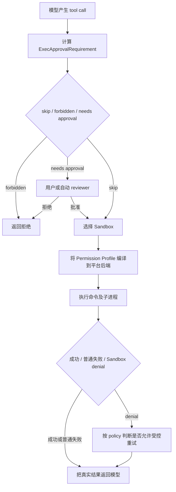

# 第 1 课：Sandbox、Approval 与威胁模型

[返回本阶段目录](README.md) · [OpenCode 对照](../02-opencode/07-coding-task-end-to-end-review.md) · [官方安全文档](https://developers.openai.com/codex/security)

## 核心问题

Sandbox、Approval 和模型决策分别控制什么？为什么 Permission policy 仍不能代替操作系统强制执行？

## 先记住一句话

```text
模型决定“想做什么”
Approval 决定“是否授权这样做”
Sandbox 决定“启动后实际上最多能做到什么”
```

三者会协作，但不能互相替代。

## 从 OpenCode 留下的问题开始

第二阶段已经看到，OpenCode 的 Permission 可以在执行 `bash` 前作出 `allow / deny / ask` 判断。但是一旦允许启动 Bash，子进程通常继承 OpenCode 宿主进程本来拥有的系统权限。

这留下一个缺口：

```text
Permission 判断正确
  ≠ 命令实现与判断描述完全一致
  ≠ 命令的子进程不会访问其他资源
  ≠ 依赖脚本和第三方程序值得信任
```

Codex CLI 增加的关键层，是把“允许执行”与“允许执行到什么范围”拆开。

## 三层控制面

| 层 | 输入 | 输出 | 它不负责什么 |
| --- | --- | --- | --- |
| 模型决策 | 用户任务、Context、工具 schema、权限说明、工具结果 | tool call、普通参数、权限提升请求或文本回答 | 不构成可信安全边界，可能误判，也可能受 prompt injection 影响。 |
| Approval / Harness policy | tool call、approval policy、exec policy、配置、已有授权 | 自动放行、拒绝、询问用户或交给自动 reviewer | 不直接限制已启动进程的系统调用、文件访问和子进程。 |
| OS Sandbox | 有效文件系统与网络策略、平台后端、待执行命令 | 一个受到内核或操作系统机制限制的进程环境 | 不判断任务语义是否合理，也不知道用户真正想要什么。 |

`文档`：[官方安全文档](https://developers.openai.com/codex/security)也把本地控制分成两层：Sandbox mode 规定技术上能做什么，Approval policy 规定什么时候必须询问。

### 模型是策略的使用者，不是策略的执行者

固定源码中的 [`AskForApproval`](https://github.com/openai/codex/blob/757c151a0e920c6238801866a3d13e010dfeddb8/codex-rs/protocol/src/protocol.rs#L917-L941) 明确把 `on-request` 描述为“模型决定何时请求授权”。这不表示模型拥有最终权限：它只是通过 tool call 表达需求，Harness 仍会按配置判断能否询问或执行，OS 仍会实施边界。

因此提示词中的“不要写工作区外文件”只是给模型的行为指导。真正运行的 `sh`、测试框架和安装脚本并不会读取这段提示词。

### Approval 是控制流，不是文件系统隔离

Approval 能让 Harness 在高风险操作前暂停，并把具体命令、原因和权限请求展示给 reviewer。它回答的是：

```text
当前请求是否可以继续？
```

它没有能力在一个已经启动的普通进程内部逐次拦截 `open()`、`connect()` 或后续 `exec()`。即使用户批准了 `npm test`，测试脚本仍可能启动更多程序；这些后代进程需要继承 Sandbox 边界，才能被同一套技术限制约束。

### Sandbox 是执行边界

[`SandboxPolicy`](https://github.com/openai/codex/blob/757c151a0e920c6238801866a3d13e010dfeddb8/codex-rs/protocol/src/protocol.rs#L1000-L1052) 的兼容接口表达三种常见本地模式：

| 模式 | 文件系统 | 默认 command network | 适合 |
| --- | --- | --- | --- |
| `read-only` | 可读，不允许工作区写入 | 关闭 | 阅读、分析、制定方案。 |
| `workspace-write` | 工作区及配置的 writable roots 可写 | 关闭 | 日常 Coding Agent 自动修改与验证。 |
| `danger-full-access` | 不施加这套文件系统限制 | 不受该 Sandbox 限制 | 已有可靠外部隔离的环境。 |

表中的模式是易用接口。当前源码内部正在把它们规范化为更细粒度的 `PermissionProfile`，再分别得到文件系统与网络策略；第 2 课会追踪这段配置收敛过程。

## 两个旋钮必须分开理解

把 Sandbox 和 Approval 当作两个正交旋钮，就能解释很多容易混淆的组合：

| Sandbox | Approval | 实际含义 |
| --- | --- | --- |
| `workspace-write` | `on-request` | 常见 Auto 组合；边界内自动执行，需要更高权限时由模型先请求授权。 |
| `workspace-write` | `never` | Sandbox 仍然有效；越界失败直接返回模型，不弹审批框。 |
| `read-only` | `on-request` | 默认不能写；需要修改时必须走允许的权限请求路径。 |
| `danger-full-access` | `never` | 没有本地 Sandbox，也不询问；这是明确的高风险 full access。 |

这说明：

```text
never approval ≠ no sandbox
approval granted ≠ sandbox 自动消失
```

批准的具体内容仍然重要：如果请求本身就是 `require_escalated` 或“在 Sandbox 外重试”，批准可以有意扩大或移除这次命令的部分边界；普通批准则不应被理解成隐式 full access。后续课程会检查这些不同 payload 怎样进入执行分支。

源码中的 [`SharedCliOptions`](https://github.com/openai/codex/blob/757c151a0e920c6238801866a3d13e010dfeddb8/codex-rs/utils/cli/src/shared_options.rs#L38-L59) 也把 `--sandbox` 和 `--dangerously-bypass-approvals-and-sandbox` 区分开；后者才会同时跳过确认与 Sandbox。

`--approve-for-me` 同样没有删除 Sandbox。固定源码把它展开为：

```toml
approvals_reviewer = "auto_review"
approval_policy = "on-request"
sandbox_mode = "workspace-write"
```

所以自动 reviewer 改变的是“谁评审”，不是“OS 边界是否存在”。

## 源码中的真实执行骨架

核心路径集中在 [`ToolOrchestrator::run()`](https://github.com/openai/codex/blob/757c151a0e920c6238801866a3d13e010dfeddb8/codex-rs/core/src/tools/orchestrator.rs#L136-L452)：



这张图先表达职责，不代表所有工具都使用相同 approval requirement。Shell、apply patch、skill、MCP 和网络请求可以提供自己的审批规则，后续课程会沿 shell 主线逐项展开。

一个重要的错误处理原则是：Sandbox denial 仍然是一次真实执行结果。`never` 不会把失败伪装成成功；[`AskForApproval::Never`](https://github.com/openai/codex/blob/757c151a0e920c6238801866a3d13e010dfeddb8/codex-rs/protocol/src/protocol.rs#L938-L940) 会让失败直接回到模型，而不是向用户申请提升。

## 抽象策略怎样落到操作系统

[`SandboxManager`](https://github.com/openai/codex/blob/757c151a0e920c6238801866a3d13e010dfeddb8/codex-rs/sandboxing/src/manager.rs#L35-L69) 根据平台选择后端：

| 平台 | 固定源码中的执行后端 | 本课确认到的边界 |
| --- | --- | --- |
| macOS | Seatbelt，通过固定的 `/usr/bin/sandbox-exec` | 将文件系统、网络等策略编译为 Seatbelt profile。 |
| Linux / WSL2 | `codex-linux-sandbox` helper | 默认先用 bubblewrap 构造文件系统与网络 namespace，再施加 `no_new_privs` 和 seccomp；Landlock 是 legacy 路径。 |
| 原生 Windows | Windows restricted-token Sandbox | 使用原生 Windows 隔离实现准备并启动子进程。 |

`源码`：虽然内部枚举仍叫 `LinuxSeccomp`，[`linux_run_main.rs`](https://github.com/openai/codex/blob/757c151a0e920c6238801866a3d13e010dfeddb8/codex-rs/linux-sandbox/src/linux_run_main.rs#L42-L135) 已明确说明 bubblewrap 是默认文件系统 Sandbox，seccomp 在内层继续收紧进程能力。不要根据旧命名推断当前只有 seccomp 或 Landlock。

这也是为什么 spawned commands 会继承边界：Codex 不是逐个信任 `git`、`npm` 或测试程序，而是在受限环境中启动它们；它们继续启动的子进程仍处于同一平台约束中。

## `workspace-write` 也不是“仓库里全能”

固定源码把 `.git`、`.agents` 和 `.codex` 定义为默认受保护 metadata path。即使父目录是 writable root，[`FileSystemSandboxPolicy::workspace_write()`](https://github.com/openai/codex/blob/757c151a0e920c6238801866a3d13e010dfeddb8/codex-rs/protocol/src/permissions.rs#L580-L627) 仍会添加这些只读 carve-out。

原因不是普通代码文件不能改，而是这些目录可以改变 Harness 或 Git 的后续行为。例如写入 `.git/hooks`，可能把一次看似普通的 Git 命令变成新的代码执行入口。

所以更准确的心智模型是：

```text
workspace-write
  = 一组允许写入的 roots
  - roots 内的受保护 metadata carve-outs
  + 独立的 network policy
```

第 5 课会继续处理 symlink、worktree、临时目录与网络这些容易出错的边界。

## 威胁模型：每一层挡什么

| 场景 | 模型指导 | Approval | Sandbox |
| --- | --- | --- | --- |
| 模型误删工作区外文件 | 可能避免提出命令，但不可靠 | 可以拦截显式越界请求 | 即使命令已经启动，也可拒绝越界写入。 |
| 仓库说明诱导上传密钥 | 可能受到 prompt injection | 网络或高风险请求可要求确认 | 默认 command network 关闭，并限制可访问资源。 |
| 用户批准运行未知测试脚本 | 无法保证依赖代码行为 | 已经完成授权，不能检查每个子行为 | 子进程继续继承文件与网络边界。 |
| 用户显式选择 full access | 可以继续提醒风险 | `never` 时不会询问 | `danger-full-access` 不再提供这层本地限制。 |

Sandbox 降低的是误操作、恶意仓库和依赖脚本造成的 blast radius，不是绝对安全证明。操作系统隔离实现本身、被显式批准的权限提升、用户可访问的敏感数据和外部 Sandbox 配置仍属于信任边界。

## 快速判断练习

先在脑中回答，再看结论：

1. `workspace-write + never` 下命令写 `/etc/example`，会自动获得 full access 吗？
2. 用户批准 `npm test` 后，为什么仍然需要 Sandbox？
3. 把 reviewer 从用户改成自动 reviewer，会关闭 Sandbox 吗？
4. 模型严格遵守“不要联网”的 system prompt，是否等于 command network 已关闭？

答案：

1. 不会。写入仍受 Sandbox 限制，denial 返回模型且不请求审批。
2. 因为测试脚本及其子进程的真实行为不等于命令名称，Approval 不能替代进程级限制。
3. 不会。它只改变授权决定由谁作出。
4. 不等于。前者是行为指导，后者必须由运行时与 OS enforcement 落实。

## 30 秒复述

1. 模型决策、Approval 和 Sandbox 各回答哪个问题？
2. 为什么 `never` 与 `danger-full-access` 不是同义词？
3. 为什么 Approval 之后仍要在受限环境里 spawn 命令？
4. `workspace-write` 为什么仍保护 `.git`、`.agents` 和 `.codex`？

如果能不看前文完整回答，本课的心智模型就建立了。

## 当前证据边界

- `源码`：固定 commit 中的类型、配置入口、Tool Orchestrator、平台选择和 protected paths 已静态核对。
- `文档`：默认网络关闭、Sandbox 与 Approval 的两层关系来自当前官方安全文档。
- `限制`：本课没有完整展开配置优先级、managed requirements、per-tool exec policy 和 denial retry 的全部分支。
- `未验证`：没有构建固定源码，也没有在三个操作系统上运行 Sandbox 实验。

## 下一步

下一课从 `--sandbox`、`--ask-for-approval` 和 `config.toml` 开始，追踪 legacy mode、named Permission Profile 与管理员约束如何合成为一个 turn 真正使用的有效权限。
