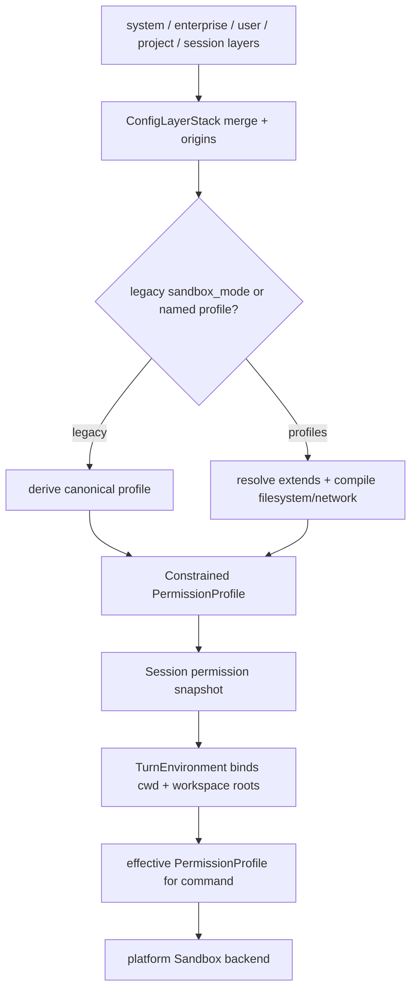

# 第 2 课：从配置到 Permission Profile

[返回本阶段目录](README.md) · [上一课](01-sandbox-approval-threat-model.md) · [官方配置文档](https://developers.openai.com/codex/config-basic)

## 核心问题

CLI 参数、用户配置、项目配置与管理员约束，怎样收敛成一次 turn 真正执行的权限？

## 先记住一句话

```text
多层配置先决定“选哪个权限方案”
  → named profile 被解析、继承并编译
  → 管理约束验证或收紧结果
  → workspace roots 在 turn 环境中具体化
  → Runtime 只执行最终 PermissionProfile
```

不要把 `config.toml` 中的一行配置直接等同于 OS Sandbox。中间还有合并、选择、编译、约束和运行时绑定。

## 输入层与执行层不是同一种数据

固定源码同时保留三类权限入口：

| 入口 | 作用 | 当前定位 |
| --- | --- | --- |
| `sandbox_mode` / `SandboxPolicy` | `read-only`、`workspace-write`、`danger-full-access` 的易用兼容接口 | legacy syntax，仍被支持。 |
| `default_permissions` + `[permissions.<name>]` | 选择并定义 named permission profile | 新的配置表达。 |
| `PermissionProfile` | 文件系统 enforcement 与网络策略的 canonical runtime representation | Runtime 必须执行的最终权限。 |

[`ConfigOverrides`](https://github.com/openai/codex/blob/757c151a0e920c6238801866a3d13e010dfeddb8/codex-rs/core/src/config/mod.rs#L2560-L2591) 同时能承载三种入口，但一次 override 不能混用：[`load_from_base_config_with_overrides`](https://github.com/openai/codex/blob/757c151a0e920c6238801866a3d13e010dfeddb8/codex-rs/core/src/config/mod.rs#L3270-L3286) 会拒绝同时设置以下任意两项：

```text
sandbox_mode
permission_profile
default_permissions
```

这不是说仓库已经删除 legacy 接口，而是避免两个入口同时声称自己是本次调用的最终选择。

## 第一步：合并配置层

`源码`：固定 commit 的 [`codex-config loader`](https://github.com/openai/codex/blob/757c151a0e920c6238801866a3d13e010dfeddb8/codex-rs/config/src/loader/README.md#L1-L44) 不只返回合并后的 TOML，还保留：

- 每个 key 的来源；
- 每一层的稳定 fingerprint；
- 被禁用但仍需给 UI 展示的层；
- 从高到低或从低到高遍历各层的能力。

固定源码列出的优先级是“上层覆盖下层”：

```text
legacy managed MDM
  > legacy managed file
  > session / CLI flags
  > project .codex/config.toml
  > selected user profile
  > user config.toml
  > enterprise cloud-managed bundle
  > system config
```

`限制`：这是固定 commit 的 loader 实现顺序，不应被脱离版本当成永久产品契约。官方文档升级后，要重新核对 managed configuration 的来源和优先级。

为什么还要保存 origin？因为“有效值是 `workspace-write`”不够诊断问题，还需要回答它来自 CLI、项目配置、用户配置还是管理员策略。

## 第二步：确定使用 legacy syntax 还是 profiles syntax

Codex 不是把所有权限字段盲目 merge 后再猜。固定源码用 [`PermissionConfigSyntax`](https://github.com/openai/codex/blob/757c151a0e920c6238801866a3d13e010dfeddb8/codex-rs/core/src/config/mod.rs#L2434-L2524) 记录本次选择来自：

```text
Legacy   → sandbox_mode
Profiles → default_permissions
```

遍历配置层时，后出现且优先级更高的显式选择会决定 active syntax。若定义了 `[permissions]` profiles，却没有选择 `default_permissions`，配置加载会显式报错，而不是偷偷挑一个 profile；检查见 [`mod.rs`](https://github.com/openai/codex/blob/757c151a0e920c6238801866a3d13e010dfeddb8/codex-rs/core/src/config/mod.rs#L3382-L3406)。

## 第三步：解析 named profile

### 三个 built-in profile

固定源码在 [`models.rs`](https://github.com/openai/codex/blob/757c151a0e920c6238801866a3d13e010dfeddb8/codex-rs/protocol/src/models.rs#L303-L330) 保留三个以 `:` 开头的名字：

| 名称 | 编译结果 |
| --- | --- |
| `:read-only` | managed、只读文件系统、restricted network。 |
| `:workspace` | managed、workspace-write 文件系统、默认 restricted network。 |
| `:danger-full-access` | `PermissionProfile::Disabled`，不施加 Codex 外层文件系统 Sandbox。 |

[`builtin_permission_profile()`](https://github.com/openai/codex/blob/757c151a0e920c6238801866a3d13e010dfeddb8/codex-rs/core/src/config/permissions.rs#L70-L96) 完成这组映射。用户自定义 profile 不能占用 `:` 前缀。

### 自定义 profile 与继承

`PermissionsToml::resolve_profile_with()` 会沿 `extends` 解析父 profile，检测未知父项和继承环，再按父 → 子顺序合并；实现见 [`permissions_toml.rs`](https://github.com/openai/codex/blob/757c151a0e920c6238801866a3d13e010dfeddb8/codex-rs/config/src/permissions_toml.rs#L25-L105)。

当前 built-in 父 profile 只允许 `:read-only` 与 `:workspace` 作为可扩展基线。不能从 `:danger-full-access` 继承后再假装这是受限 profile。

一个用于理解结构的示例：

```toml
default_permissions = "project-edit"

[permissions.project-edit]
description = "Write project files but keep env files unreadable"
extends = ":workspace"

[permissions.project-edit.filesystem.":workspace_roots"]
"**/*.env" = "deny"

[permissions.project-edit.network]
enabled = true

[permissions.project-edit.network.domains]
"crates.io" = "allow"
"*.crates.io" = "allow"
```

`文档`：`network.enabled = true` 改变网络 Sandbox policy；domain 表配置代理允许的目标。两者不是同一个开关，第 5 课会展开。

## 第四步：编译成文件与网络策略

[`compile_permission_profile()`](https://github.com/openai/codex/blob/757c151a0e920c6238801866a3d13e010dfeddb8/codex-rs/core/src/config/permissions.rs#L347-L407) 将解析后的 profile 编译为：

```text
FileSystemSandboxPolicy
NetworkSandboxPolicy
```

其中还会验证平台可表达性：例如非 macOS 平台上的 read / write glob 支持较弱，未限制深度的 `**` deny-read 也会产生警告。编译不是简单反序列化，它会把配置语义转换为 Runtime 能执行的策略。

## 第五步：形成 canonical `PermissionProfile`

[`PermissionProfile`](https://github.com/openai/codex/blob/757c151a0e920c6238801866a3d13e010dfeddb8/codex-rs/protocol/src/models.rs#L312-L330) 只有三种 enforcement 形态：

```rust
Managed  { file_system, network } // Codex 构造 Sandbox
Disabled                         // 不施加外层 Sandbox
External { network }             // 文件隔离由外部调用方保证
```

这是重要的边界：

- `Managed` 不代表一定是 workspace-write，它也可以是 read-only 或自定义精细策略；
- `Disabled` 是明确不构造外层文件 Sandbox；
- `External` 不是“忘了 Sandbox”，而是把文件系统 enforcement 的责任交给外部环境；
- Runtime 必须信任 `PermissionProfile`，`ActivePermissionProfile` 只用于显示 profile 名称和继承信息，不能反向替代已编译策略。

`源码`：即使继续使用 legacy `sandbox_mode`，固定源码也先派生 canonical profile，再为尚未迁移的调用路径保留兼容投影；见 [`mod.rs`](https://github.com/openai/codex/blob/757c151a0e920c6238801866a3d13e010dfeddb8/codex-rs/core/src/config/mod.rs#L3578-L3614)。

## 第六步：应用管理员约束

普通配置的“高优先级覆盖”不能覆盖管理员安全要求。固定源码用 [`Constrained<T>`](https://github.com/openai/codex/blob/757c151a0e920c6238801866a3d13e010dfeddb8/codex-rs/config/src/constraint.rs#L54-L93) 把当前值与 validator / normalizer 组合在一起：

- validator 决定候选值是否允许；
- normalizer 可以把候选值收紧为满足要求的值；
- [`set()`](https://github.com/openai/codex/blob/757c151a0e920c6238801866a3d13e010dfeddb8/codex-rs/config/src/constraint.rs#L171-L179) 先规范化，再验证，失败会显式返回错误。

因此 managed requirements 的含义不是“又一份可被 CLI 覆盖的 config.toml”，而是有效配置必须满足的约束。比如管理员 deny-read 不能被用户的 full-access profile 弱化。

## 第七步：在 turn 中绑定真实 workspace roots

`:workspace_roots` 在 durable profile 里是符号，不应在配置加载时永久绑定到某一个 cwd。固定源码的 [`TurnEnvironment`](https://github.com/openai/codex/blob/757c151a0e920c6238801866a3d13e010dfeddb8/codex-rs/core/src/session/turn_context.rs#L28-L62) 同时保存：

```text
environment id
cwd
workspace_roots[]
shell
permission profile snapshot
```

真正执行前，[`permission_profile_with_workspace_roots()`](https://github.com/openai/codex/blob/757c151a0e920c6238801866a3d13e010dfeddb8/codex-rs/core/src/session/turn_context.rs#L80-L101) 才把每个符号 project root 展开为本轮环境的绝对 root。

这解决了两个问题：

1. 同一会话可以面向不同执行环境，而不把本机 cwd 错当成远端 root；
2. cwd 改到 workspace 子目录时，不会无意把权限根缩成该子目录或扩成别处。

## Approval policy 也在配置中，但不属于 Permission Profile

Approval 与 Sandbox 保持独立。固定源码的默认选择是：

- trusted project：`OnRequest`；
- untrusted project：`UnlessTrusted`；
- 未分类项目：使用 `AskForApproval::default()`，当前也是 `OnRequest`。

代码见 [`mod.rs`](https://github.com/openai/codex/blob/757c151a0e920c6238801866a3d13e010dfeddb8/codex-rs/core/src/config/mod.rs#L3625-L3644)。管理员约束若不允许计算出的默认值，Runtime 会使用 required default 并记录 warning。

不要把项目 trust level 理解为文件系统权限本身。它影响默认 approval 行为，也参与默认 built-in profile 选择，但最终文件与网络边界仍由 `PermissionProfile` 表达。

## 一张完整收敛图



## 快速排错顺序

遇到“为什么没有按我的 config 执行”时，按以下顺序检查：

1. 哪个配置层最终赢得该 key，origin 是什么？
2. active syntax 是 legacy 还是 profiles？
3. `default_permissions` 是否真的选择了目标 profile？
4. `extends` 是否解析成功，是否出现未知父项或环？
5. profile 是否被编译成预期的 filesystem / network policy？
6. managed requirements 是否拒绝或规范化了候选值？
7. 本轮 `workspace_roots` 是否与预期环境一致？

## 30 秒复述

1. 为什么配置层合并完还不能直接启动命令？
2. legacy `sandbox_mode` 与 canonical `PermissionProfile` 是什么关系？
3. `Managed`、`Disabled`、`External` 分别把 enforcement 责任放在哪里？
4. 为什么 `:workspace_roots` 要到 turn 环境才具体化？
5. 为什么 managed requirements 不能按普通配置覆盖理解？

## 当前证据边界

- `源码`：固定 commit 中的配置层、syntax 选择、profile 继承、编译、约束与 turn materialization 已静态核对。
- `文档`：named permissions 的用户配置语义参考当前官方 Codex 配置与 Permissions 文档。
- `限制`：源码正在迁移 permissions API，legacy 与 profiles 分支仍同时存在；后续 commit 可能继续收口。
- `未验证`：没有用固定 commit 构建 CLI，也没有实际加载示例 TOML；示例用于解释结构，不是本机运行记录。

## 下一步

下一课从已经得到的 `PermissionProfile` 出发，追踪一次 shell tool call 怎样经过 ExecPolicy、审批、Sandbox、spawn 与 denial 处理。
