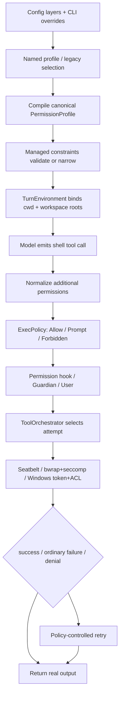

# 第 6 课：权限提升实验与阶段复盘

[返回本阶段目录](README.md) · [上一课](05-filesystem-network-protected-paths.md) · [实验目录](../examples/03-codex-cli/06-escalation-lab/README.md)

## 核心问题

怎样安全观察“边界内成功、越界失败、显式授权、受控重试与 never 拒绝”，并把第三阶段串成一条生产级执行链？

## 本课的证据规则

本课同时包含三类内容，必须分开：

| 标记 | 含义 |
| --- | --- |
| `源码` | 已从固定 commit 的实现静态确认。 |
| `实验步骤` | 可复现的操作方法，但本仓库没有代替学习者填写结果。 |
| `未验证` | 当前没有构建固定 commit，也没有得到对应平台的真实运行证据。 |

课程“已完成”表示教材与探针已经写完，不表示个人掌握清单已经通过，也不表示三平台实验已经执行。

## 实验准备

探针位于：

```text
examples/03-codex-cli/06-escalation-lab/probe.sh
```

先在普通终端做静态检查：

```bash
bash -n examples/03-codex-cli/06-escalation-lab/probe.sh
examples/03-codex-cli/06-escalation-lab/probe.sh help
```

脚本的安全约束：

- 工作区内只写课程目录下被 `.gitignore` 忽略的 `.runtime/`；
- 工作区外测试必须传入一个绝对文件路径，且父目录名必须是 `codex-sandbox-lab`；
- 不创建工作区外父目录；
- 拒绝把 `/`、当前 home、仓库 root 或课程目录本身当成文件目标；
- read probe 只输出字节数，不打印文件内容；
- network probe 只对 `https://example.com` 发出 `HEAD` 请求；
- 不自动清理工作区外文件，避免脚本替用户删除数据。

不要拿真实 SSH key、云凭据或生产目录做学习实验。使用单独创建的 disposable directory 和无敏感内容的文件。

## 建立两组会话

如果使用固定 commit 构建出的 CLI，分别启动：

```bash
codex --sandbox workspace-write --ask-for-approval on-request
codex --sandbox workspace-write --ask-for-approval never
```

`限制`：若使用系统已安装的 Codex，它可能不是本阶段固定 commit。必须在结果中记录 `codex --version`、平台和配置来源，不能把结果标成固定源码实验。

## 实验 1：workspace 内写入

在 `workspace-write + on-request` 会话中，要求 Codex 不提升权限，运行：

```bash
examples/03-codex-cli/06-escalation-lab/probe.sh inside-write
```

预期观察：

```text
ExecPolicy 对普通非危险命令 Allow
  → 不必弹审批
  → 平台 Sandbox 仍启用
  → .runtime/marker.txt 写入成功
```

`源码`：`on-request` 对 restricted Sandbox 内、未请求 override 的普通命令返回 `Allow`，见 [`render_decision_for_unmatched_command()`](https://github.com/openai/codex/blob/757c151a0e920c6238801866a3d13e010dfeddb8/codex-rs/core/src/exec_policy.rs#L786-L803)。

这个实验验证的是“自动执行与 Sandbox 可以同时成立”，不是 full access。

## 实验 2：workspace 外写入被拒绝

先在 Codex 会话之外，用普通终端创建一个 disposable parent directory。然后把目标文件绝对路径代入：

```bash
examples/03-codex-cli/06-escalation-lab/probe.sh outside-write /absolute/disposable/codex-sandbox-lab/probe.txt
```

第一次明确要求 Codex：

```text
不要申请 additional permissions，不要 require_escalated，直接在当前 Sandbox 内运行。
```

预期观察：命令启动，但 shell 重定向写入命中 Sandbox denial，原始 stderr / exit 信息返回模型；目标文件不存在。

`源码`：Orchestrator 只对 `SandboxErr::Denied` 进入专门分支，并保留原始 output；见 [`orchestrator.rs`](https://github.com/openai/codex/blob/757c151a0e920c6238801866a3d13e010dfeddb8/codex-rs/core/src/tools/orchestrator.rs#L278-L329)。

如果目标文件已经存在，先换一个新名字。不要让实验覆盖已有文件。

## 实验 3：请求精确 additional permission

仍在 `on-request` 会话，要求 Codex 对同一命令显式请求：

```text
只增加该 disposable target 所需的精确文件写权限，并说明理由；不要申请更宽的目录或 full access。
```

观察审批界面是否包含：

```text
command
cwd / environment
justification
requested filesystem scope
```

批准后再检查：

- 目标文件是否成功创建；
- 批准范围是否只覆盖请求的 target / parent；
- 相邻的另一个未批准路径是否仍不能写；
- 同命令改变 cwd 或权限范围后，是否重新需要决策。

`源码`：additional permissions 在生效前会规范化，并与 reviewer 实际 grant 求交集；Session approval cache key 还包含 environment、canonical command、cwd 与权限范围。

这个路径适合表达“仍保留 Sandbox，只增加一小块能力”。

## 实验 4：`require_escalated` 与 full bypass

另起一个新的 disposable target，要求 Codex 明确使用 `require_escalated`，并给出具体 justification。

预期控制流：

```text
handler 检查 approval policy
  → ExecPolicy 产生 Prompt
  → reviewer 批准或拒绝
  → 首次 attempt 可选择绕过外层 filesystem Sandbox
```

这与精确 additional permission 不同：`require_escalated` 通常代表更宽的执行能力。能用精确 grant 完成时，应优先选择精确 grant。

`源码/限制`：若 active filesystem policy 存在 deny-read，Runtime 不允许简单无 Sandbox 执行，因为那会丢失 deny-read；见 [`sandbox_override_for_first_attempt()`](https://github.com/openai/codex/blob/757c151a0e920c6238801866a3d13e010dfeddb8/codex-rs/core/src/tools/sandboxing.rs#L250-L306)。

## 实验 5：默认网络与显式网络权限

先在默认 `workspace-write` 权限下运行：

```bash
examples/03-codex-cli/06-escalation-lab/probe.sh network-head
```

默认 command network restricted 时，预期连接失败。记录失败发生在：

```text
DNS / connect
OS network Sandbox
managed proxy policy
其他宿主网络条件
```

然后要求 Codex 显式请求本命令所需的 network additional permission，再观察 reviewer、managed proxy 和 domain policy 是否参与。

`限制`：如果没有启用 managed network proxy，不能根据一个普通 curl 错误推断 domain approval flow 已验证。网络 capability、proxy enabled 与 domains 必须分别记录。

## 实验 6：`never` 下 denial 不升级

切换到 `workspace-write + never` 会话，再运行新的 outside target：

```bash
examples/03-codex-cli/06-escalation-lab/probe.sh outside-write /absolute/disposable/codex-sandbox-lab/never.txt
```

预期观察：

- 普通命令可以在 Sandbox 内启动；
- 越界写被 OS Sandbox 拒绝；
- denial 直接返回模型；
- 不显示用户审批；
- 模型不能在该 policy 下再请求未经预批准的 escalation。

这组实验直接验证：

```text
never approval ≠ danger-full-access
```

## 实验记录模板

每个平台复制一份下面的表，不要提前填写“通过”：

| 项目 | 记录 |
| --- | --- |
| Codex commit / version | 未执行 |
| OS / version | 未执行 |
| active Sandbox / approval policy | 未执行 |
| config origins / managed requirements | 未执行 |
| inside-write | 未执行 |
| outside-write denial 与原始输出 | 未执行 |
| exact additional permission | 未执行 |
| require_escalated | 未执行 |
| default network | 未执行 |
| approved network / proxy / domain | 未执行 |
| never denial | 未执行 |
| deny-read 与平台限制 | 未执行 |

至少分别在 macOS、Linux 或 WSL2、原生 Windows 留记录，才能声称三平台行为已实验验证。

## 第三阶段端到端复盘



整个链条最重要的设计，是每一层只承担自己能可信完成的职责：

| 层 | 可信职责 |
| --- | --- |
| 模型 | 根据任务提出命令和权限意图。 |
| Config / managed requirements | 计算允许的权限上限与审批规则。 |
| ExecPolicy / Approval | 决定本次请求是否能继续。 |
| PermissionProfile | 表达本次 Runtime 的 canonical 文件与网络权限。 |
| OS Sandbox | 对已经启动的命令及其子进程强制执行边界。 |
| Result path | 保留成功、普通失败与 denial 的真实证据。 |

## 与 OpenCode 阶段的关键差异

第二阶段的 OpenCode Permission 主要在 tool leaf 执行前做 `allow / deny / ask`。它能控制是否启动 Bash，却没有在所读固定版本中提供同等级的本地 OS Sandbox。

Codex CLI 增加的是：

```text
执行前授权控制
+ 执行后的进程级 blast-radius 限制
+ 跨平台 policy compiler
+ denial-aware retry
+ 管理员不可弱化约束
```

这就是第三阶段所说的“生产级 Sandbox”：不是某一个 API，而是配置、授权、运行时与操作系统后端组成的闭环。

## 阶段自测

不看前文，尝试完整回答：

1. `sandbox_mode`、named profile 与 `PermissionProfile` 的层次关系是什么？
2. `on-request` 为什么能让普通命令不审批却仍保持安全边界？
3. ExecPolicy 的显式 allow rule 何时可能要求 bypass Sandbox？
4. deny-read 为什么会阻止无 Sandbox escalation？
5. macOS、Linux / WSL2、原生 Windows 分别使用什么 enforcement 机制？
6. `workspace-write` 为什么仍保护 `.git`、`.agents`、`.codex`？
7. network capability 与 managed proxy 分别控制什么？
8. 原生 Windows managed deny-read 有什么 shell subprocess 限制？
9. 为什么 denial 必须保留原始 output？
10. 怎样证明三平台真的执行了同一策略，而不是只做静态阅读？

能独立回答并完成实验记录后，再勾选阶段目录中的个人掌握清单。

## 当前证据边界

- `源码`：第三阶段六课已沿固定 commit 静态追踪配置、PermissionProfile、ExecPolicy、Approval、Orchestrator、平台后端、文件与网络策略。
- `实验步骤`：安全探针、命令与记录模板已提供，脚本本身可以做语法与工作区内 smoke test。
- `限制`：系统已安装 Codex 的结果不能自动归属固定 commit；三平台结果必须分别记录。
- `未验证`：本阶段收口时没有构建固定源码，没有执行真实 approval / escalation，也没有声称 Seatbelt、bubblewrap 或 Windows Sandbox 集成测试通过。

## 阶段结论

```text
提示模型遵守边界，是行为引导
Harness 审批权限，是控制流
OS Sandbox 强制权限，是安全边界
真实失败结果，是下一步决策的证据
```

第三阶段教材至此完成。下一阶段进入 Claude Code，研究完整的 Harness 架构。本阶段尚未完成的跨平台实验继续保留为待验证项。
