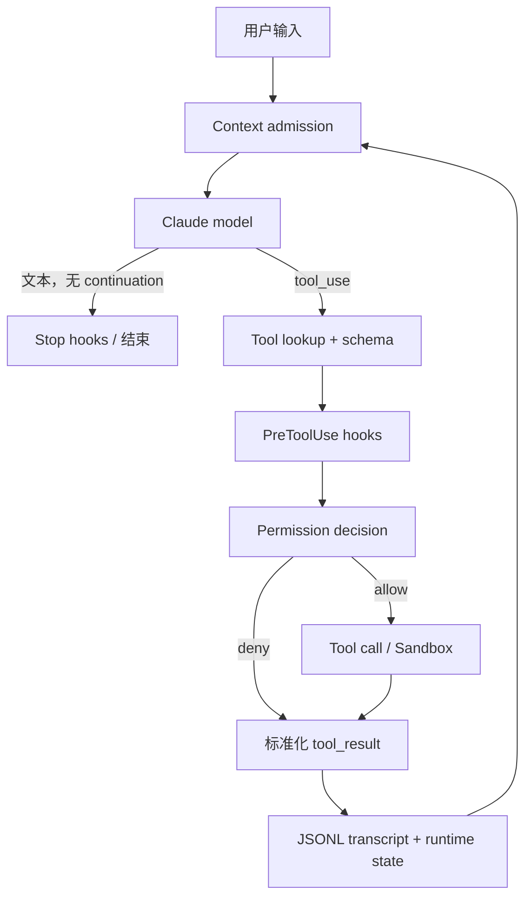

# 第 1 课：来源边界与 Harness 总体架构

[返回本阶段目录](README.md) · [官方工作原理](https://code.claude.com/docs/en/how-claude-code-works) · [课程实验](../examples/04-claude-code/01-harness-map/index.mjs)

## 核心问题

怎样在没有官方完整源码的前提下，沿 Loop、Context、Tools、State、Safety、Extension 六个维度研究完整的 Claude Code Harness 架构？

## 先划清证据边界

本阶段使用三类证据：

| 标记 | 含义 | 能证明什么 |
| --- | --- | --- |
| `文档` | Anthropic 官方 Claude Code 文档。 | 面向用户公开承诺的功能、概念和使用方式。 |
| `源码` | 非官方 source map 还原仓库的固定 commit。 | 该快照中可见的实现结构和调用关系。 |
| `实验` / `实验步骤` | 独立最小模型或真实 CLI 观察。 | 可复现行为；不能自动证明内部实现。 |

`源码`：[还原仓库自己的 README](https://github.com/pengchengneo/Claude-Code/blob/b78dd22a091b717c8938ab98c736bc04825a8ee8/README.md#L1-L10)明确写着“非官方”“基于公开 npm 包 source map 还原”。因此课程不会把它称为 Anthropic 官方源码，也不会根据其中的内部 feature gate 承诺公开产品一定可用。

`限制`：该仓库没有可依赖的官方开源许可证声明，且 package version 被改成 `999.0.0-restored`。本项目只提交原创分析、独立示例和固定 permalink；本地 `sources/claude-code/` 不进入 Git。

## 六维 Harness 地图

`文档`：[官方工作原理](https://code.claude.com/docs/en/how-claude-code-works)直接把 Claude Code 描述为模型外部的 agentic harness：它提供工具、上下文管理和执行环境。

课程使用六个问题建立 Claude Code Harness 地图：

| 维度 | Claude Code 中的观察入口 | 本阶段对应课程 |
| --- | --- | --- |
| Loop | `queryLoop()`、模型流、tool continuation、停止条件 | 2 |
| Context | System prompt、CLAUDE.md、Attachments、Compaction | 3–5 |
| Tools | Tool contract、注册、校验、权限和 result 回灌 | 6 |
| State | JSONL transcript、parent chain、resume / fork / rewind | 7 |
| Safety | Permission、Hooks、Bash 语义检查、Sandbox | 8 |
| Extension | Skills、Custom Agents、Hooks、MCP、Plugins | 12 |

Memory、Subagent 和 Agent Teams 不是第七至第九个平行维度，而是跨层机制：

```text
Memory      = Context 的注入策略 + State 的跨会话存储
Subagent    = 独立 Loop + 隔离 Context + 受限 Tools + sidechain State
Agent Team  = 多个 Agent + shared Tasks + Mailbox + permission sync
```

## 总体调用图



图中还有三条旁路：

- Context 接近上限时，Microcompact / Compaction 重写“下一轮模型看到的历史”。
- Auto Memory 从历史中提炼少量跨会话知识，在未来会话重新进入 Context。
- Agent / Team 把工作分配到别的 loop，最后以摘要、通知或 mailbox 消息回到主 loop。

## Claude Code Harness 的跨层结构

Claude Code Harness 的可靠运行依赖六个维度持续协作：

1. Context 最终仍要经过 Loop 才产生行为。
2. Tools 和 Safety 决定模型输出能否变成真实副作用。
3. State 决定中断、压缩、恢复和分叉以后，系统是否仍知道自己做过什么。

`结论`：六维结构共同支撑一次长任务中的 Context admission、副作用执行、安全控制、状态恢复与多 Agent 协作。第四阶段沿一条完整 continuation 逐层展开。

## 实验

运行：

```bash
node examples/04-claude-code/01-harness-map/index.mjs
```

`实验`：脚本打印六维地图，并把 Memory、Subagent、Agent Team 映射回六个基础维度。

尝试不看文档回答：

1. Permission 属于 Tools 还是 Safety？为什么执行器仍要感知它？
2. Compaction 属于 Context 还是 State？为什么 transcript 也需要 compact boundary？
3. Subagent 为什么不能只理解成“另一次模型调用”？

## 本课结论

- `文档`：Claude Code 官方把自身定义为 Claude 模型外部的 agentic harness。
- `源码`：固定快照可以提供实现证据，但来源是非官方 source map 还原。
- `结论`：Loop、Context、Tools、State、Safety、Extension 构成课程主线；Memory、Subagent 与 Agent Teams 作为跨层机制深入分析。
- `限制`：内部 feature gate、ant-only 分支和还原仓库附加代码不等于公开产品契约。
