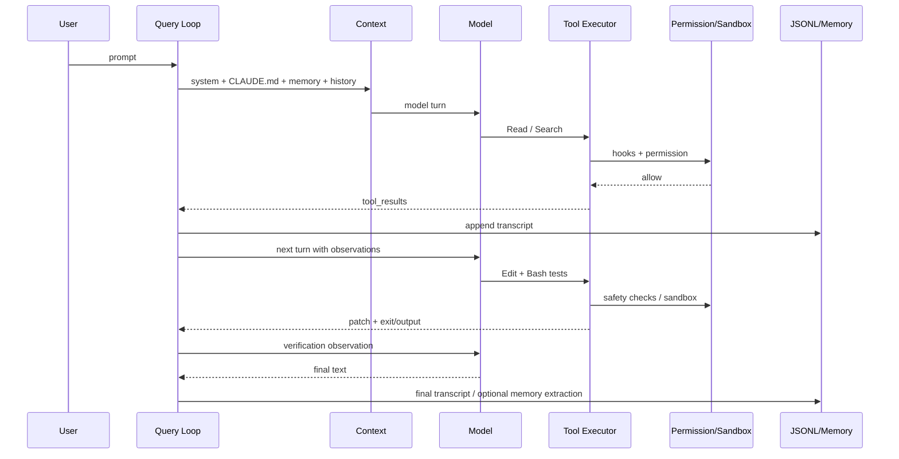

# 第 12 课：Plugin、MCP、Hooks、Skills 扩展与端到端复盘

[返回本阶段目录](README.md) · [上一课](11-agent-teams-tasks-mailbox.md) · [官方 Features 总览](https://code.claude.com/docs/en/features-overview) · [课程实验](../examples/04-claude-code/12-extension-routing/index.mjs)

## 核心问题

面对“给 Claude Code 增加能力”的需求，什么时候用 CLAUDE.md、Skill、Custom Agent、Hook、MCP 或 Plugin？怎样用六维框架复盘一次完整 Coding Task？

## 先按生命周期选扩展

| 需求 | 首选机制 | 原因 |
| --- | --- | --- |
| 每次会话遵守稳定项目规则 | CLAUDE.md / rules | 自动加载、可版本化 |
| 按需注入一套知识与步骤 | Skill | 渐进披露，完整正文只在使用时加载 |
| 隔离 Context、模型或工具权限 | Custom Agent | 独立 loop 与 ToolUseContext |
| 在确定事件边界执行策略 | Hook | 不依赖模型“记得做” |
| 连接外部服务、资源和工具 | MCP | 标准化远程 / 本地工具协议 |
| 打包并分发一组能力 | Plugin | 统一 manifest、命名空间和生命周期 |

不要因为 Plugin 最“大”就默认使用 Plugin。单项目的一条规则用 CLAUDE.md 更清晰；一个确定性 lint 动作用 PostToolUse Hook 比 Skill 更可靠。

## Skills

`源码`：[`loadSkillsDir.ts`](https://github.com/pengchengneo/Claude-Code/blob/b78dd22a091b717c8938ab98c736bc04825a8ee8/src/skills/loadSkillsDir.ts#L638-L723)并行加载 managed、user、project、additional directories 与 legacy commands，再按 canonical file 去重。

Skills 适合“模型应该知道何时调用的工作方法”。它仍是 Prompt 级能力，不会凭自身创造新的系统权限。

## Custom Agents

Agent definition 可声明：

- system prompt / description。
- allowed / disallowed tools。
- model、effort、max turns。
- Skills、MCP servers、Memory scope。
- foreground / background 和 worktree isolation。

它适合重复出现的角色边界，如只读 Explore、security reviewer、test runner。Agent 名称进入 discovery Context，真正调用后才创建独立 loop。

## Hooks

`文档`：[Hooks](https://code.claude.com/docs/en/hooks)提供 Session、Prompt、Pre/Post Tool、Permission、Compact、Subagent、Stop 等事件。

`源码`：Hook 可来自 settings、Skill frontmatter 和 Plugin；Plugin hooks 会[转换为带 plugin root / name 的 matcher](https://github.com/pengchengneo/Claude-Code/blob/b78dd22a091b717c8938ab98c736bc04825a8ee8/src/utils/plugins/loadPluginHooks.ts#L26-L85)后注册。

Hooks 的风险：

- command hook 本身能执行代码。
- 阻塞型 Hook 增加每个事件延迟。
- Prompt / agent hook 仍有模型成本和不确定性。
- Hook output 必须校验，错误不能静默当成功。

## MCP

MCP 将外部 server 的 tools、resources 和 prompts 接入 Harness。

`源码`：[MCP tools 与 built-ins 统一组装](https://github.com/pengchengneo/Claude-Code/blob/b78dd22a091b717c8938ab98c736bc04825a8ee8/src/tools.ts#L329-L367)，因此模型侧仍看到 Tool contract；执行侧仍经过 schema、Hook、Permission 和 result 回灌。

MCP 不是信任捷径：

- server 可能执行代码或访问外部数据。
- tool description 和 result 都是外部输入。
- OAuth / env credentials 要最小化。
- 大量 tool schema 会占 Context，应该使用 deferred tool search。

## Plugin 是分发边界

`源码`：[`pluginLoader.ts`](https://github.com/pengchengneo/Claude-Code/blob/b78dd22a091b717c8938ab98c736bc04825a8ee8/src/utils/plugins/pluginLoader.ts#L1-L29)列出的组件包括 commands / skills、agents、MCP、hooks；loader 负责 manifest validation 和变量处理。

`文档`：[Plugins](https://code.claude.com/docs/en/plugins)还可打包 LSP、monitors、bin 和有限 settings。标准结构是：

```text
plugin-root/
├─ .claude-plugin/plugin.json
├─ skills/
├─ agents/
├─ hooks/hooks.json
├─ .mcp.json
├─ .lsp.json
└─ monitors/
```

`源码`：[marketplace policy](https://github.com/pengchengneo/Claude-Code/blob/b78dd22a091b717c8938ab98c736bc04825a8ee8/src/utils/plugins/pluginLoader.ts#L1880-L1973)在企业策略启用、来源无法解析时采用 fail-closed。

Plugin 的主要价值是组合、命名空间、版本和分发；代价是更大的信任面和升级面。

## 用六维复盘一次 Coding Task

任务：修复 auth refresh，运行相关测试，保留 public API。



六维检查：

1. **Loop**：tool result 后是否真的 continuation，何时停止？
2. **Context**：哪些指令、文件、Memory 和 summary 进入了本轮？
3. **Tools**：输入是否校验，失败是否真实回灌，验证结果是否读取？
4. **State**：修改、checkpoint、transcript 和 resume 是否一致？
5. **Safety**：动作由谁批准，进程实际受什么 Sandbox 限制？
6. **Extension**：需要常驻规则、按需 Skill、Hook 还是外部 MCP？

## 实验

```bash
node examples/04-claude-code/12-extension-routing/index.mjs
```

`实验`：脚本为六类扩展选择合适生命周期，并打印完整 Harness continuation。

最终练习：给“每次 Edit 后只对修改文件运行 formatter，并把失败反馈给模型”选择扩展。推荐答案是 PostToolUse Hook；如果 formatter 本身来自远程服务，才进一步考虑 MCP。

## 阶段复盘

完成教材后，学习者应能不看源码复述：

```text
input
 → context admission
 → model stream
 → tool contract
 → hooks + permission + sandbox
 → side effect + tool_result
 → transcript
 → continuation / compact / stop
 → resume / memory / subagent / team
```

个人掌握清单仍在 [README](README.md) 中保持未勾选；文档写完不等于已经掌握。

## 本课结论

- `源码/文档`：Skills、Agents、Hooks、MCP 是不同生命周期的扩展；Plugin 是组合与分发边界。
- `源码`：MCP tools 最终进入统一 Tool executor，Plugin marketplace policy 可 fail-closed。
- `结论`：先选最窄的生命周期，再考虑组合成 Plugin。
- `结论`：Claude Code Harness 通过六维闭环组织 Context、Memory、Subagent 与 Agent Teams。
- `限制`：扩展可执行代码、访问外部系统或注入 Prompt；安装来源、凭据和权限必须按不受信输入治理。
