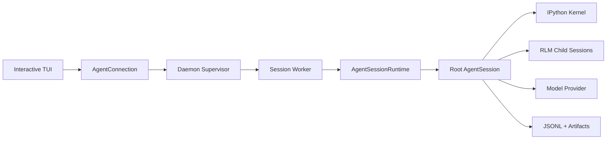

# 第 1 课：来源边界、Pi 血缘与总体架构

[返回本阶段目录](README.md) · [官方 Architecture](https://github.com/PrimeIntellect-ai/prime-agent/blob/71ca6cfd1a2f7205ca0ec1baa65d10d0ed88f6e8/packages/coding-agent/docs/architecture.md) · [课程实验](../examples/05-prime-agent/01-architecture-map/index.mjs)

## 核心问题

Prime Agent 在 Pi 的 Agent Runtime 之上增加了哪些产品、进程和状态边界？研究时怎样区分官方实现、官方说明与尚未运行的行为？

## 先固定来源

本阶段只使用官方 MIT 仓库 commit [`71ca6cf`](https://github.com/PrimeIntellect-ai/prime-agent/tree/71ca6cfd1a2f7205ca0ec1baa65d10d0ed88f6e8)。

`源码`：根 workspace 仍使用 `@earendil-works/pi-*` 包名，官方 [`packages/agent/README.md`](https://github.com/PrimeIntellect-ai/prime-agent/blob/71ca6cfd1a2f7205ca0ec1baa65d10d0ed88f6e8/packages/agent/README.md#L13-L18)说明源码 manifest 尚处于 namespace migration。这意味着：

- `packages/agent` 与第一阶段 Pi Agent loop 有直接血缘。
- 不能因为包名含 `pi` 就把整个 Prime Agent 当成没有新增架构。
- 课程结论必须指出落在 Runtime core、Coding Agent product 还是 Python runtime。

## Package 与进程地图

| 层 | 主要位置 | 当前职责 |
| --- | --- | --- |
| Model / Provider | `packages/ai` | 统一模型、消息、工具 schema 与 provider stream。 |
| Agent Runtime | `packages/agent` | Agent loop、State、Event、ToolResult、Steering / Follow-up。 |
| Coding Agent | `packages/coding-agent` | Session、Context、Kernel、Daemon、Goal、Schedule、Extension 与 TUI mode。 |
| Terminal UI | `packages/tui` | 终端渲染和输入组件。 |
| Python shim | `prime-agent-runtime` | `rlm`、Host request、Harness ledger 和 MCP base。 |

正常交互路径不是“TUI 直接拥有 Agent”：



`文档`：[Architecture Overview](https://github.com/PrimeIntellect-ai/prime-agent/blob/71ca6cfd1a2f7205ca0ec1baa65d10d0ed88f6e8/packages/coding-agent/docs/architecture.md#L1-L49)给出五个关键 ownership：

1. Client 负责渲染、键盘与 UI preference。
2. Supervisor 负责发现、路由、attachment、Worker health 与跨 Agent 消息。
3. 每个 Worker 负责一棵 root Session tree、Scheduler、Kernels 和 descendants。
4. `AgentSession` 负责 provider、队列、工具、Compaction、Goal、child lifecycle 与 transcript。
5. IPython 是模型控制面；权威 Host 操作仍回到 TypeScript。

## 六维观察入口

| 维度 | Prime Agent 的观察入口 | 课程 |
| --- | --- | --- |
| Loop | `packages/agent/agent-loop.ts`、Session continuation hooks | 2、8 |
| Context | RLM prompt、AGENTS / CLAUDE、Skills、Compaction、Harness state | 2、5、6 |
| Tools | `ipython`、Kernel、typed Host Bridge、Extensions | 3、9 |
| State | JSONL tree、artifacts、Daemon cursor、Goal / schedules | 5、7、8 |
| Safety | Host validation、process ownership、外部 Sandbox 要求 | 3、9 |
| Extension | Skills、Python packages、MCP、TypeScript Extensions、Harness entries | 6、9 |

RLM、Continual Harness 与 Daemon 不是三个互不相关的新维度：

```text
RLM               = programmatic Loop + Kernel Tools + child Agent
Continual Harness = Context routing + persistent State + refinement policy
Daemon continuity = execution ownership + recovery State + transport
```

## 固定版本中的文档滞后

`文档`：[`daemon.md`](https://github.com/PrimeIntellect-ai/prime-agent/blob/71ca6cfd1a2f7205ca0ec1baa65d10d0ed88f6e8/packages/coding-agent/docs/daemon.md#L66-L86)标题仍写 Public Daemon Protocol v4。

`源码`：同一 commit 的 [`daemon-protocol.ts`](https://github.com/PrimeIntellect-ai/prime-agent/blob/71ca6cfd1a2f7205ca0ec1baa65d10d0ed88f6e8/packages/coding-agent/src/modes/daemon/daemon-protocol.ts#L47-L63)定义 protocol v7、schema revision 15。

`结论`：官方文档可证明设计意图，但具体协议版本必须从固定源码验证。课程不会把 README 或架构图中的数字自动当作当前实现事实。

## 实验

```bash
node examples/05-prime-agent/01-architecture-map/index.mjs
```

`实验`：脚本对一条 prompt 逐层分配 ownership，并断言 UI、Supervisor、Worker、AgentSession 与 Kernel 不能被压成一个“Agent 进程”。

## 本课结论

- `源码/文档`：Prime Agent 复用 Pi Runtime，但在其外建立 AgentConnection、Daemon、Worker、Kernel 和持久化边界。
- `源码/文档`：模型面向 IPython 编程，Provider、Session 和调度权威仍在 TypeScript Host。
- `结论`：研究主线应从 ownership 和一条 prompt flow 出发，而不是按 939 个源码文件横扫目录。
- `限制`：本阶段没有运行真实二进制，所有 runtime 行为仍需在实际实验后升级为 `实验` 证据。

## 下一步

下一课进入 Worker 内部，追踪为何默认只有一个 `ipython` 模型工具，以及 ToolResult 如何继续驱动原有 Agent loop。
