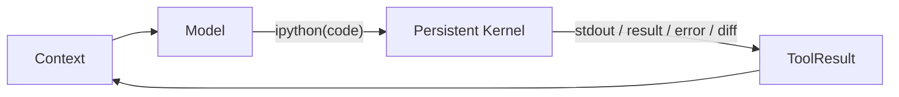

# 第 2 课：单工具 RLM Loop 与 Context 构建

[返回本阶段目录](README.md) · [上一课](01-source-boundary-and-architecture.md) · [官方 RLM Programming Model](https://github.com/PrimeIntellect-ai/prime-agent/blob/71ca6cfd1a2f7205ca0ec1baa65d10d0ed88f6e8/packages/coding-agent/docs/rlm.md) · [课程实验](../examples/05-prime-agent/02-rlm-loop/index.mjs)

## 核心问题

为什么 Prime Agent 默认只向模型暴露一个 `ipython` 工具？这个程序化控制面怎样仍然形成标准的 model → tool → result → model 循环？

## 底层 Loop 没有消失

`源码`：[`runLoop()`](https://github.com/PrimeIntellect-ai/prime-agent/blob/71ca6cfd1a2f7205ca0ec1baa65d10d0ed88f6e8/packages/agent/src/agent-loop.ts#L307-L464)仍保留两层推进：

```text
外层：Agent 本可停止后检查 Follow-up / Host continuation
内层：处理 Tool Calls 与 Steering
```

一轮模型响应中的 Tool Calls 执行完成后，`ToolResultMessage` 被追加到 Context；只要工具批次没有全部声明 `terminate`，下一轮模型就能观察结果并继续。未知工具、参数错误和执行异常仍应变成显式 error ToolResult。

Prime Agent 的主要变化不在 loop 形状，而在默认 Tool catalog。

## 默认 Built-in Tool 只有 `ipython`

`源码`：[`tools/index.ts`](https://github.com/PrimeIntellect-ai/prime-agent/blob/71ca6cfd1a2f7205ca0ec1baa65d10d0ed88f6e8/packages/coding-agent/src/core/tools/index.ts#L42-L80)把 `ToolName` 固定为 `"ipython"`，`createAllTools()` 默认也只创建它。

因此模型侧的闭环变成：



文件、搜索、数据转换和项目命令不是消失了，而是从多份模型 Tool schema 收敛为 Python 代码或 `%%bash`：

```python
from pathlib import Path
files = list(Path(".").rglob("*.ts"))
```

```bash
%%bash
npm run check
```

`文档`：[RLM Programming Model](https://github.com/PrimeIntellect-ai/prime-agent/blob/71ca6cfd1a2f7205ca0ec1baa65d10d0ed88f6e8/packages/coding-agent/docs/rlm.md#L24-L51)明确区分：

- Python namespace 跨 tool calls 与 Compaction 保持。
- 每个 `%%bash` 是临时 subshell；Shell 变量和 `cd` 不跨 cell。
- 项目代码应通过项目自己的环境运行，不应为了方便直接污染 Kernel 环境。

## Context 从哪些部分构造

`源码`：[`buildSystemPrompt()`](https://github.com/PrimeIntellect-ai/prime-agent/blob/71ca6cfd1a2f7205ca0ec1baa65d10d0ed88f6e8/packages/coding-agent/src/core/system-prompt.ts#L54-L171)按当前 Session 动态组合：

1. RLM base prompt 与当前 cwd / transcript path。
2. 是否允许递归、当前 depth、父 Agent doctrine。
3. Active tools 与 Python-backed Skills。
4. 合并后的 local / global Continual Harness 摘要。
5. 额外 guidelines。
6. `AGENTS.md` / `CLAUDE.md` 项目上下文。
7. 可选 append system prompt。

`源码`：[`loadProjectContextFiles()`](https://github.com/PrimeIntellect-ai/prime-agent/blob/71ca6cfd1a2f7205ca0ec1baa65d10d0ed88f6e8/packages/coding-agent/src/core/resource-loader.ts#L58-L113)加载 global context，并从 cwd 向祖先目录收集 `AGENTS.md` 或 `CLAUDE.md`。

Skills 使用渐进披露：启动 Context 只有 metadata 与路径，匹配任务后才从文件读取完整 `SKILL.md`。

## AgentSession 再增加 Host continuation

低层 loop 只知道 `getContinuationMessages()`。`AgentSession` 在该扩展点按顺序检查：

1. 当前是否已有已接纳 Session action。
2. Active Goal 是否需要继续。
3. Autonomous policy 是否需要另一轮。

`源码`：[`_getContinuationMessages()`](https://github.com/PrimeIntellect-ai/prime-agent/blob/71ca6cfd1a2f7205ca0ec1baa65d10d0ed88f6e8/packages/coding-agent/src/core/agent-session.ts#L3198-L3243)还用 arrival epoch 防止在异步 policy 判断期间新用户输入到达后注入陈旧 continuation。

所以“模型停止调用工具”只表示当前模型 turn 可以结束，不一定表示 Session policy 已完成。

## 与传统多工具 Harness 的取舍

| 单一 `ipython` 控制面 | 多个结构化 built-in tools |
| --- | --- |
| Python 状态可组合、可复用。 | 每个 Tool schema 更容易单独授权与审计。 |
| 能用代码筛选大 Context，减少往返。 | 输入结构更窄，模型较难执行任意代码。 |
| Skill 与 RLM child 成为普通函数调用。 | 文件、Shell、网络能力可以分别做 Permission。 |
| Kernel 与宿主同权限时影响半径大。 | 仍需统一 executor，避免每个工具各自绕过 Safety。 |

`结论`：单工具不是“工具系统更少”，而是把工具组合语言提升为 Python。代价是 Safety 不能只靠 schema 数量收敛。

## 实验

```bash
node examples/05-prime-agent/02-rlm-loop/index.mjs
```

`实验`：脚本用一个持久 namespace 模拟两次 `ipython` ToolResult，断言第二轮能复用第一轮变量，并在无 Tool Call 且无 Host continuation 时结束。

## 本课结论

- `源码`：Prime Agent 保留 Pi 的 ToolResult continuation loop，默认 catalog 只包含 `ipython`。
- `源码/文档`：Persistent Kernel 保存 Python working state，`%%bash` subshell 状态不持久。
- `源码`：System prompt 动态接纳项目规则、Skill metadata、递归 doctrine 与 Harness 摘要。
- `结论`：RLM 的核心是“Context 作为变量、能力作为函数、Kernel 作为长寿命控制环境”。
- `限制`：Python 的表达力扩大了默认权限面；单工具设计本身不提供 Permission 或 Sandbox。

## 下一步

下一课沿一次 `await rlm(...)` 或 `await goal.get()` 进入 Jupyter comm，研究 Kernel 与 TypeScript Host 的类型化边界。
