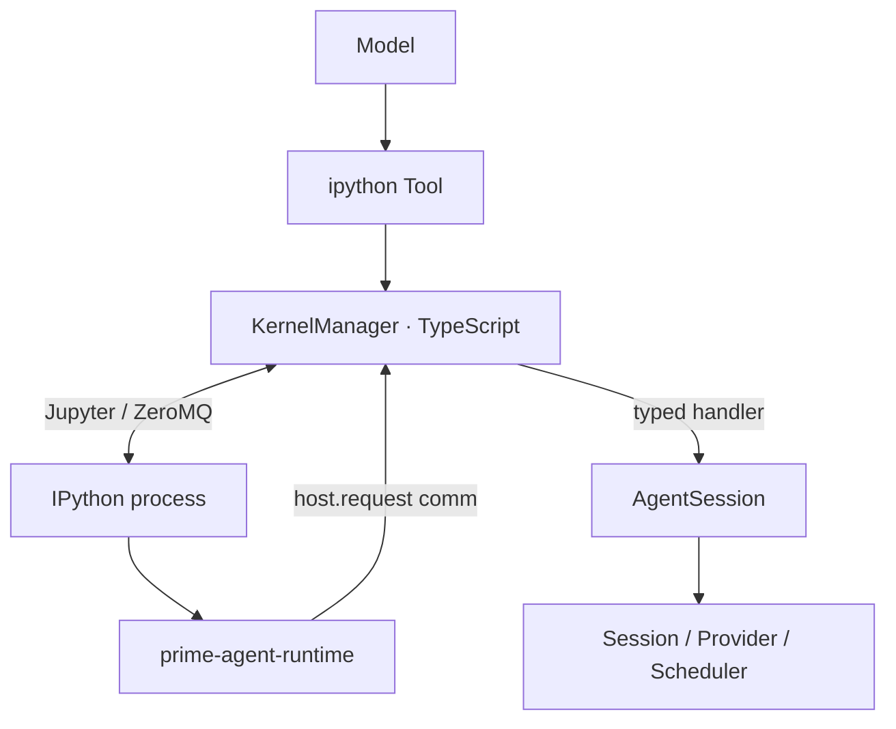

# 第 3 课：IPython Kernel、Jupyter 通道与 Host Bridge

[返回本阶段目录](README.md) · [上一课](02-single-tool-rlm-loop-and-context.md) · [官方 RLM Runtime Architecture](https://github.com/PrimeIntellect-ai/prime-agent/blob/71ca6cfd1a2f7205ca0ec1baa65d10d0ed88f6e8/packages/coding-agent/docs/rlm-runtime.md) · [课程实验](../examples/05-prime-agent/03-host-bridge/index.mjs)

## 核心问题

模型执行的 Python 怎样请求“创建子 Agent、更新 Goal、发送消息”等 Host 权威操作？为什么这不是让 Python shim 直接调用 Provider？

## Kernel 是控制面，不是 Session 权威面

组件关系：



`源码`：Python [`host_request()`](https://github.com/PrimeIntellect-ai/prime-agent/blob/71ca6cfd1a2f7205ca0ec1baa65d10d0ed88f6e8/prime-agent-runtime/src/rlm/__init__.py#L53-L125)只做四件事：

1. 校验 request type 与 payload。
2. 打开 target 为 `host.request` 的 Jupyter comm。
3. 等待 `ok` 或 `error` reply。
4. 将 Host 错误显式抛为 `RuntimeError`。

Python side 不保存 Provider credential、不执行模型 loop，也不写 Session transcript。

## 三个 Jupyter 通道

`源码/文档`：KernelManager 使用：

| 通道 | 用途 |
| --- | --- |
| `shell` | `execute_request` / `execute_reply` / readiness。 |
| `iopub` | stdout、stderr、result、error、display 与 comm event。 |
| `control` | interrupt、shutdown，以及 active cell 等待的 Host reply。 |

连接文件只绑定 loopback 端口，Jupyter frames 通过 HMAC-SHA256 签名。`KernelManager.execute()` 串行化普通 cell，因为一个 Kernel 共享一个 namespace。

`源码`：[`KernelManager`](https://github.com/PrimeIntellect-ai/prime-agent/blob/71ca6cfd1a2f7205ca0ec1baa65d10d0ed88f6e8/packages/coding-agent/src/core/kernel/index.ts#L514-L557)保存 shell / iopub / control sockets 和 execute serialization queue。

## 为什么 Host reply 必须走 Control Channel

考虑一个仍在执行的 cell：

```python
handle = await rlm("inspect the API")
```

如果 Host 把结果发回 shell channel：

```text
execute_request 尚未结束
  → cell 等待 rlm reply
  → shell 串行处理，reply 等待 execute_request 结束
  → 死锁
```

`源码`：Kernel Manager 在处理 `host.request` 后用 [`control ?? shell`](https://github.com/PrimeIntellect-ai/prime-agent/blob/71ca6cfd1a2f7205ca0ec1baa65d10d0ed88f6e8/packages/coding-agent/src/core/kernel/index.ts#L1203-L1285)回复；Python shim 把 comm handler 注册到 control handlers，并通过 `loop.call_soon_threadsafe()`结算 Future。

这条边界比“异步函数要 await”更具体：传输通道选择决定调用是否能够完成。

## Host handler 是显式 allowlist

`AgentSession` 按当前能力注册 request type，例如：

- `rlm.run`、`rlm.find_models`、`rlm.list_subagents`、`rlm.delete_subagent`。
- `goal.*`。
- `compact.*`、`refine.*`。
- `agent_message.*`、`agent_observe.*`。
- `rlm_heartbeat.*`。
- 已启用 MCP integration 的 credential / config 请求。

`源码`：[`_createKernelHostHandlers()`](https://github.com/PrimeIntellect-ai/prime-agent/blob/71ca6cfd1a2f7205ca0ec1baa65d10d0ed88f6e8/packages/coding-agent/src/core/agent-session.ts#L8758-L8870)只将当前 Session 启用的 handler 加入映射。未知 type 明确失败，不会降级为任意 Host method invocation。

## Kernel lifecycle 与 snapshot

Kernel 第一次使用时惰性创建；自管环境包含 Python 3.11、`ipykernel` 和 `prime-agent-runtime`。持久 Session 可以将 namespace 保存为 `kernel-state.dill` 与 manifest。

必须区分：

| 状态 | 保存位置 | 作用 |
| --- | --- | --- |
| Python variables / imports | Kernel memory、可选 namespace snapshot | 继续程序化工作。 |
| 模型消息 | Session JSONL | 恢复、审计、构造 Context。 |
| Compaction summary | JSONL compaction entry | 缩短下一次模型 Context。 |
| Host domain state | Goal、Schedule、child registry 等 Host storage | 保持权威状态与策略。 |

Kernel snapshot 是 best-effort namespace revival，不是对文件、网络或子进程副作用的事务 checkpoint。

## 信任边界

`文档`：[RLM Runtime Architecture](https://github.com/PrimeIntellect-ai/prime-agent/blob/71ca6cfd1a2f7205ca0ec1baa65d10d0ed88f6e8/packages/coding-agent/docs/rlm-runtime.md#L247-L256)明确说明：

- IPython 执行模型生成的 Python 与 shell magic。
- Kernel 使用 Worker 的 OS 权限。
- 进程边界用于 protocol / lifecycle isolation，不是 security sandbox。
- Skills、Extensions 和安装的 Python packages 都属于受信代码。

Host handler validation 能限制“Python 调哪一个 AgentSession API”，却不能限制普通 Python 自己读写宿主文件。

## 实验

```bash
node examples/05-prime-agent/03-host-bridge/index.mjs
```

`实验`：脚本实现最小 typed dispatcher，验证已注册 request 成功、未知 request 显式失败，并展示 active cell reply 走 control channel 的必要性。

## 本课结论

- `源码`：Python shim 是薄桥，Provider、Session、凭据和调度仍由 TypeScript Host 掌握。
- `源码`：Jupyter shell / iopub / control 承担不同职责；active cell 的 Host reply 走 control 防止死锁。
- `源码`：普通 cell 在同一 Kernel 串行，RLM child 通过独立 AgentSession 获得并发。
- `限制`：typed bridge 不是 Sandbox；模型仍可通过普通 Python 和 `%%bash` 使用宿主用户权限。

## 下一步

下一课追踪 `rlm.run` Host handler 怎样接纳一个独立子 Agent，并通过 Registry、消息和文件完成异步 fan-out / fan-in。
