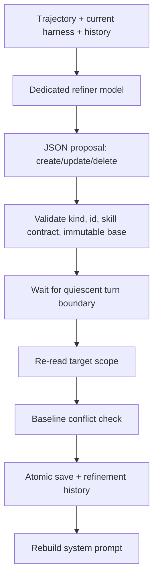

# 第 6 课：Continual Harness、Refinement 与回滚

[返回本阶段目录](README.md) · [上一课](05-session-tree-compaction-kernel-state.md) · [官方 RLM Runtime：Continual Harness](https://github.com/PrimeIntellect-ai/prime-agent/blob/71ca6cfd1a2f7205ca0ec1baa65d10d0ed88f6e8/packages/coding-agent/docs/rlm-runtime.md#continual-harness-state) · [课程实验](../examples/05-prime-agent/06-continual-harness/index.mjs)

## 核心问题

Agent 怎样从当前轨迹形成可复用状态，同时避免把一次性噪声、未经验证的猜测或整段聊天永久写入未来 Context？

## 先区分 RLM 与 Continual Harness

```text
RLM
  = IPython runtime + rlm() native call + Host Bridge + child execution

Continual Harness
  = persistent prompt notes + memories + skill descriptions
    + subagent specs + refinement history
```

`源码`：Refiner system prompt 明确要求这两个名称分开，见 [`refinement.ts`](https://github.com/PrimeIntellect-ai/prime-agent/blob/71ca6cfd1a2f7205ca0ec1baa65d10d0ed88f6e8/packages/coding-agent/src/core/refinement/refinement.ts#L123-L153)。

Harness state 不是第二个 Agent loop，也不直接执行 Provider 或副作用。它作为 compact routing/context hints 进入未来 system prompt。

## 四类条目

| Kind | 应保存 | 不应保存 |
| --- | --- | --- |
| `prompt` | 狭窄、稳定的补充行为策略 | 重写 base system prompt。 |
| `memory` | 已验证事实、决策、失败、偏好、结果 | 可随时从代码重读的瞬时输出。 |
| `skill` | 可复用 Python call 的 reference 与 argument contract | 没有真实 callable 的虚构能力。 |
| `subagent` | 可复用委派角色、触发条件与 brief 模式 | 一个当前 child runtime 的临时状态。 |

已安装 Python-backed Skill 与 Harness skill entry 不同：

- 已安装 Skill 是磁盘上的真实 Python package，可为 Kernel 增加可执行代码。
- Harness skill entry 是对现有 Python callable 的持久描述和路由提示。
- `/refine` 不代替 `skill-creator` 打包、安装和验证新代码。

## Local 默认，Global 显式

`源码`：local state 位于当前 Session artifacts：

```text
session-artifacts/<session-id>/harness/harness_state.json
```

Global state 位于：

```text
~/.prime/agent/harness/harness_state.json
```

Local 适合当前任务进度、暂时 blocker、Session 协调和不应影响其他 Session 的项目事实。只有稳定跨 Session 偏好、可复用 skill / subagent 或明确项目限定的长期事实，才显式请求 global。

System prompt 每次构建时合并 global + current local；发生同 ID 冲突时保留 scope 信息，不静默覆写来源。

## `/refine` 是 Plan / Apply 两阶段



### Planning

`源码`：[`planRefinement()`](https://github.com/PrimeIntellect-ai/prime-agent/blob/71ca6cfd1a2f7205ca0ec1baa65d10d0ed88f6e8/packages/coding-agent/src/core/refinement/refinement.ts#L857-L934)把最近 trajectory、Harness overview、history 与 scope policy 发给专用模型，要求只返回结构化 JSON edits。

规则包括：

- 小而有证据。
- 一次 local refine 不更新 / 删除 global entries。
- `base_system_prompt` 不可编辑。
- Skill edit 必须有 Python import、callable / call pattern 与 arguments。
- 没有足够证据时返回 empty edits，而不是制造“学习”。

### Apply

`源码`：AgentSession 在 apply 前重新读取目标 `harness_state.json`，并使用 planning baseline 拒绝期间发生冲突的 entry；随后临时断开 Agent event handling，在短 critical section 中应用、原子 rename 保存、追加 history，再重建 system prompt，见 [`_applyRefine()`](https://github.com/PrimeIntellect-ai/prime-agent/blob/71ca6cfd1a2f7205ca0ec1baa65d10d0ed88f6e8/packages/coding-agent/src/core/agent-session.ts#L7867-L7962)。

`refine.run()` 从 Kernel 内调用时只负责 scheduling。它在当前 turn 结束边界运行，避免 active Tool cell 等待 Agent idle 造成死锁。

## Auto-refine 还有 Review Gate

自动路径先问一个单独 reviewer：当前 checkpoint 是否真的包含对未来 turn 有用的证据。它应拒绝：

- 一次性噪声。
- 未支持的假设。
- 瞬时 Tool output。

只有 reviewer 通过才进入 plan / apply。固定实现还使用 interval、post-compaction trigger 与 cooldown，防止每个 turn 都产生额外模型调用或反复失败。

## Refinement history 与 rollback

每次结果记录：

- ID、summary、rationale、expected outcome。
- 每个 edit 的 before / after snapshot。
- applied / failed 与 error。
- scope 和 state path。

Rollback 根据反向 snapshots 生成新 proposal，再走相同 validation / apply；它是“补充 Harness state 回滚”，不是代码、Session 或外部世界回滚。

## 实验

```bash
node examples/05-prime-agent/06-continual-harness/index.mjs
```

`实验`：脚本对 local Harness 应用一个小型 create proposal，验证 base prompt edit 被拒绝、global state 不受影响，并用 before / after snapshot 回滚。

## 本课结论

- `源码`：Continual Harness 是四类持久补充条目，不是可自改写的 base prompt。
- `源码`：local 是默认 scope，global 需要明确扩大影响范围。
- `源码`：Refinement 将慢 LLM planning 与短 atomic apply 分开，并做 baseline 冲突检查。
- `结论`：所谓“自改进”只有在来源、scope、验证、历史和 rollback 都可审计时才具有工程意义。
- `限制`：Refiner 仍是模型；结构校验能阻止无效 shape，不能自动证明内容真实或改进有效，下一次行动必须验证 outcome。

## 下一步

下一课离开单个 Worker，研究 Daemon 怎样让 Session 在 TUI 关闭后继续，并在断线、Supervisor 替换或 Worker crash 后恢复。
