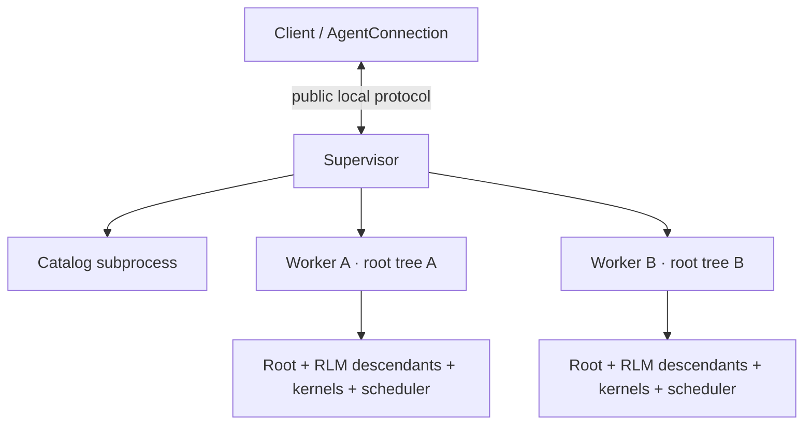

# 第 7 课：Daemon、Worker、重连与崩溃恢复

[返回本阶段目录](README.md) · [上一课](06-continual-harness-refinement.md) · [官方 Daemon Architecture](https://github.com/PrimeIntellect-ai/prime-agent/blob/71ca6cfd1a2f7205ca0ec1baa65d10d0ed88f6e8/packages/coding-agent/docs/daemon.md) · [课程实验](../examples/05-prime-agent/07-daemon-recovery/index.mjs)

## 核心问题

TUI 断开、Supervisor 被替换或 Session Worker 崩溃后，Prime Agent 能恢复哪些事实？为什么“补齐事件”和“重放副作用”必须采用不同策略？

## Daemon 先分 ownership



`文档`：[`daemon.md`](https://github.com/PrimeIntellect-ai/prime-agent/blob/71ca6cfd1a2f7205ca0ec1baa65d10d0ed88f6e8/packages/coding-agent/docs/daemon.md#L23-L39)把职责分成三层：

| Owner | 持有 | 不执行 |
| --- | --- | --- |
| Supervisor | public socket、attachment、routing、Worker health、command journal、跨 Agent 消息 | Provider、Tool、Compaction、Kernel、Schedule、transcript scan。 |
| Catalog | saved-session scan 与 inactive-session 文件操作 | 活动 Agent loop。 |
| Worker | 一棵 root Session tree、Scheduler、Kernels、所有 RLM descendants | 其他 root tree。 |

关闭 TUI 只是 detach；resident Worker 仍可继续运行。Supervisor 消失后，Worker 通过 launch lease 竞争启动替代者，新 Supervisor 再接管 live Workers。Worker crash 只影响一棵 root tree。

## Session Lease 保护单写者

每个持久 Session 都按 canonical JSONL path 获取进程安全 lease：

1. 打开 Session 前先获取目标 lease。
2. 替换 runtime 时先拿新 lease，再释放旧 lease。
3. 同一路径已被打开时返回 `session_already_active`。
4. 同路径的并发 create 收敛到一个 Worker。

`结论`：JSONL append-only 只能保留历史，不能自行阻止两个进程同时写。Lease 解决的是 execution ownership，不是文件格式问题。

## Cursor 是 `{ generation, sequence }`

固定源码的公共事件 cursor 不是一个裸整数：

```ts
interface DaemonEventCursor {
  generation: string
  sequence: number
}
```

`源码`：[`daemon-protocol.ts`](https://github.com/PrimeIntellect-ai/prime-agent/blob/71ca6cfd1a2f7205ca0ec1baa65d10d0ed88f6e8/packages/coding-agent/src/modes/daemon/daemon-protocol.ts#L52-L73)定义 protocol v7、schema revision 15 与 generation-aware cursor。随仓库发布的 `daemon.md` 标题仍写 protocol v4，这是第一课记录的文档滞后，不应据此覆盖源码事实。

恢复规则：

- generation 相同且 replay interval 完整：按 sequence 补齐事件。
- generation 相同但 replay 只部分可用：应用可用事件，并以 attach snapshot 对齐完整状态。
- generation 已变化：旧 sequence 不可与新 generation 比较。
- replay 不可用：snapshot 是新的 durable baseline，不把缺失 UI delta 当作 Session 丢失。
- snapshot 后忽略重复 sequence 与 retired generation 的迟到事件。

因此 snapshot 与 event stream 是“基线 + 增量”关系，不是二选一。

## Event Replay 不等于 Mutation Replay

事件通常是已发生事实的可重复投影；文件写入、Bash、外部 API 与 child spawn 则可能已经发生，但结果尚未来得及持久化。

`源码`：[`command-recovery-journal.ts`](https://github.com/PrimeIntellect-ai/prime-agent/blob/71ca6cfd1a2f7205ca0ec1baa65d10d0ed88f6e8/packages/coding-agent/src/modes/daemon/command-recovery-journal.ts#L37-L105)在 Supervisor 边界使用 `clientId + commandId`：

```text
received 已持久化，尚未 dispatch 结果
  → pending / uncertain
  → 不自动重放

result 已持久化
  → complete
  → 相同 commandId 返回保存结果

client acknowledge
  → journal entry 可清理
```

`结论`：幂等键可以去重已知完成结果，却不能凭空证明 uncertain mutation 没执行。此时安全策略是显式报告不确定，由后续 reconciliation 检查真实世界。

## Worker Crash 的恢复边界

Worker 恢复会：

1. 清理旧 Worker process group 与被跟踪的 detached subprocess tree。
2. 在 transcript 追加可见的 recovery marker。
3. 用原 active-session ID 恢复 root。
4. 保留已持久 Session facts 与 schedules。
5. 不重放结果不确定的 model、tool、bash 或 child-agent 工作。

`源码`：[`daemon-catalog-process.ts`](https://github.com/PrimeIntellect-ai/prime-agent/blob/71ca6cfd1a2f7205ca0ec1baa65d10d0ed88f6e8/packages/coding-agent/src/modes/daemon/daemon-catalog-process.ts#L268-L277)写入的恢复消息明确要求继续前先检查外部副作用。

这里的“恢复”不是 exactly-once world mutation。它恢复 durable facts 和 execution ownership，并把未知部分保留为未知。

## 实验

```bash
node examples/05-prime-agent/07-daemon-recovery/index.mjs
```

`实验`：脚本验证同 generation 可 replay、generation 变化必须使用 snapshot；同时模拟 command journal，断言 completed command 可返回缓存结果，而 received-without-result 只能标记 `uncertain`，不会再次执行副作用。

## 本课结论

- `源码/文档`：Supervisor 管协调与恢复，每个 Worker 独占一棵 root Session tree。
- `源码/文档`：Session lease 保护 canonical transcript 的单写者。
- `源码`：固定版本使用 protocol v7 / schema 15，事件位置必须用 generation + sequence。
- `源码`：command journal 对已完成 mutation 去重，对 uncertain mutation 不盲目重放。
- `结论`：可靠恢复的核心不是“自动再试一切”，而是区分可 replay 的事实、可重算的 projection 与不可证明幂等的副作用。
- `限制`：Daemon 的 token、lease 与 generation fencing 是本地进程协调，不是 OS Sandbox 或多用户隔离。

## 下一步

下一课研究没有新用户输入时谁有权继续 Session，以及 Goal、Autonomous、Heartbeat 与 Schedule 为什么不能合并成一个“自动运行”开关。
