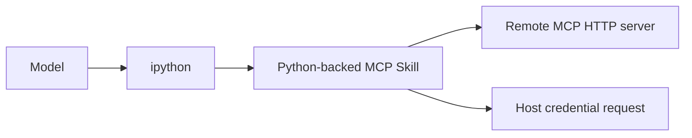

# 第 9 课：Skills、MCP、Extensions 与信任边界

[返回本阶段目录](README.md) · [上一课](08-long-running-continuation-policies.md) · [官方 Skills](https://github.com/PrimeIntellect-ai/prime-agent/blob/71ca6cfd1a2f7205ca0ec1baa65d10d0ed88f6e8/packages/coding-agent/docs/skills.md) · [官方 MCP Integrations](https://github.com/PrimeIntellect-ai/prime-agent/blob/71ca6cfd1a2f7205ca0ec1baa65d10d0ed88f6e8/packages/coding-agent/docs/mcp-integrations.md) · [课程实验](../examples/05-prime-agent/09-extension-routing/index.mjs)

## 核心问题

应该在什么时候选择 Markdown Skill、Python-backed Skill、MCP integration、TypeScript Extension 或 Continual Harness entry？这些机制中的“可拦截”能否提供系统级安全保证？

## 先按能力形状选择最窄扩展面

| 需求 | 首选机制 | 进入模型 / Runtime 的方式 |
| --- | --- | --- |
| 按需知识、步骤和参考资料 | Markdown Skill | 启动只披露 metadata，匹配后读取完整 `SKILL.md`。 |
| Kernel 内可复用 Python callable | Python-backed Skill | 真实 Python package 安装、import 后从 `ipython` 调用。 |
| Remote service 的 MCP tools | MCP integration | Kernel 内 Python-backed Skill，经 official Python SDK 调用 server。 |
| 新模型 Tool、命令、事件策略或 TUI | TypeScript Extension | Host 侧注册 tool / command / event / UI。 |
| 已有 callable 的持久路由提示 | Continual Harness `skill` entry | future system prompt 中的 reference + argument contract。 |

最小选择原则：如果 `SKILL.md` 足以解决问题，不创建代码；如果只需复用一个 Kernel callable，不扩大为 Host Extension；只有外部服务真正提供 MCP contract 时才使用 MCP。

## Skill 使用渐进披露

`文档`：[`skills.md`](https://github.com/PrimeIntellect-ai/prime-agent/blob/71ca6cfd1a2f7205ca0ec1baa65d10d0ed88f6e8/packages/coding-agent/docs/skills.md)描述两级加载：

1. 启动时接纳名称、描述、路径等轻量 metadata。
2. 任务匹配后按需读取 `SKILL.md` 和相关 references / scripts。

Python-backed Skill 仍必须有 `SKILL.md`，并额外包含 `pyproject.toml` 与 `src/<import_name>/__init__.py`。它是真实 package，可以有依赖和副作用；不是一段被 prompt 声称存在的伪代码。

`源码/文档`：已安装 Python Skill 与第六课的 Harness `skill` entry 不同。后者只描述已经存在的 import、call pattern 与 arguments，`/refine` 不负责创建、安装或验证 package。

## MCP 保持单工具模型

Prime Agent 没有把每个 MCP tool 增加为新的模型 Tool schema：



`文档`：[`mcp-integrations.md`](https://github.com/PrimeIntellect-ai/prime-agent/blob/71ca6cfd1a2f7205ca0ec1baa65d10d0ed88f6e8/packages/coding-agent/docs/mcp-integrations.md#L1-L17)说明 MCP SDK 连接运行在 Kernel 内；Host 只处理 interactive login 和 credential mint / refresh。

调用前应 `list_tools()` 并检查 schema，而不是猜测 server tool name 或 arguments。固定版本的 `McpIntegration` 只接入 remote `"http"` server；`stdio` local subprocess entry 会被 Host 丢弃，见[实现限制](https://github.com/PrimeIntellect-ai/prime-agent/blob/71ca6cfd1a2f7205ca0ec1baa65d10d0ed88f6e8/packages/coding-agent/docs/mcp-integrations.md#L79-L110)。

这项限制属于固定 commit，升级时需要重新验证，不能推广为 MCP 协议本身只支持 HTTP。

## TypeScript Extension 改变 Host 行为

`文档`：[`extensions.md`](https://github.com/PrimeIntellect-ai/prime-agent/blob/71ca6cfd1a2f7205ca0ec1baa65d10d0ed88f6e8/packages/coding-agent/docs/extensions.md#L3-L29)列出的能力包括：

- 注册模型可调用的 custom tool。
- 注册 command、shortcut、flag 与 UI。
- 订阅或改变 session / agent / model / tool lifecycle。
- 用 `appendEntry()` 保存 extension state。
- 在 `tool_call` event 返回 `{ block: true, reason }`。

Extension 比 Skill 更接近权威 Host，影响启动、Context、Provider、Tool execution 与 UI。它应被当作受信任代码审查、版本固定和测试，而不是普通提示文本。

## Hook Gate 不是 OS Enforcement

`tool_call` Hook 能在正常执行路径中阻止一个已识别调用，这是有价值的 policy gate。但它不能证明：

- 另一条执行路径一定经过相同 Hook。
- Kernel Python、第三方 package 或 `%%bash` 无法直接访问文件和网络。
- 恶意 Extension 不会绕过或修改 gate。
- child process 的系统调用受到 OS 限制。

`文档`：[`architecture.md`](https://github.com/PrimeIntellect-ai/prime-agent/blob/71ca6cfd1a2f7205ca0ec1baa65d10d0ed88f6e8/packages/coding-agent/docs/architecture.md#L45-L49)明确说 Worker 与 Kernel 是 lifecycle / failure containment，不是 security sandbox；[`extensions.md`](https://github.com/PrimeIntellect-ai/prime-agent/blob/71ca6cfd1a2f7205ca0ec1baa65d10d0ed88f6e8/packages/coding-agent/docs/extensions.md#L108-L110)也说明 Extension 以用户完整系统权限执行。

因此生产部署仍应在 Prime Agent 外施加：

```text
最小权限 OS user / container / VM
  + filesystem / network policy
  + secret isolation
  + scoped approvals
  + Hook / validation 作为额外应用层
```

第 3 课的 typed Host allowlist 约束“Python 能请求哪些 Host API”，不约束 Python 自身以同一用户能做什么。

## 实验

```bash
node examples/05-prime-agent/09-extension-routing/index.mjs
```

`实验`：脚本根据需求选择最窄扩展面，断言 MCP 仍通过 `ipython → Python Skill`；同时证明 application hook 可以 block 已路由调用，但只有独立 enforcement boundary 才能限制绕过 Hook 的直接访问。

## 本课结论

- `文档`：Skill 用渐进披露控制 Context；Python-backed Skill 是真实 package。
- `文档`：MCP integration 在 Kernel 内表现为 Python Skill，固定版本只支持 remote HTTP。
- `文档`：TypeScript Extension 可改变 Host Tool、事件、命令和 UI，信任面最大。
- `源码/文档`：Continual Harness skill entry 是 callable 路由描述，不是可执行 package。
- `结论`：按最窄生命周期选择扩展可以同时降低 Context、依赖、升级和安全成本。
- `限制`：Host validation、Hook block、Worker 和 Kernel 进程边界都不能替代 OS Sandbox。

## 下一步

最后一课把输入接纳、RLM、Daemon、Context、长期状态和安全边界串成一条端到端调用链，并完成截至本阶段五个项目的阶段性对照。
