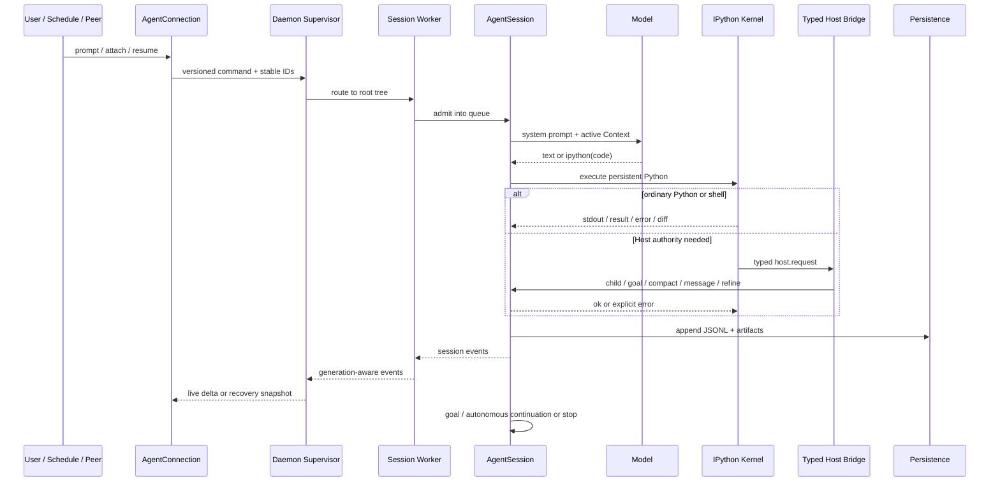

# 第 10 课：长任务端到端复盘与阶段性五项目对照

[返回本阶段目录](README.md) · [上一课](09-skills-mcp-extensions-safety.md) · [官方 Architecture](https://github.com/PrimeIntellect-ai/prime-agent/blob/71ca6cfd1a2f7205ca0ec1baa65d10d0ed88f6e8/packages/coding-agent/docs/architecture.md) · [课程实验](../examples/05-prime-agent/10-end-to-end/index.mjs) · [六项目横向对照](../comparison.md)

## 核心问题

一次可递归、可断线恢复、可持续改进的长任务，怎样从输入进入 Session，经过单一 `ipython` 控制面，再形成可审计状态并安全地继续或停止？

## 一条完整调用链



User、Schedule、Goal continuation、Heartbeat 和 Agent message 的来源不同，但进入 Session queue 后共享同一执行与持久化路径。Extension 可以加入额外 Tool 或 Hook，不过默认 built-in model tool 仍只有 `ipython`。

## 六维复盘

| 维度 | Prime Agent 的关键机制 | 必须保持的边界 |
| --- | --- | --- |
| Loop | Pi ToolResult loop + AgentSession Host continuation | 模型停止当前 turn 不等于长期任务完成。 |
| Context | RLM prompt、项目规则、Skill metadata、Compaction、Harness state | Transcript、模型 projection、summary 与 Kernel namespace 不混为一层。 |
| Tools | persistent IPython、`%%bash`、Python Skills、typed Host Bridge | Kernel 组合能力，Host 保留 Provider / Session / scheduling 权威。 |
| State | JSONL tree、artifacts、child registry、Goal、schedule、daemon cursor | durable fact、UI event、operational owner 与 world side effect 分开。 |
| Safety | Host request validation、Extension gates、外部隔离要求 | Worker / Kernel 不是 OS Sandbox，Hook 不是 enforcement。 |
| Extension | Markdown / Python Skill、MCP、TypeScript Extension、Harness entries | 按最窄生命周期和信任面选择。 |

## 四条最重要的不变量

### 1. Admission 不等于 Completion

Prompt queue receipt、`rlm()` child handle、queued agent message、schedule claim 都只证明某个阶段已接纳。最终结果必须由对应 transcript、message、goal status 或 durable settlement 证明。

### 2. Context 连续不等于世界状态可回滚

Compaction summary、Kernel snapshot 和 JSONL tree 可以让 Agent 继续推理；它们不能撤销已经写入的文件、网络请求或外部部署。Crash 后 uncertain mutation 必须 reconciliation。

### 3. 进程隔离不等于权限隔离

Worker crash containment、Kernel lifecycle、Supervisor generation fencing 都改善可靠性，却仍继承同一 OS 用户权限。生产安全必须另有 enforcement boundary。

### 4. 自改进不等于自改写

Continual Harness 只允许对 prompt / memory / skill / subagent 补充条目做小型、带 scope 和 history 的变更；base system prompt 保持不可变。Refinement proposal 仍需由未来行为和验证结果证明有效。

## Prime Agent 与 Claude Code 的结构差异

| 问题 | Claude Code | Prime Agent |
| --- | --- | --- |
| 默认能力界面 | 多个结构化 built-in / MCP tools。 | 单一 `ipython`，能力以代码和 Python callable 组合。 |
| 子 Agent | Fresh / Fork、前台 / 后台、sidechain；Team 再加 Tasks / Mailbox。 | `rlm()` admission、独立 AgentSession、parent registry 与 direct messaging。 |
| 长期知识 | CLAUDE.md、Auto Memory index + topics。 | 项目规则 + Continual Harness 四类补充 entry。 |
| 长任务持续性 | Session DAG、background agents、Tasks / Mailbox。 | resident Worker、Goal、Autonomous、Heartbeat / Schedule、Kernel state。 |
| 安全主线 | Permission / Hook / 可配置 Sandbox 分层。 | Host allowlist 与 Hook gate；默认需要外部 OS Sandbox。 |

两者不是功能排名。Claude Code 更强调结构化 Tool 和显式协调对象；Prime Agent 更强调持久 Python 控制面、递归计算与 Daemon continuity。

## 截至本阶段五个项目各取一块

```text
Pi Mono     → 小而可测试的 Agent loop
OpenCode    → durable facts、执行 owner 与 client projection
Codex CLI   → canonical permission + Approval + OS enforcement
Claude Code → Context 生命周期、Memory 与显式 Multi-Agent 协调
Prime Agent → persistent Python、typed Host Bridge、RLM、Daemon 与 Continual Harness
```

自研时不应直接拼接产品 API，而应组合这些原则：

1. Runtime core 对 UI、Provider、数据库和 Sandbox 依赖注入。
2. 输入、Tool lifecycle、Session tree 与恢复 marker 形成 durable facts。
3. 每个副作用在 canonical resource 上经过授权，并受 OS policy 强制。
4. Context 使用 admission、bounded output、Compaction 和按需 recall。
5. 子 Agent 有独立 Context、usage、owner、message 和 completion contract。
6. 长任务的 objective、continuation、schedule 与 crash semantics 显式分开。
7. 所有自动学习都有 scope、evidence、conflict check、history 和 rollback。

## 实验

```bash
node examples/05-prime-agent/10-end-to-end/index.mjs
```

`实验`：脚本让一条 schedule prompt 经过 Daemon route、Session admission、模型 `ipython` call、typed Host child request、ToolResult、JSONL / artifacts 和 Goal completion；并断言 mutation side effect 不会被 event recovery 隐式重放。

## 阶段复述题

不看前文，尝试回答：

1. 为什么 `rlm()` 返回 handle 而不是 child 最终答案？
2. active IPython cell 的 Host reply 为什么必须走 control channel？
3. JSONL tree、Compaction summary 与 Kernel snapshot 各保存什么？
4. generation cursor 变化后，为什么 snapshot 比猜测缺失 events 更可靠？
5. Goal、Autonomous 和 Schedule 各回答什么问题？
6. Python Skill、MCP、Extension 与 Harness skill entry 怎样选择？
7. Prime Agent 的哪个边界负责安全策略，哪个边界真正限制系统权限？

能沿一条 prompt flow 回答这些问题，才算形成了本阶段的 Harness 心智模型。

## 本课结论

- `源码/文档`：Prime Agent 把 Pi loop 放入 Daemon-backed AgentSession，并以 persistent IPython 作为默认模型控制面。
- `源码/文档`：typed Host Bridge、child registry、Session artifacts、Goal / Schedule 和 generation-aware events 共同支撑长任务。
- `源码`：Continual Harness refinement 修改可审计的补充状态，不修改 base prompt。
- `结论`：Prime Agent 最值得学习的不是“一个工具可以做一切”，而是表达力强的 Kernel 与权威 Host、durable state、恢复 policy 之间的分工。
- `限制`：本阶段没有安装或运行真实 Prime Agent workspace、Provider 或 MCP server；所有“实验”验证的是课程提炼的不变量，不是上游端到端兼容测试。

## 后续

继续进入[第六阶段：DeepSeek Harness](../06-deepseek-harness/README.md)，再回到[六个 Agent Harness 横向对照](../comparison.md)，逐列检查哪些结论来自源码、文档、独立实验或仍未验证。若升级 Prime Agent commit，首先复核 Tool catalog、Daemon protocol / schema、RLM API 与安全边界。
