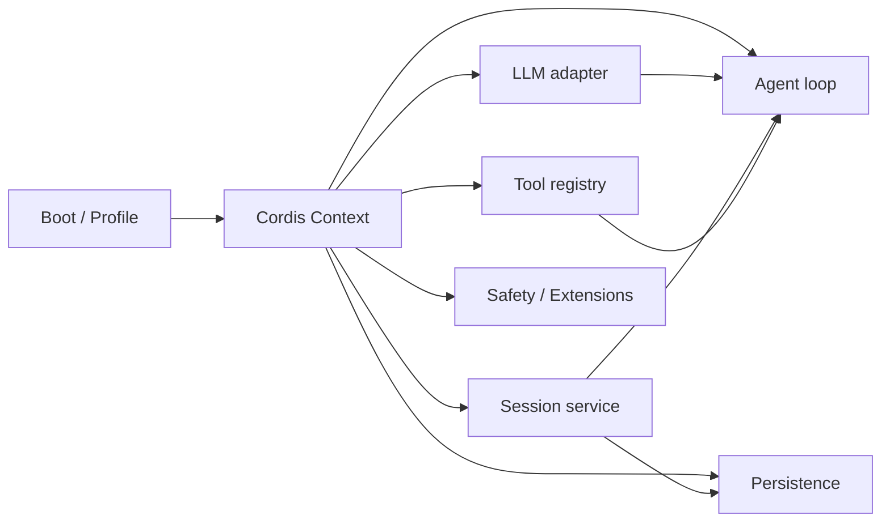

# 第 1 课：来源边界、Cordis 与总体架构

[返回本阶段目录](README.md) · [官方 Architecture](https://github.com/deepseek-ai/deepseek-harness/blob/47f943859bef60e4160492346772ded9b24f765a/docs/architecture.md) · [Cordis Primer](https://github.com/deepseek-ai/deepseek-harness/blob/47f943859bef60e4160492346772ded9b24f765a/docs/cordis-primer.md) · [课程实验](../examples/06-deepseek-harness/01-capability-map/index.mjs)

## 核心问题

为什么说 DeepSeek Harness 的基本架构单位是 capability seam，而不只是一个持有模型和工具的 `Agent` class？

## 先固定来源

本阶段只使用官方仓库 commit [`47f9438`](https://github.com/deepseek-ai/deepseek-harness/tree/47f943859bef60e4160492346772ded9b24f765a)。根版本是 `0.1.0-rc.5`，项目处于 developer preview。

`限制`：预发布版本明确可能发生 breaking changes。课程中的 package 路径、配置格式和事件名都是固定 commit 的事实，不自动代表后续版本。

## Cordis 提供什么

`源码/文档`：DeepSeek Harness 用 Cordis 组织四类基础能力：

| 概念 | 作用 | Harness 中的例子 |
| --- | --- | --- |
| `Context` | 插件只看见当前作用域允许的服务和事件。 | agent preset、session scope、global host。 |
| Service | 以键注入可替换能力。 | `ctx.tools`、`ctx.session`、`ctx.sandbox`。 |
| typed event | 在稳定生命周期点广播或组成 waterfall。 | `agent/pre-step`、`tools/pre-execute`。 |
| Fiber / effect | 管理插件加载、卸载与可逆副作用。 | 注册工具、监听事件、提供服务。 |

Fiber 典型状态是：

```text
PENDING → LOADING → ACTIVE → UNLOADING → DISPOSED
                  ↘ FAILED
```

`inject` 声明插件依赖。等待的 Service 可用后 Fiber 才激活，因此 YAML 行顺序不是依赖语义。

## Everything-as-a-Plugin

固定源码中的模型 adapter、Session log、Agent loop、工具注册、Compaction、Persistence、Approval、Sandbox、Subagent 和 Web UI 都通过插件组合。



这里的“插件”不是只给最终用户安装的第三方包。核心 Loop 也服从同一依赖与卸载模型，这使测试、Headless 部署、Web 部署和 agent preset 能复用相同 capability seams。

## 六维观察入口

| 维度 | 固定源码入口 | 课程 |
| --- | --- | --- |
| Loop | `packages/core/agent-loop`、`packages/core/agent/src/inbox.ts` | 3 |
| Context | `system-prompt`、`runtime-context.ts`、LLM assembler | 4、7 |
| Tools | `packages/core/tools`、`agent-loop/src/tool-calls.ts` | 5 |
| State | `packages/core/session`、persistence backends | 2、6、9 |
| Safety | approval、fs、shell、sandbox packages | 5、8 |
| Extension | Cordis、Skills、MCP、Hooks、dynamic packages | 2、10 |

## Capability seam 与产品功能

以“执行 Shell”为例，它不是一个孤立函数：

```text
tool definition
  → scoped tool view
  → policy waterfall
  → optional approval
  → shell service
  → sandbox policy
  → platform runner
  → canonical ToolResult
  → Session events
```

每一段都能由 Service 或 event seam 替换，但替换仍受 schema、scope、生命周期和日志不变量约束。可组合不等于随意拼装。

## 与前五阶段的差异

- Pi Mono 强调最小 Loop 与 wrapper 的分离。
- OpenCode 强调 durable facts、执行 owner 与 client projection。
- Codex CLI 强调 canonical permission 与 OS enforcement。
- Claude Code 强调 Context 生命周期、Memory 与显式协作。
- Prime Agent 强调 persistent Python 控制面与 Daemon continuity。
- DeepSeek Harness 把上述多数能力放进统一的 Cordis 插件生命周期和作用域模型。

这不是功能优劣排序，而是最适合本阶段观察的架构切口。

## 实验

```bash
node examples/06-deepseek-harness/01-capability-map/index.mjs
```

`实验`：脚本构造最小 capability graph，按 Service 依赖排序 Agent、Tools、Session 与 Persistence，并断言 UI 和 Sandbox 都不是 Loop 的硬编码成员。

## 本课结论

- `源码/文档`：Context、Service、typed event、Fiber 和 effect 构成 DeepSeek Harness 的组合底座。
- `源码`：核心 Agent loop 与 Session 也作为插件装载，不享有绕过生命周期的特殊地位。
- `结论`：阅读应追踪 capability 的 provider、consumer、scope 和 disposer，而不是只找一个总控 Agent 类。
- `限制`：课程没有运行真实 composition；插件激活、HMR 与 UI 行为仍需上游 runtime 实验。

## 下一步

下一课进入 Boot 层，区分 Profile、Bundle 与 Patch，并验证一次插件注册为什么能在卸载时完整回滚。
