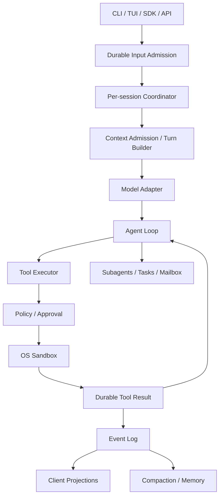

# 四个 Agent Harness 的优秀设计与自研基线

[返回首页](README.md) · [学习路线](00-roadmap.md) · [横向对照](comparison.md)

## 文档目标

本文基于现有四个阶段的学习记录，提炼适合自研 Harness Agent 的设计原则。目标不是完整复刻某一个项目，而是组合各自最成熟的部分：

```text
Pi Mono     → 简洁、可测试的 Runtime 内核
OpenCode    → 产品化、持久化与状态同步
Codex CLI   → 权限收敛、审批与 OS Sandbox
Claude Code → 长 Context、Memory、扩展与 Multi-Agent
```

最终希望得到一个同时满足以下目标的 Harness：

- **好用**：响应及时、状态透明、可暂停恢复，并能服务 CLI、TUI、SDK 等入口。
- **安全**：模型意图、执行授权与操作系统强制边界互相独立，默认最小权限。
- **高性能**：控制 Context、工具输出、事件和渲染成本，在安全边界内并行执行。
- **可演进**：Runtime、Provider、Tool、安全、持久化和扩展机制可以分别替换或增强。

## 一、四个项目最值得学习的设计

| 项目 | 最优秀的设计 | 对自研 Harness 的价值 |
| --- | --- | --- |
| Pi Mono | Loop、State wrapper、Event、Context projection 相互分离 | 建立小而稳定、容易测试的 Runtime Core。 |
| OpenCode | Durable Session、Client / Server、可靠事实与 UI projection 分层 | 支撑多入口、后台执行、恢复和复杂产品状态。 |
| Codex CLI | Approval 与 OS Sandbox 正交、canonical Permission Profile | 建立真正可信的最小权限执行底座。 |
| Claude Code | Context admission、Compaction、Session DAG、Memory、Subagent 和扩展生命周期 | 支撑长任务、长期知识和复杂 Agent 编排。 |

### Pi Mono：最干净的 Runtime 内核

Pi Mono 最值得学习的不是功能数量，而是边界清楚：

- 低层 loop 只负责“模型 → 工具 → 结果 → 模型”。
- 有状态 wrapper 负责生命周期、队列、Abort 和订阅。
- 完整 transcript 与本次模型请求的 Context projection 分离。
- Event 描述“刚刚发生了什么”，State 是 Event 的当前归约结果。
- 模型调用边界可以注入 fake stream，工具和循环可以脱离真实模型测试。
- 未知工具、参数错误和执行异常都生成显式 error ToolResult，让模型能够恢复。
- Steering、Follow-up 与 Abort 有各自明确的 drain point，不会在任意位置改变当前工具批次。

这些设计适合作为自研 Harness 的最小内核。Runtime 不应直接依赖 UI、数据库、具体 Provider 或平台 Sandbox。

证据与详细流程见 [Pi Mono 阶段复盘](01-pi-mono/07-phase-review.md)。

### OpenCode：最完整的产品化与可靠状态设计

OpenCode 最优秀的地方，是把看似相同的“状态”拆成不同可靠性边界。

#### 输入接纳与执行分离

```text
Prompt admitted
  ≠ 已发送给模型
  ≠ 正在执行
  ≠ 已完成
```

Prompt 先进入 durable inbox，再发送一次可合并的 execution wake。同一个 Session 只允许一个串行 drain，不同 Session 可以并发。Message ID 同时承担幂等重试键：相同 ID 与相同内容可以 reconcile，相同 ID 与不同内容必须冲突。

这让 API 能快速返回“输入已可靠接纳”，而不需要保持一个请求直到 Agent 完成全部工作。

#### 四条时间线分离

| 时间线 | 保存内容 |
| --- | --- |
| Durable Session facts | Prompt、消息、Tool lifecycle、Compaction 等可回放事实。 |
| Process operational state | active drain、pending permission、tool fiber、wake。 |
| Host side effects | 文件写入、进程、网络和外部系统真实变化。 |
| Client projection | UI 为渲染维护的 message、part、diff、busy / idle 等视图。 |

这四条时间线相关，但不能互相替代。文件已经写入，不代表 Tool.Success 已落库；事件已落库，也不代表断线 UI 已收到。

#### Tool 与 Context 的时间一致性

- Tool Registry 为一次 provider turn 固定 definitions 和 settlement identity；中途替换实现会返回 stale error。
- Tool leaf 在副作用前对 canonical resource 做 Permission 判断。
- `Tool.Called` 在副作用前持久化，成功或失败后再 durable settlement。
- 大 Tool output 只给模型 bounded preview，完整内容单独存储。
- Edit 使用 compare-and-write，避免等待权限或并发修改后覆盖新内容。
- Context Source 有稳定 key、结构化 snapshot、baseline、update、removed 和 unavailable 语义。
- Context 变化以 chronological system update 进入 Session，而不是静默改写过去的 baseline。
- Compaction 生成 durable checkpoint，并与 Context Epoch 一起建立新的环境锚点。

#### 可靠事实与通知分离

Durable event log 和 sequence 是事实来源；进程内 wake 只表示“可能有新事实”。Wake 可以合并，因为 reader 会按 cursor 从数据库补齐所有事件。这比要求每个通知都可靠、更容易实现正确的背压和恢复。

证据与详细流程见 [OpenCode 端到端复盘](02-opencode/07-coding-task-end-to-end-review.md)。

### Codex CLI：最适合作为安全底座

Codex CLI 最重要的安全模型是：

```text
模型决定“想做什么”
Approval 决定“是否授权这样做”
OS Sandbox 决定“启动后实际上最多能做到什么”
```

三者不能互相替代。Prompt 和 Hook 只能影响行为或控制流，不能限制已经启动的进程及其子进程。

#### 配置先收敛为 canonical 权限

```text
多层配置与 CLI overrides
  → 选择 legacy mode 或 named profile
  → 解析继承并编译 filesystem / network policy
  → 管理员要求验证或收紧
  → TurnEnvironment 绑定 cwd 与 workspace roots
  → 得到本次执行的 PermissionProfile
```

优秀之处包括：

- 普通配置可以覆盖，管理员约束只能验证或收紧，不能被用户弱化。
- `:workspace_roots` 保持符号形式，到本轮执行环境才绑定真实路径。
- Approval cache 绑定 environment、canonical command、cwd 和权限范围，不能只按命令文本复用。
- Additional permissions 先规范化，再与 reviewer 实际 grant 求交集。
- deny-read 不会因为一次普通 escalation 被静默删除。

#### OS enforcement 与 fail-closed

- macOS 将共同策略编译为 Seatbelt profile。
- Linux / WSL2 使用 bubblewrap 构造文件和网络视图，再施加 `no_new_privs` 与 seccomp。
- 原生 Windows 使用 restricted token、capability SID 和 ACL。
- 默认后端不可用时显式失败，不静默降级为无 Sandbox 或语义更弱的实现。
- `workspace-write` 仍保护 `.git`、`.agents` 和 `.codex` 等会影响 Harness 后续行为的元数据。
- `.git` 是 pointer file 时还要保护实际 gitdir，不能只做字符串前缀判断。
- Network capability 与 managed proxy 是两个开关；允许联网不等于允许任意域名、HTTP 方法、本地监听或 Unix socket。

#### 真实失败进入控制流

执行链明确区分：

1. 策略拒绝或审批拒绝：命令未启动。
2. 普通非零退出、超时或程序错误：命令已执行。
3. Sandbox denial：命令已执行，但被 OS 边界阻止。

所有情况都应保留真实结果。只有策略允许时，Sandbox denial 才能触发新的、受控的权限请求或重试。

证据与详细流程见 [Codex CLI 阶段复盘](03-codex-cli/06-escalation-experiment-phase-review.md)。

### Claude Code：最系统的长任务与扩展设计

Claude Code 最值得学习的是把 Context 当成有生命周期的 admission system，而不是不断增长的字符串。

#### Context 生命周期

| 生命周期 | 典型内容 |
| --- | --- |
| 基线常驻 | System prompt、环境、根 CLAUDE.md、Memory 入口。 |
| 可发现 | Skill、Agent、MCP tool 的名称与短描述。 |
| 路径触发 | nested CLAUDE.md、conditional rules。 |
| 调用触发 | 完整 Skill 正文、具体 MCP schema。 |
| 一次性 observation | 文件内容、命令输出、Hook additional context。 |
| 可替换 | 旧 Tool results、已经被 checkpoint 覆盖的细节。 |

稳定 System prefix 与动态 Attachments 分开，可以减少 Context 浪费，也更有利于 Prompt Cache。

#### 分级 Context 压力处理

```text
Tool result budget / snip
  → Microcompact 清理旧的可重读结果
  → Compaction 生成 continuation checkpoint
```

Compaction 不只是聊天总结。它需要保留目标、决策、真实修改、验证证据、错误原因和未完成工作，并恢复 Plan、Skills、Agents、Tools、MCP 等运行信息。摘要和 compact boundary 共同决定后续模型看到什么。

#### Session、Memory 与 Multi-Agent

- Append-only JSONL 通过 `parentUuid` 形成 DAG，支持 resume、fork 和 rewind。
- 审计历史、活动 Context、文件 checkpoint 与世界状态 rollback 是不同能力。
- Memory 使用有限大小的入口索引和 topic files，按当前任务只 recall 少量主题。
- 可从代码、Git 或项目规则重新推导的信息不应进入长期 Memory。
- 当前 observation 优先于陈旧 Memory，Memory 必须可审计、编辑和删除。
- Subagent 拥有独立 loop、Context、工具权限和 sidechain transcript。
- Fresh / Fork 控制 Context，前台 / 后台控制调度，Worktree 控制文件隔离。
- Agent Team 用 Tasks、owner、dependencies、Mailbox 和 permission sync 建立显式协调协议。

#### 按生命周期选择扩展

| 需求 | 首选机制 |
| --- | --- |
| 稳定项目规则 | CLAUDE.md / rules |
| 按需知识与工作流 | Skill |
| 独立 Context、模型或工具范围 | Custom Agent |
| 确定事件边界上的策略 | Hook |
| 外部服务、资源和工具 | MCP |
| 组合、命名空间、版本和分发 | Plugin |

扩展越大，信任面、Context 成本和升级成本越高，因此应优先选择最窄的生命周期。

证据与详细流程见 [Claude Code 阶段目录](04-claude-code/README.md)和[端到端复盘](04-claude-code/12-extension-system-end-to-end-review.md)。

## 二、建议的自研总体架构



### 建议的模块边界

| 模块 | 核心职责 | 不应负责 |
| --- | --- | --- |
| Runtime Core | continuation、停止条件、工具结果回灌、Abort。 | UI、数据库和具体 OS Sandbox。 |
| Session Service | durable admission、sequence、history、resume / fork。 | 直接执行宿主副作用。 |
| Context Manager | admission、projection、output budget、Compaction。 | 改写审计历史。 |
| Model Adapter | Provider 解析、协议编译、流式 canonical events。 | 工具副作用和业务权限。 |
| Tool Registry / Executor | schema、调用身份、并发 contract、标准化结果。 | 决定 OS 最终能访问什么。 |
| Policy / Approval | catalog visibility、资源授权、用户或自动 reviewer。 | 替代 OS enforcement。 |
| Sandbox Runtime | 文件、网络、进程与子进程的实际边界。 | 判断任务语义是否合理。 |
| Event / Projection | durable replay、live stream、UI reducer。 | 把 Client Store 当成 Server 真相。 |
| Memory / Multi-Agent | 长期知识、独立 loop、Tasks、Mailbox。 | 绕过父级权限和状态协议。 |

## 三、必须坚持的核心不变量

### Loop 与状态

1. Transcript、模型 Context 和 UI projection 必须是三种数据。
2. Prompt admitted、promoted、running、waiting 和 completed 必须是不同状态。
3. 同一 Session 的 provider turns 串行，不同 Session 可以并行。
4. Tool result、Steering、Follow-up 和 Abort 只能在定义好的安全边界改变 continuation。
5. Event 必须先归约 State，再通知外部订阅者。

### Tools 与副作用

6. 工具“存在”、本轮“可见”和本次调用“获准”是三种状态。
7. 工具输入和输出都必须做 schema 校验。
8. 每个 tool call 必须得到匹配 call ID 的 success、error 或 denial result。
9. 只读且声明 concurrency-safe 的工具可以并行；写工具必须独占或按资源加锁。
10. `Tool.Called` 应在副作用前落库，但不能因此宣称 exactly-once。
11. 外部副作用需要幂等键、compare-and-write 或启动后的 reconciliation。
12. 已产生部分模型输出或副作用后，不得盲目重试整个 turn。

### Safety

13. Tool catalog visibility、调用授权和 OS Sandbox 必须是三层检查。
14. Sandbox 默认开启，权限提升必须精确、可解释、可审计。
15. Permission grant 必须绑定 environment、cwd、canonical resource 和权限范围。
16. 控制配置、Git metadata、Agent instructions、Skills 和凭据路径应默认受保护。
17. Sandbox 不可用或策略无法表达时，应显式失败，不得静默弱化。
18. Prompt、项目规则、Skill、MCP description 和 Tool result 都应按不受信输入治理。

### Context、事件与 Memory

19. 实时 delta 可以不持久化，但可靠边界必须保存完整最终值和 sequence。
20. Durable log 是事实来源，live wake 只是可合并通知。
21. Compaction 不应删除审计历史，而应建立新的活动 Context checkpoint。
22. Compaction 必须保留目标、修改、验证、失败和未完成工作。
23. Memory 必须有大小预算、来源、更新时间和可删除机制。
24. 当前代码、Git 和真实 observation 永远优先于历史 Memory。

### Multi-Agent

25. 每个 Subagent 必须有独立 loop、Context、Tool view、permission view 和 transcript。
26. 并行任务必须有明确 owner，并尽量避免共享热点文件。
27. Task claim、dependency、permission、plan 和 shutdown 使用结构化协议，不依赖自然语言猜测。
28. Worktree 只提供文件隔离，不等于 OS Sandbox，也不自动合并变更。

## 四、好用、安全和高性能的具体落点

### 好用

- Prompt API 快速返回 durable admission，执行进度通过事件订阅展示。
- 明确显示 running、waiting permission、retrying、aborted 和 completed。
- 支持 Steering、Queue、Abort、Resume、Fork 和针对性 Rewind。
- 本地和远端共用 Client / Server contract，本地 transport 可以使用 in-process fetch。
- Tool error 和 denial 给出真实、可操作的信息，而不是笼统“执行失败”。

### 安全

- 默认使用 workspace-write + restricted network，而不是宿主 full access。
- Plan / Explore Agent 默认只读；写入、Shell、外部目录和网络分别授权。
- Shell permission parser 需要理解 compound command、wrapper、环境变量和路径语义，不能只做 `startsWith()`。
- 对插件、Hooks、Skills、MCP server 和 Auto Memory 记录来源与权限范围。
- 对平台能力差异做显式 feature detection，并为每个平台保留真实 integration tests。

### 高性能

- 多 Session 并行、单 Session 串行；同一 turn 内只并发 concurrency-safe 工具。
- Context 使用稳定前缀、渐进披露、deferred tool schema 和按需 Skill。
- Tool output 从 capture 层开始限流，并将完整结果与模型可见预览分离。
- 先进行局部、低损失清理，再触发全局 Compaction。
- Durable event 只保存可重建边界，token delta 走 live stream。
- Wake 可以合并，客户端对连续 delta 做短窗口批量归约。
- Provider 只对确定可安全重试的连接前错误做有限重试；流已经开始后默认不重放整个 turn。
- UI projection 设置可见消息窗口，完整历史继续保留在 Server。

## 五、推荐实现顺序

### 第 1 阶段：最小可测试 Runtime

- Messages、Model boundary、Tool Registry、Agent loop 和 Event。
- ToolResult 闭环、Abort、Steering 和 Follow-up。
- Fake model 与 fake tool 的确定性测试。

### 第 2 阶段：最小安全 Coding Agent

- Read、Search、Edit、Patch、Shell 等少量工具。
- Schema、资源级 Permission、Approval 和 bounded output。
- 默认 workspace Sandbox、restricted network 和受保护 metadata。
- 文件写入使用 compare-and-write，进程使用 timeout 与完整退出状态。

### 第 3 阶段：Durable Session 与产品边界

- Client / Server contract、durable prompt admission 和 per-session coordinator。
- Append-only event log、sequence cursor、resume / fork。
- Durable replay、live wake 和 Client projection 分离。

### 第 4 阶段：长 Context

- Context sources、baseline / updates、Skill discovery 和 deferred tools。
- Tool-result budget、Microcompact 和 durable Compaction checkpoint。
- 稳定 prompt prefix 与 Provider cache 策略。

### 第 5 阶段：Memory、Subagent 与扩展

- 可审计的 Memory index 与按需 topic recall。
- 独立 Subagent loop、sidechain transcript 和 worktree option。
- 有 owner、dependency、Mailbox 与 permission sync 的 Agent Team。
- 最后再加入 Hooks、MCP 和 Plugin 分发。

不要一开始就实现 Agent Teams。一个不能可靠保存状态、限制副作用和恢复 Context 的单 Agent，扩展成多个只会放大错误、成本和竞态。

## 六、不能直接照搬的边界

- Pi Mono 第一阶段没有提供生产级 Session 持久化或 OS Sandbox。
- OpenCode 的 Permission 不是 OS Sandbox；Tool call 与外部副作用之间没有通用 exactly-once，固定版本全局事件流也不能可靠补齐断线缺口。
- Codex CLI 阶段聚焦 Sandbox 主线，没有重新验证完整 Context、Session 和 Multi-Agent；三平台实验步骤已提供，但尚未在本仓库记录真实执行结果。
- Claude Code 的公开功能以官方文档为准；内部实现分析来自非官方 source-map 还原，只适合借鉴设计，不能当作官方稳定契约。
- Conversation rewind、文件恢复和外部世界状态回滚是三件事，任何一个项目都不能自动提供通用事务回滚。

## 总结

适合自研的组合可以压缩为：

```text
Pi Mono 的小内核
+ OpenCode 的 durable Session 与 projection
+ Codex CLI 的 canonical permissions 与 OS Sandbox
+ Claude Code 的 Context lifecycle、Memory 和 Agent protocol
```

真正优秀的 Harness 不是工具最多，而是每一层都有清晰、可验证的责任：模型提出意图，Runtime 控制 continuation，Tool contract 描述副作用，Approval 处理授权，Sandbox 强制边界，Event Log 保存事实，Context Manager 选择下一轮真正需要的信息。
